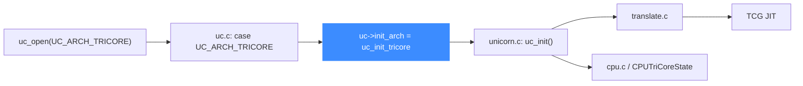

# TriCore 后端

> 🧩 本页讲 Unicorn 的 Infineon TriCore 后端：它位于 `qemu/target/tricore/`，由 `uc_init_tricore` 挂载函数指针。TriCore 是面向汽车/嵌入式实时控制的 32 位架构，单一入口。读完你能理解它的目录结构与入口。

TriCore 只有一个入口 `uc_init_tricore`，无位宽/端序变体，是 `uc.c` 分发 switch 里的最后一个 case。

## 🚀 从分发到后端的路径



## 📁 目录关键文件

| 文件 | 职责 |
| --- | --- |
| `translate.c` | TriCore 指令翻译主体 |
| `cpu.c` / `cpu.h` | `CPUTriCoreState`、CPU 模型与复位 |
| `unicorn.c` | Unicorn 胶水层，实现 `uc_init`、`tricore_set_pc` 等 |
| `op_helper.c` / `helper.c` | 运行期辅助例程 |
| `fpu_helper.c` | 浮点辅助 |
| `tricore-opcodes.h` / `tricore-defs.h` | 指令编码与架构常量定义 |

## 🔧 uc_init_tricore 挂了哪些函数指针

```c
// qemu/target/tricore/unicorn.c
void uc_init(struct uc_struct *uc)
{
    uc->reg_read = reg_read;
    uc->reg_write = reg_write;
    uc->reg_reset = reg_reset;
    uc->set_pc = tricore_set_pc;
    uc->get_pc = tricore_get_pc;
    uc->cpus_init = tricore_cpus_init;
    uc->release = tricore_release;
    uc->cpu_context_size = offsetof(CPUTriCoreState, end_reset_fields);
    uc_common_init(uc);
}
```

同样是精简型入口：只挂寄存器、PC、CPU 初始化与释放，其余通用能力由 `uc_common_init` 提供。

## 🔀 分发中的位置

```c
// uc.c
case UC_ARCH_TRICORE:
    if ((mode & ~UC_MODE_TRICORE_MASK)) {
        free(uc);
        return UC_ERR_MODE;
    }
    uc->init_arch = uc_init_tricore;
    break;
```

::: tip 端序宽松
与 M68K/PPC/SPARC/s390x 不同，TriCore 分支**不强制** `UC_MODE_BIG_ENDIAN`，只校验没有未定义位（`mode & ~UC_MODE_TRICORE_MASK`）。TriCore 通常按小端处理。
:::

::: warning 较新的后端
TriCore 是 Unicorn v2 才引入的后端之一，寄存器与型号覆盖不如 x86/ARM 全面。使用前建议对照 `include/unicorn/tricore.h` 确认可用寄存器 ID。
:::

## 相关页面

- [TriCore 架构页](/arch/tricore/)
- [uc.c 分发层](/internals/uc-dispatch)
- [TCG 翻译流水线](/internals/tcg-pipeline)
- [uc_struct 与函数指针](/internals/function-pointers)
