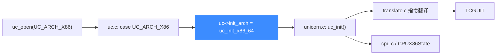

# i386 / x86-64 后端

> 🧩 本页讲 Unicorn 的 x86 后端：它位于 `qemu/target/i386/`，由 `uc_init_x86_64` 把一整套函数指针挂进 `uc_struct`。读完你能明白从 `uc_open(UC_ARCH_X86, …)` 到实际翻译一条 x86 指令，代码是怎么串起来的。

x86 是唯一一个「一个后端覆盖三种位宽」的架构：16、32、64 位共用同一份 `uc_init_x86_64`，运行时按 `UC_MODE_16 / 32 / 64` 决定 CPU 模型与寄存器语义。

## 🚀 从分发到后端的路径



`uc_init_x86_64` 其实就是 `qemu/target/i386/unicorn.c` 里的 `uc_init`——通过 `qemu/x86_64.h` 的 `#define uc_init uc_init_x86_64` 在编译期改名，从而让十来个后端的同名 `uc_init` 不冲突。

## 📁 目录关键文件

| 文件 | 职责 |
| --- | --- |
| `translate.c` | 指令翻译核心：把 x86 机器码解码成 TCG 中间表示 |
| `cpu.c` / `cpu.h` | `CPUX86State` 定义、CPU 模型注册与复位 |
| `unicorn.c` | Unicorn 胶水层，实现 `uc_init`、寄存器读写、`x86_set_pc` 等 |
| `seg_helper.c` | 段选择子、GDT/LDT、调用门等保护模式逻辑 |
| `excp_helper.c` | 异常与中断注入 |
| `fpu_helper.c` / `ops_sse.h` | x87 FPU 与 SSE/AVX 运算 |
| `cc_helper.c` | EFLAGS 条件码惰性求值 |
| `mem_helper.c` / `smm_helper.c` | 访存辅助、系统管理模式 |

## 🔧 uc_init_x86_64 挂了哪些函数指针

```c
// qemu/target/i386/unicorn.c
void uc_init(struct uc_struct *uc)
{
    uc->reg_read = reg_read;
    uc->reg_write = reg_write;
    uc->reg_reset = reg_reset;
    uc->release = x86_release;
    uc->set_pc = x86_set_pc;
    uc->get_pc = x86_get_pc;
    uc->stop_interrupt = x86_stop_interrupt;
    uc->insn_hook_validate = x86_insn_hook_validate;
    uc->opcode_hook_invalidate = x86_opcode_hook_invalidate;
    uc->cpus_init = x86_cpus_init;
    uc->cpu_context_size = offsetof(CPUX86State, end_reset_fields);
    uc_common_init(uc);
}
```

结尾的 `uc_common_init(uc)` 把访存、内存映射、TCG 初始化等**架构无关**的函数指针一次性补齐（见 `qemu/unicorn_common.h`），所以后端只需填写自己「特有」的那几项。

::: tip 段与 GDT
x86 是少数需要认真处理段寄存器的架构。`seg_helper.c` 负责段描述符加载、特权级检查；实模式（`UC_MODE_16`）、保护模式（`UC_MODE_32`）、长模式（`UC_MODE_64`）下段语义差异很大，写 shellcode 模拟时尤其要留意 CS/DS 的初始值。
:::

::: warning mode 校验
`uc.c` 里 x86 分支拒绝 `UC_MODE_BIG_ENDIAN`，且必须显式给出 `UC_MODE_16/32/64` 之一，否则返回 `UC_ERR_MODE`。x86 没有大端模式。
:::

## 相关页面

- [x86 架构页](/arch/x86/)
- [uc.c 分发层](/internals/uc-dispatch)
- [TCG 翻译流水线](/internals/tcg-pipeline)
- [uc_struct 与函数指针](/internals/function-pointers)
