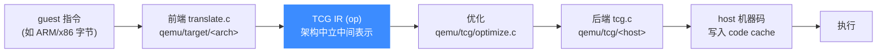
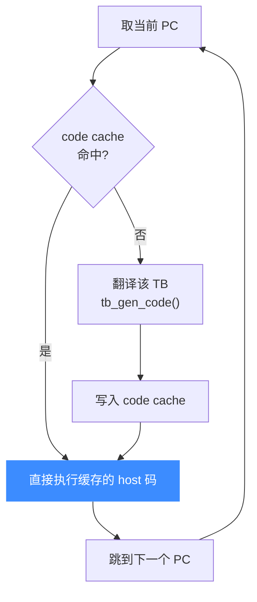

# TCG 翻译流水线

> ⚡ TCG（Tiny Code Generator）是 Unicorn 从 QEMU 继承的动态二进制翻译器。本页讲一条 guest 指令如何经「前端翻译 → TCG IR → 后端生成 host 机器码」变成可直接执行的原生代码，并被缓存复用。

## 🧭 三段式翻译

TCG 把「模拟」变成「翻译 + 执行原生码」。它不逐条解释 guest 指令，而是把一个**基本块**（basic block）整体翻译成宿主机器码后跳过去执行。



- **前端**（`qemu/target/<arch>/translate*.c`，如 [i386 前端](https://github.com/android-security-engineer/unicorn-skills/blob/master/qemu/target/i386/translate.c) 的 `gen_intermediate_code` 在 [L9444](https://github.com/android-security-engineer/unicorn-skills/blob/master/qemu/target/i386/translate.c#L9444)）：把 guest 指令解码，逐条 emit 成 TCG op。
- **TCG IR**：一组架构无关的操作（加载、算术、分支、`qemu_ld`/`qemu_st` 访存等），是 x86 前端和 ARM 前端的「公共语言」。
- **后端**（`qemu/tcg/` 下按宿主架构分目录：`i386`、`aarch64`、`arm`、`riscv`…，入口 [`tcg_gen_code`](https://github.com/android-security-engineer/unicorn-skills/blob/master/qemu/tcg/tcg.c#L3709) 在 [tcg.c:3709](https://github.com/android-security-engineer/unicorn-skills/blob/master/qemu/tcg/tcg.c#L3709)）：把 TCG IR 生成为宿主的真实机器码。
- **优化**：[`qemu/tcg/optimize.c`](https://github.com/android-security-engineer/unicorn-skills/blob/master/qemu/tcg/optimize.c) 在中间做常量传播等优化。

## 🧱 以基本块为单位

翻译的单位是**翻译块（TranslationBlock, TB）**——通常对应一段直到分支/跳转为止的 guest 代码。一个 TB 翻译一次、缓存起来，之后每次执行到同一入口 PC 直接复用，这是动态翻译能接近原生速度的关键。整条翻译由 [`tb_gen_code()`](https://github.com/android-security-engineer/unicorn-skills/blob/master/qemu/accel/tcg/translate-all.c#L1693)（[translate-all.c:1693](https://github.com/android-security-engineer/unicorn-skills/blob/master/qemu/accel/tcg/translate-all.c#L1693)）驱动。



## 🔧 Unicorn 的接入点

Unicorn 通过 `uc_struct` 里的函数指针把 TCG 暴露给用户：

| 指针 | 作用 |
| --- | --- |
| `uc_gen_tb` | 主动在某 PC 生成一个 TB（`UC_CTL_TB_REQUEST_CACHE`） |
| `uc_invalidate_tb` | 失效某地址范围的 TB（`UC_CTL_TB_REMOVE_CACHE`） |
| `tb_flush` | 清空整个 code cache |
| `tcg_ctx` | 指向 `TCGContext`，即代码生成上下文 |

```c
// uc.c: UC_CTL_TB_REQUEST_CACHE 处理
uint64_t addr = va_arg(args, uint64_t);
uc_tb *tb = va_arg(args, uc_tb *);
err = uc->uc_gen_tb(uc, addr, tb);   // 生成并回填 uc_tb{pc,icount,size}
```

::: tip 自修改代码（SMC）
guest 若改写了已翻译区域的内存，对应 TB 必须失效重译，否则会执行到过期的 host 码。这条失效路径见 [translate-all 翻译块](/internals/translate-all)。
:::

::: warning 首块开销
每个 TB 第一次执行都要付「翻译」的成本，之后才是缓存命中。所以对短小、只跑一次的代码，翻译开销占比会更明显。
:::

## 📂 相关源码

| 文件 | 角色 |
|------|------|
| [`qemu/accel/tcg/translate-all.c`](https://github.com/android-security-engineer/unicorn-skills/blob/master/qemu/accel/tcg/translate-all.c) | `tb_gen_code` 翻译入口、TB 缓存管理 |
| [`qemu/accel/tcg/cpu-exec.c`](https://github.com/android-security-engineer/unicorn-skills/blob/master/qemu/accel/tcg/cpu-exec.c) | `cpu_exec` 执行循环、TB 查找 |
| [`qemu/tcg/tcg.c`](https://github.com/android-security-engineer/unicorn-skills/blob/master/qemu/tcg/tcg.c) | TCG IR 后端代码生成（`tcg_gen_code`） |
| [`qemu/tcg/optimize.c`](https://github.com/android-security-engineer/unicorn-skills/blob/master/qemu/tcg/optimize.c) | TCG IR 优化（常量传播等） |
| [`qemu/target/<arch>/translate.c`](https://github.com/android-security-engineer/unicorn-skills/blob/master/qemu/target/i386/translate.c) | 各架构前端：guest 指令 → TCG IR |

## 相关页面

- [JIT 与动态翻译](/features/jit)
- [translate-all 翻译块](/internals/translate-all)
- [cpu-exec 执行循环](/internals/cpu-exec)
- [内置 QEMU Fork](/internals/qemu-fork)
