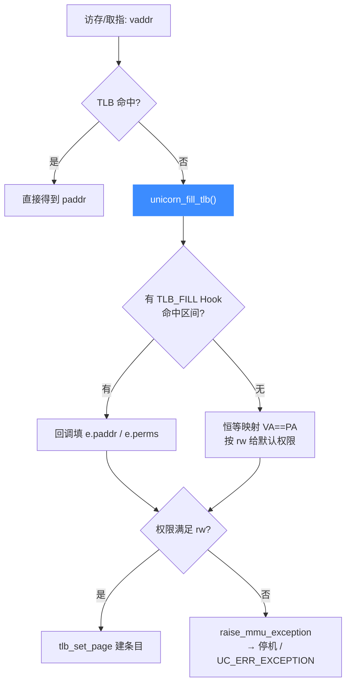

# TLB 与地址翻译

> 🗺️ TLB（Translation Lookaside Buffer）是软件 MMU 的地址翻译缓存。Unicorn 提供两种 TLB 实现：`UC_TLB_CPU`（完整 CPU 语义）和 `UC_TLB_VIRTUAL`（虚拟地址=物理地址 + 可 Hook 覆盖）。本页讲两者差异与 `UC_HOOK_TLB_FILL` 的注入点。相关代码在 [`qemu/accel/tcg/cputlb.c`](https://github.com/android-security-engineer/unicorn-skills/blob/master/qemu/accel/tcg/cputlb.c) 与 [`qemu/softmmu/unicorn_vtlb.c`](https://github.com/android-security-engineer/unicorn-skills/blob/master/qemu/softmmu/unicorn_vtlb.c)。

## 🔀 两种 TLB 模式

```c
// include/unicorn/unicorn.h
typedef enum uc_tlb_type {
    UC_TLB_CPU = 0,   // 默认：CPU 自身的 TLB，最贴近全系统模拟
    UC_TLB_VIRTUAL    // 虚拟地址==物理地址，且可用 hook 覆盖 TLB 条目
} uc_tlb_type;
```

| 模式 | 语义 | 适用 |
| --- | --- | --- |
| `UC_TLB_CPU` | 走架构真实的 MMU/页表翻译 | 需要真实分页、特权级、页表遍历时 |
| `UC_TLB_VIRTUAL` | 默认恒等映射（VA==PA），配合 `UC_HOOK_TLB_FILL` 精细控制 | 想自己决定每次翻译结果、做插桩时 |

切换通过 `uc_ctl` 的 `UC_CTL_TLB_TYPE`，落到后端函数指针 `set_tlb`（处理见 [uc.c:2934](https://github.com/android-security-engineer/unicorn-skills/blob/master/uc.c#L2934)）：

```c
// uc.c: UC_CTL_TLB_TYPE
int mode = va_arg(args, int);
err = uc->set_tlb(uc, mode);   // uc_set_tlb_t
```

## 🪝 UC_HOOK_TLB_FILL：接管翻译

在 `UC_TLB_VIRTUAL` 下，每次需要 fill 一个 TLB 条目时会遍历 `UC_HOOK_TLB_FILL` 链表，让用户回调决定该虚拟页映射到哪个物理页、给什么权限。核心在 [`unicorn_fill_tlb`](https://github.com/android-security-engineer/unicorn-skills/blob/master/qemu/softmmu/unicorn_vtlb.c#L47)（[unicorn_vtlb.c:47](https://github.com/android-security-engineer/unicorn-skills/blob/master/qemu/softmmu/unicorn_vtlb.c#L47)）：

```c
// qemu/softmmu/unicorn_vtlb.c: unicorn_fill_tlb()
HOOK_FOREACH(uc, hook, UC_HOOK_TLB_FILL) {
    if (hook->to_delete) continue;
    if (!HOOK_BOUND_CHECK(hook, address)) continue;
    handled = true;
    JIT_CALLBACK_GUARD_VAR(ret, ((uc_cb_tlbevent_t)hook->callback)(
        uc, address & TARGET_PAGE_MASK, rw_to_mem_type(rw), &e, hook->user_data));
    if (ret) break;
}
```

回调通过 `uc_tlb_entry e` 返回 `paddr` 与 `perms`。若没有任何 Hook 处理（`!handled`），则退回恒等映射（`e.paddr = address & TARGET_PAGE_MASK`，见 [unicorn_vtlb.c:79](https://github.com/android-security-engineer/unicorn-skills/blob/master/qemu/softmmu/unicorn_vtlb.c#L79)）并按访问类型给默认权限。

## 🔬 翻译与授权流程



权限检查（`unicorn_fill_tlb`）：读要 `UC_PROT_READ`、写要 `UC_PROT_WRITE`、取指要 `UC_PROT_EXEC`；满足则 [`tlb_set_page(...)`](https://github.com/android-security-engineer/unicorn-skills/blob/master/qemu/accel/tcg/cputlb.c#L973)（[cputlb.c:973](https://github.com/android-security-engineer/unicorn-skills/blob/master/qemu/accel/tcg/cputlb.c#L973)）建立条目并返回，否则走 `tlb_miss` → `raise_mmu_exception`，把 `invalid_addr` 记为该地址并停机。

::: tip 刷新 TLB
`uc->tcg_flush_tlb`（对应 `UC_CTL_TLB_FLUSH`）用于清空软件 TLB。任何内存映射变更后，softmmu 都会主动刷 TLB（[`tlb_flush`](https://github.com/android-security-engineer/unicorn-skills/blob/master/qemu/accel/tcg/cputlb.c#L324) 在 [cputlb.c:324](https://github.com/android-security-engineer/unicorn-skills/blob/master/qemu/accel/tcg/cputlb.c#L324)），避免命中过期条目。
:::

::: warning probe 模式
`unicorn_fill_tlb` 的 `probe` 参数为真时（探测而非真正访问），权限不足只返回 `false` 而不抛异常。
:::

## 📂 相关源码

| 文件 | 角色 |
|------|------|
| [`qemu/softmmu/unicorn_vtlb.c`](https://github.com/android-security-engineer/unicorn-skills/blob/master/qemu/softmmu/unicorn_vtlb.c) | `UC_TLB_VIRTUAL` 模式：`unicorn_fill_tlb` 与 `UC_HOOK_TLB_FILL` 遍历 |
| [`qemu/accel/tcg/cputlb.c`](https://github.com/android-security-engineer/unicorn-skills/blob/master/qemu/accel/tcg/cputlb.c) | 软件 TLB 命中/未命中处理、`tlb_set_page`、`tlb_flush` |
| [`uc.c`](https://github.com/android-security-engineer/unicorn-skills/blob/master/uc.c) | `UC_CTL_TLB_TYPE` / `UC_CTL_TLB_FLUSH` 处理（调 `set_tlb` / `tcg_flush_tlb`） |
| [`include/uc_priv.h`](https://github.com/android-security-engineer/unicorn-skills/blob/master/include/uc_priv.h) | `uc_set_tlb_t` / `uc_tcg_flush_tlb` typedef |

## 相关页面

- [MMU 与虚拟内存](/features/mmu)
- [TLB Fill Hook](/hooks/tlb-fill)
- [softmmu 软件 MMU](/internals/softmmu)
- [内存模型总览](/memory/overview)
