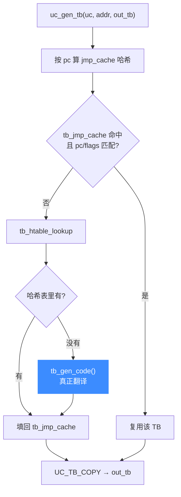

# translate-all.c 与翻译块（TB）

> 🧱 [`qemu/accel/tcg/translate-all.c`](https://github.com/android-security-engineer/unicorn-skills/blob/master/qemu/accel/tcg/translate-all.c) 负责翻译块（TranslationBlock）的生成、查找、缓存与失效。本页讲 Unicorn 如何在这里挂钩，实现 `uc_gen_tb` / `uc_invalidate_tb` / `tb_flush`，以及自修改代码为什么会触发 TB 失效。

## 🧩 TB 是什么

一个 **TranslationBlock** 是一段翻译好的宿主机器码，对应一段 guest 代码（通常到分支为止）。Unicorn 对外只暴露它的精简版 `uc_tb`：

```c
// include/unicorn/unicorn.h
typedef struct uc_tb {
    uint64_t pc;      // 块入口 guest PC
    uint16_t icount;  // 块内指令条数
    uint16_t size;    // 块内 guest 字节数
} uc_tb;
```

内部的 [`UC_TB_COPY`](https://github.com/android-security-engineer/unicorn-skills/blob/master/include/uc_priv.h#L222) 宏（`include/uc_priv.h`，[L222](https://github.com/android-security-engineer/unicorn-skills/blob/master/include/uc_priv.h#L222)）就是把完整 `TranslationBlock` 的 `pc/icount/size` 拷进 `uc_tb`。

## 🔁 生成与缓存流程



真实实现（[`uc_gen_tb`](https://github.com/android-security-engineer/unicorn-skills/blob/master/qemu/accel/tcg/translate-all.c#L1150)，[translate-all.c:1150](https://github.com/android-security-engineer/unicorn-skills/blob/master/qemu/accel/tcg/translate-all.c#L1150)）先查每 CPU 的 `tb_jmp_cache` 快表，未命中再查全局哈希表 [`tb_htable_lookup`](https://github.com/android-security-engineer/unicorn-skills/blob/master/qemu/accel/tcg/translate-all.c#L1182)（[L1182](https://github.com/android-security-engineer/unicorn-skills/blob/master/qemu/accel/tcg/translate-all.c#L1182)），仍无则 `tb_gen_code(cpu, pc, cs_base, flags, cflags)` 翻译：

```c
// qemu/accel/tcg/translate-all.c: uc_gen_tb()
tb = tb_htable_lookup(cpu, pc, cs_base, flags, cflags);
cpu->tb_jmp_cache[hash] = tb;
if (tb == NULL) {
    mmap_lock();
    tb = tb_gen_code(cpu, pc, cs_base, flags, cflags);
    mmap_unlock();
    cpu->tb_jmp_cache[hash] = tb;
}
if (tb == NULL) {
    return UC_ERR_NOMEM;   // 翻译失败通常是内存不足
}
```

## 🗑️ 失效：范围失效与全清

| 后端函数 | 触发 | 行为 |
| --- | --- | --- |
| [`uc_invalidate_tb`](https://github.com/android-security-engineer/unicorn-skills/blob/master/qemu/accel/tcg/translate-all.c#L1117) | `UC_CTL_TB_REMOVE_CACHE`、SMC | 把 guest 地址范围转成 ram addr，调 `tb_invalidate_phys_range` |
| [`uc_tb_flush`](https://github.com/android-security-engineer/unicorn-skills/blob/master/qemu/accel/tcg/translate-all.c#L1111) | `UC_CTL_TB_FLUSH`、`uc_close`、count hook 变化 | `tb_flush(uc->cpu)` 清空整个 code cache |

`uc_invalidate_tb` 会先把 GPA 经 [`get_page_addr_code`](https://github.com/android-security-engineer/unicorn-skills/blob/master/qemu/accel/tcg/translate-all.c#L1135) 翻成 ram addr（[L1135](https://github.com/android-security-engineer/unicorn-skills/blob/master/qemu/accel/tcg/translate-all.c#L1135)），再作范围失效；它用 `sigsetjmp` 保护，若在取址时发生 CPU fault 会安全返回：

```c
// qemu/accel/tcg/translate-all.c: uc_invalidate_tb()
start = get_page_addr_code(uc->cpu->env_ptr, start_addr) & (target_ulong)(-1);
end = (start + len) & (target_ulong)(-1);
if (start > end) return;   // 32 位 wrap 保护
tb_invalidate_phys_range(uc, start, end);
```

这三个指针在 [`tcg_exec_init()`](https://github.com/android-security-engineer/unicorn-skills/blob/master/qemu/accel/tcg/translate-all.c#L1209)（[translate-all.c:1209](https://github.com/android-security-engineer/unicorn-skills/blob/master/qemu/accel/tcg/translate-all.c#L1209)）里一次性注册到 `uc_struct`：

```c
uc->uc_invalidate_tb = uc_invalidate_tb;
uc->uc_gen_tb = uc_gen_tb;
uc->tb_flush = uc_tb_flush;
```

::: warning 自修改代码（SMC）
当 guest 写入的物理页上「曾经翻译过 TB」，softmmu 的写路径会触发对应页的 TB 失效，保证下次执行时重新翻译新代码。这就是为什么改写内存后旧的翻译不会被错误复用。
:::

::: tip l1_map 页表
[`uc->l1_map`](https://github.com/android-security-engineer/unicorn-skills/blob/master/qemu/accel/tcg/translate-all.c#L1226) 是覆盖虚拟地址空间的多级映射（底层指向 `PageDesc`），`tcg_exec_init` 里 `g_malloc0(sizeof(void *) * V_L1_MAX_SIZE)` 分配（[L1226](https://github.com/android-security-engineer/unicorn-skills/blob/master/qemu/accel/tcg/translate-all.c#L1226)），用于快速定位某页上的 TB。
:::

## 📂 相关源码

| 文件 | 角色 |
|------|------|
| [`qemu/accel/tcg/translate-all.c`](https://github.com/android-security-engineer/unicorn-skills/blob/master/qemu/accel/tcg/translate-all.c) | `uc_gen_tb` / `uc_invalidate_tb` / `uc_tb_flush` / `tcg_exec_init` / `tb_gen_code` |
| [`include/uc_priv.h`](https://github.com/android-security-engineer/unicorn-skills/blob/master/include/uc_priv.h) | `UC_TB_COPY` 宏、`uc_gen_tb_t` 等 typedef |
| [`uc.c`](https://github.com/android-security-engineer/unicorn-skills/blob/master/uc.c) | `UC_CTL_TB_REQUEST_CACHE` / `UC_CTL_TB_REMOVE_CACHE` / `UC_CTL_TB_FLUSH` 处理 |
| [`qemu/accel/tcg/cpu-exec.c`](https://github.com/android-security-engineer/unicorn-skills/blob/master/qemu/accel/tcg/cpu-exec.c) | 执行循环查找并执行 `uc_gen_tb` 生成的 TB |

## 相关页面

- [清空翻译缓存 uc_ctl](/ctl/flush-tb)
- [边生成 Hook](/hooks/edge-generated)
- [TCG 翻译流水线](/internals/tcg-pipeline)
- [cpu-exec 执行循环](/internals/cpu-exec)
