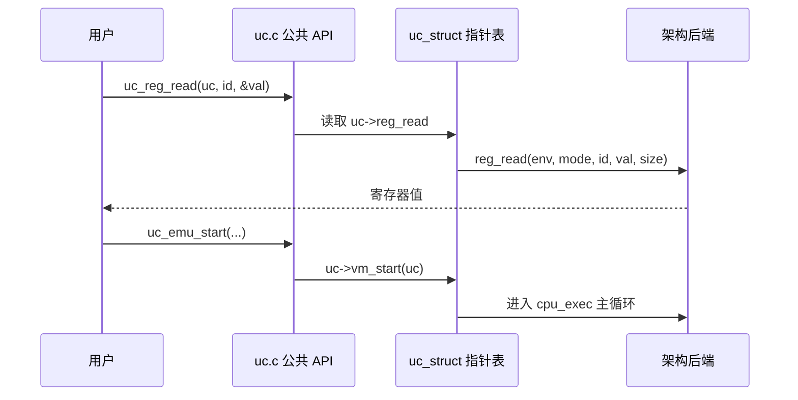
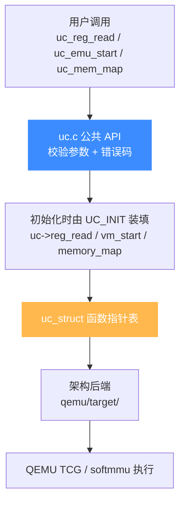

# uc.c 分发层

> 🔧 本页讲 [`uc.c`](https://github.com/android-security-engineer/unicorn-skills/blob/master/uc.c) 这个「公共 API 的心脏」如何工作：`uc_open()` 根据 `arch` 选定一个 `uc_init_<arch>` 函数，之后所有 API 都通过 `uc_struct` 里的函数指针转调后端。读完你会明白为什么 Unicorn 能用一套 API 支持十来种架构。

## 🎯 uc_open 做的第一件事：选后端

`uc_open()`（[uc.c:310](https://github.com/android-security-engineer/unicorn-skills/blob/master/uc.c#L310)）分配 `uc_struct`，校验 `mode` 合法性，然后在一个 `switch (arch)` 里把 `uc->init_arch` 指向对应架构的初始化函数。这是**唯一**一次按架构分支的地方——之后运行时不再有 `switch (arch)`。

```c
// uc.c:310 uc_open()
switch (arch) {
#ifdef UNICORN_HAS_X86
case UC_ARCH_X86:
    if ((mode & ~UC_MODE_X86_MASK) || (mode & UC_MODE_BIG_ENDIAN) ||
        !(mode & (UC_MODE_16 | UC_MODE_32 | UC_MODE_64))) {
        free(uc);
        return UC_ERR_MODE;
    }
    uc->init_arch = uc_init_x86_64;
    break;
#endif
#ifdef UNICORN_HAS_ARM64
case UC_ARCH_ARM64:
    if (mode & ~UC_MODE_ARM_MASK) { free(uc); return UC_ERR_MODE; }
    uc->init_arch = uc_init_aarch64;
    break;
#endif
    // ... m68k / arm / mips / sparc / ppc / riscv / s390x / tricore
}
if (uc->init_arch == NULL) {
    free(uc);
    return UC_ERR_ARCH;
}
```

::: tip 每个分支都有 `#ifdef UNICORN_HAS_*`
这些宏由 CMake 根据 `UNICORN_ARCH` 定义（见 [CMake 构建系统](/internals/build-system)）。没编进来的架构，其 `case` 与 `uc_init_*` 符号根本不存在——所以 `uc_open` 会返回 `UC_ERR_ARCH`。
:::

## 🗺️ 从 arch 到后端函数指针

同一个 `UC_ARCH` 可能对应多个 `uc_init_*`，由 `mode` 进一步区分。真实映射：

| arch | mode 条件 | init_arch |
| --- | --- | --- |
| `UC_ARCH_X86` | 16/32/64 统一入口 | `uc_init_x86_64` |
| `UC_ARCH_ARM` | 含 `UC_MODE_THUMB` 时置 `uc->thumb=1` | `uc_init_arm` |
| `UC_ARCH_ARM64` | — | `uc_init_aarch64` |
| `UC_ARCH_MIPS` | 大端 32 / 大端 64 / 小端 32 / 小端 64 | `uc_init_mips` / `mips64` / `mipsel` / `mips64el` |
| `UC_ARCH_SPARC` | `UC_MODE_SPARC64` 与否 | `uc_init_sparc64` / `uc_init_sparc` |
| `UC_ARCH_PPC` | `UC_MODE_PPC64` 与否 | `uc_init_ppc64` / `uc_init_ppc` |
| `UC_ARCH_RISCV` | 32 / 64 | `uc_init_riscv32` / `uc_init_riscv64` |
| `UC_ARCH_S390X` | 大端 | `uc_init_s390x` |
| `UC_ARCH_M68K` / `UC_ARCH_TRICORE` | 单一 | `uc_init_m68k` / `uc_init_tricore` |

## 🔁 API 如何转调后端

选好 `init_arch` 后，真正填充函数指针发生在第一次 `UC_INIT(uc)`（[uc.c:247](https://github.com/android-security-engineer/unicorn-skills/blob/master/uc.c#L247) 定义的内部宏，调用 `uc_init_engine` → `uc->init_arch(uc)`）。此后，公共 API 只是「读字段并调用」。例如：



`uc_emu_start()`（[uc.c:1076](https://github.com/android-security-engineer/unicorn-skills/blob/master/uc.c#L1076)）的落点非常薄——写好起始 PC、设置 count/exit hook 后，直接 `uc->vm_start(uc)` 进入 QEMU 主循环。分发层本身不含任何 CPU 语义。

## 🧭 调用链全景

从用户调用到后端执行，整条链路只经过 `uc_struct` 函数指针一次转调：



::: tip 为什么分发层这么薄
Unicorn 把所有架构差异折叠进 `uc_struct` 的函数指针——分发层只做「参数校验 + 转调」，因此 `uc.c` 几乎不随架构增长。新增架构只动 `qemu/target/<arch>/` 与 `uc_open` 的一个 `case`，公共 API 零改动。这也是 [bindings/](/bindings/overview) 各语言能共享同一套 API 语义的根因。
:::

## 📂 相关源码

| 文件 | 角色 |
|------|------|
| [`uc.c`](https://github.com/android-security-engineer/unicorn-skills/blob/master/uc.c) | 公共 API 实现 + `uc_open`/`uc_emu_start` 分发 |
| [`include/uc_priv.h`](https://github.com/android-security-engineer/unicorn-skills/blob/master/include/uc_priv.h) | `uc_struct` 与函数指针 typedef |
| [`list.c`](https://github.com/android-security-engineer/unicorn-skills/blob/master/list.c) | 分发层用到的链表工具 |

## 相关页面

- [uc_struct 结构](/internals/uc-struct)
- [函数指针后端](/internals/function-pointers)
- [cpu-exec 执行循环](/internals/cpu-exec)
- [CMake 构建系统](/internals/build-system)
