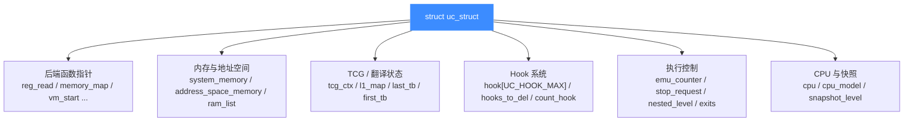

# struct uc_struct 结构

> 🧠 `struct uc_struct`（定义在 [`include/uc_priv.h`](https://github.com/android-security-engineer/unicorn-skills/blob/master/include/uc_priv.h#L272)，[L272](https://github.com/android-security-engineer/unicorn-skills/blob/master/include/uc_priv.h#L272)）是整个引擎的核心状态：它既是「一台虚拟 CPU + 内存 + Hook 系统」的全部运行时状态，又是一张后端函数指针表。读完你会认识它最关键的那些字段。

## 📌 它是什么

`uc_engine` 对外是不透明指针，对内就是 `struct uc_struct`。一个 [`uc_open()`](https://github.com/android-security-engineer/unicorn-skills/blob/master/uc.c#L310)（[uc.c:310](https://github.com/android-security-engineer/unicorn-skills/blob/master/uc.c#L310)）创建一个实例，`uc_close()` 销毁它。Unicorn 每个引擎**只有一个 CPU**（注释里写明 `only 1 cpu in unicorn`），因此不需要 `current_cpu` 之类的多核状态。

```c
// include/uc_priv.h（节选）
struct uc_struct {
    uc_arch arch;
    uc_mode mode;
    uc_err errnum;
    AddressSpace address_space_memory;
    // —— 后端函数指针 ——
    reg_read_t reg_read;
    reg_write_t reg_write;
    uc_args_uc_ram_size_t memory_map;
    uc_args_int_uc_t vm_start;
    uc_gen_tb_t uc_gen_tb;
    uc_set_tlb_t set_tlb;
    // —— 运行时状态 ——
    CPUState *cpu;
    struct list hook[UC_HOOK_MAX];
    size_t emu_counter;
    uint64_t next_pc;
    // ... 还有很多
};
```

## 🗂️ 字段结构总览



## 🔑 关键字段速查

| 字段 | 类型 | 用途 |
| --- | --- | --- |
| `arch` / `mode` | `uc_arch` / `uc_mode` | 当前架构与模式 |
| `reg_read` / `reg_write` | 函数指针 | 寄存器读写后端（见 [函数指针](/internals/function-pointers)） |
| `init_arch` | `uc_args_uc_t` | 由 `uc_open` 选定的后端初始化入口 |
| `vm_start` | `uc_args_int_uc_t` | 进入 QEMU 主循环 |
| `uc_gen_tb` / `uc_invalidate_tb` / `tb_flush` | 函数指针 | 翻译块生成 / 失效 / 全清 |
| `set_tlb` | `uc_set_tlb_t` | 切换 TLB 模式（CPU / VIRTUAL） |
| `cpu` | `CPUState *` | 唯一的虚拟 CPU |
| `system_memory` | `MemoryRegion *` | 根内存区域 |
| `address_space_memory` | `AddressSpace` | 主地址空间 |
| `tcg_ctx` | `TCGContext *` | TCG 代码生成上下文 |
| `l1_map` / `v_l1_size` | 指针 / 计数 | 虚拟地址页表（`translate-all.c` 用） |
| `hook[UC_HOOK_MAX]` | `struct list[]` | 每种 Hook 类型一条链表 |
| `hooks_to_del` | `struct list` | 延迟删除的 Hook（避免遍历中释放） |
| `count_hook` | `uc_hook` | 用于 `count` 限制的指令计数 Hook |
| `emu_counter` / `emu_count` | `size_t` | 已执行 / 目标指令数 |
| `stop_request` | `bool` | `uc_emu_stop()` 请求立刻停止 |
| `quit_request` | `bool` | 退出当前 TB 但继续模拟（`uc_mem_protect`） |
| `nested_level` / `jmp_bufs[]` | `int` / `sigjmp_buf[]` | 支持嵌套 `uc_emu_start` |
| `exits[]` / `ctl_exits` | 数组 / `GTree` | `until` 停止地址集合 |
| `first_tb` | `bool` | 是否本次 `uc_emu_start` 后第一个 TB |
| `last_tb` | `TranslationBlock *` | 真正执行过的最后一个 TB |
| `invalid_addr` / `invalid_error` | `uint64_t` / `int` | 触发异常的地址与类型 |
| `snapshot_level` | `int32_t` | 当前内存快照层级（COW 用） |
| `next_pc` | `uint64_t` | 某些特殊情形下保存的下一个 PC |

::: warning 嵌套 emu_start
`jmp_bufs[UC_MAX_NESTED_LEVEL]` 与 `nested_level` 一起支持在 Hook 回调里再次调用 `uc_emu_start()`。`UC_MAX_NESTED_LEVEL` 为 64，超过返回 `UC_ERR_RESOURCE`。
:::

## 🧷 uc_context：可分离的快照壳

[`struct uc_context`](https://github.com/android-security-engineer/unicorn-skills/blob/master/include/uc_priv.h#L438)（同文件 [L438](https://github.com/android-security-engineer/unicorn-skills/blob/master/include/uc_priv.h#L438)）是 `uc_context_save/restore` 用的变长结构，尾部 `char data[0]` 承载真实的 CPU 上下文，另存 `mode`、`arch`、`snapshot_level`、`fv`（当前 FlatView）等。

## 📂 相关源码

| 文件 | 角色 |
|------|------|
| [`include/uc_priv.h`](https://github.com/android-security-engineer/unicorn-skills/blob/master/include/uc_priv.h) | `struct uc_struct` / `struct uc_context` 与函数指针 typedef 定义 |
| [`uc.c`](https://github.com/android-security-engineer/unicorn-skills/blob/master/uc.c) | `uc_open` / `uc_close` 等公共 API，操作该结构 |
| [`qemu/softmmu/memory.c`](https://github.com/android-security-engineer/unicorn-skills/blob/master/qemu/softmmu/memory.c) | 维护 `system_memory` / `address_space_memory` 等内存字段 |
| [`qemu/accel/tcg/cpu-exec.c`](https://github.com/android-security-engineer/unicorn-skills/blob/master/qemu/accel/tcg/cpu-exec.c) | 主循环读写 `emu_counter` / `stop_request` / `jmp_bufs` 等执行控制字段 |

## 相关页面

- [函数指针后端](/internals/function-pointers)
- [uc.c 分发层](/internals/uc-dispatch)
- [Hook 体系](/features/hooks)
- [快照与 COW 实现](/internals/snapshot-impl)
