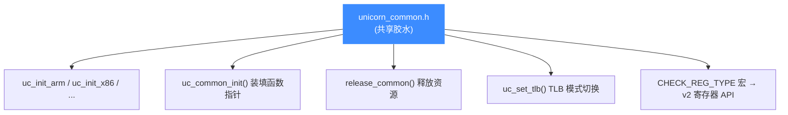
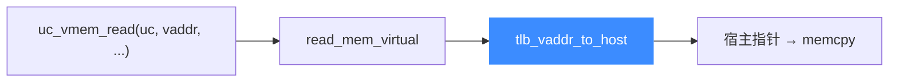

# unicorn_common.h — 架构共享胶水层

> 🧠 `qemu/unicorn_common.h` 是被所有架构后端 `#include` 的共享头文件。它把分散在 QEMU 各处的初始化、访存、TLB、资源释放逻辑收拢成一组通用函数与内联，再由各 target 的 `uc_init_<arch>` 调用，避免在 10 份后端代码里重复同样的样板。本页讲它装填了哪些 `uc_struct` 函数指针、以及 v2 寄存器 API 背后的 `CHECK_REG_TYPE` 宏。

## 📌 它解决什么问题

QEMU 是按 target 组织的，每个架构后端都要做同一套「装填函数指针 + 释放资源 + 桥接物理/虚拟内存」的事。若每份后端各写一遍，重复且易漏。`unicorn_common.h` 把这套公共逻辑抽成内联/静态函数，各后端 `#include` 即用：



## 🔧 uc_common_init — 装填函数指针

这是头文件的核心。各后端在 `uc_init_<arch>` 末尾调用它，把一组统一的后端实现写入 [uc_struct](/internals/uc-struct)：

| `uc_struct` 字段 | 被装填为 | 作用 |
|------------------|---------|------|
| `write_mem` / `read_mem` | `cpu_physical_mem_write/read` | 物理地址读写（`uc_mem_*` 后端） |
| `read_mem_virtual` | `cpu_virtual_mem_read` | 虚拟地址读（`uc_vmem_read` 后端） |
| `virtual_to_physical` | `cpu_virtual_to_physical` | 地址翻译（`uc_vmem_translate` 后端） |
| `set_tlb` | `uc_set_tlb` | TLB 模式切换 |
| `memory_map` / `memory_map_ptr` / `memory_unmap` | `memory_map*` 系列 | 内存映射后端 |
| `release` | `release_common` | 引擎关闭时释放 |

::: tip 这是「函数指针后端」模式的落地
[uc.c 分发层](/internals/uc-dispatch) 的架构无关 API 之所以能工作，正是因为 `uc_common_init` 在引擎初始化时把这些后端函数统一装填好。详见 [函数指针后端](/internals/function-pointers)。
:::

## 🧠 虚拟内存桥接

`cpu_virtual_mem_read` / `cpu_virtual_to_physical` 是 [uc_vmem_read](/api/vmem-read) / [uc_vmem_translate](/api/vmem-translate) 的后端实现，它们通过 `tlb_vaddr_to_host` / `tlb_vaddr_to_paddr` 走 softmmu 完成翻译：



注意 `cpu_virtual_mem_read` 内有断言：**访问必须页对齐**（不跨页），因为 `tlb_fill()` 可能在中途改变映射。

## 🔧 uc_set_tlb — TLB 模式切换

[uc_ctl_tlb_mode](/ctl/tlb-mode) 的后端。两种模式区别在于把 `cpu->cc->tlb_fill` 指向谁：

| 模式 | `tlb_fill` 指向 | 行为 |
|------|----------------|------|
| `UC_TLB_VIRTUAL` | `unicorn_fill_tlb` | 简单模式，`vaddr = paddr` |
| `UC_TLB_CPU` | `cpu->cc->tlb_fill_cpu` | 走真实 CPU MMU 页表 |

## 🧪 CHECK_REG_TYPE — v2 寄存器 API 的宽度回传

[uc_reg_read2](/api/reg-read2) 等 v2 变体函数能「按缓冲容量截断并回传真实宽度」，靠的就是这个宏：

```c
#define CHECK_REG_TYPE(type) do {
    if (unlikely(*size < sizeof(type)))   // 缓冲不够 → 截断
        return UC_ERR_OVERFLOW;
    *size = sizeof(type);                 // 回传真实宽度
    ret = UC_ERR_OK;
} while (0)
```

各架构后端在寄存器读写实现里，按寄存器类型展开该宏，完成「宽度校验 + 回传」的统一逻辑。详见 [寄存器读写](/features/registers)。

## 🧹 release_common — 资源释放

[uc_close](/api/close) 后端。它依次释放：断点/监视点、TCG 操作码表、TCG 内存池、helper 哈希表、TB 树、代码缓冲、地址空间。这些 QEMU 内部 API 在 `uc.c` 外部不可见，所以释放逻辑只能放在这份被后端共享的头里。

::: warning 不能随意拆分
`release_common` 引用的 `memory_free`、`address_space_destroy`、`tb_cleanup`、`qht_destroy` 都是 QEMU 内部符号，必须在 QEMU 编译单元内可见——这正是它放在共享头而非 `uc.c` 的原因。
:::

## 相关页面

- [uc_struct 结构](/internals/uc-struct)
- [函数指针后端](/internals/function-pointers)
- [uc.c 分发层](/internals/uc-dispatch)
- [softmmu 软件 MMU](/internals/softmmu)
- [TLB 与地址翻译](/internals/tlb)
- [uc_reg_read2 — 带宽度读寄存器](/api/reg-read2)
