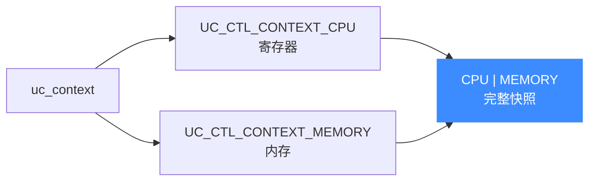
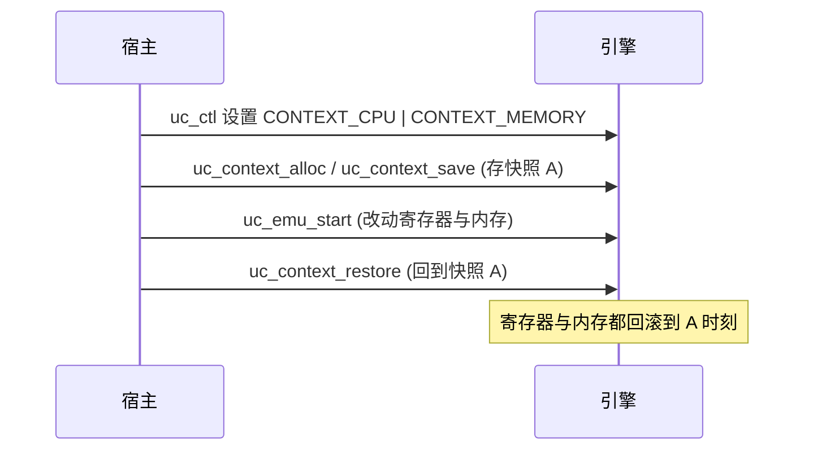

# 写时复制与内存快照

本页讲清如何用 `uc_context` 配合 `UC_CTL_CONTEXT_MEMORY` 把**内存状态**也纳入快照,从而实现"保存点—回滚"式的写时复制(COW)工作流。读完你能在仿真中打快照、回滚,不必每次从零重建内存。

## 🧠 上下文能存什么

`uc_context` 是引擎状态的可序列化快照。默认它只保存 **CPU 寄存器**;通过 `uc_ctl` 打开 `UC_CTL_CONTEXT_MEMORY`,还能把**内存**一并纳入:

```c
typedef enum uc_context_content {
    UC_CTL_CONTEXT_CPU    = 1,   // 默认:仅寄存器
    UC_CTL_CONTEXT_MEMORY = 2,   // 追加:内存状态
} uc_context_content;
```

两者可按位或组合以同时保存寄存器与内存:



## 🔄 快照 / 回滚流程



## 🔧 示例

```c
#include <unicorn/unicorn.h>

uc_engine *uc;
uc_open(UC_ARCH_X86, UC_MODE_64, &uc);
uc_mem_map(uc, 0x1000, 0x1000, UC_PROT_ALL);

// 1. 声明快照要同时包含寄存器和内存
uc_ctl_context_mode(uc, UC_CTL_CONTEXT_CPU | UC_CTL_CONTEXT_MEMORY);

// 2. 分配上下文并保存当前状态(快照 A)
uc_context *ctx;
uc_context_alloc(uc, &ctx);
uc_context_save(uc, ctx);

// 3. 运行,期间寄存器与内存都可能被改写
uc_emu_start(uc, 0x1000, 0x1000 + 4, 0, 0);

// 4. 回滚:寄存器与内存一并恢复到快照 A
uc_context_restore(uc, ctx);

uc_context_free(ctx);
uc_close(uc);
```

## 🧩 COW 的意义

把"保存快照 → 试探性执行 → 不满意就回滚"当作写时复制来用,非常适合:

- **模糊测试(fuzzing)**:每个测试用例前恢复到干净快照,免去重新映射与写入;
- **符号执行 / 路径分叉**:在分支点存档,分别探索各分支;
- **调试回退**:执行出错后回到上一个已知良好状态。

::: warning CONTEXT_MEMORY 绑定单个引擎
[`unicorn.h`](https://github.com/android-security-engineer/unicorn-skills/blob/master/include/unicorn/unicorn.h#L1116) 明确:`UC_CTL_CONTEXT_MEMORY` 会在上下文里保存指向**引擎内部分配内存的指针**,因此**不能把这种上下文用于另一个 unicorn 对象**。跨引擎迁移状态时只能用 `UC_CTL_CONTEXT_CPU`(纯寄存器)。
:::

::: tip 上下文需先分配再用
使用前必须 `uc_context_alloc` 分配,用完 `uc_context_free` 释放。`uc_context_save` / `uc_context_restore` 反复调用可复用同一个 `ctx`。
:::

## 📂 相关源码

| 文件 | 角色 |
|------|------|
| [`include/unicorn/unicorn.h`](https://github.com/android-security-engineer/unicorn-skills/blob/master/include/unicorn/unicorn.h#L1116) | `uc_context_content` 枚举（`UC_CTL_CONTEXT_CPU` / `UC_CTL_CONTEXT_MEMORY`） |
| [`uc.c`](https://github.com/android-security-engineer/unicorn-skills/blob/master/uc.c#L2277) | `uc_context_save` / `uc_context_restore` 含内存快照逻辑 |
| [`tests/benchmarks/cow/`](https://github.com/android-security-engineer/unicorn-skills/blob/master/tests/benchmarks/cow) | COW 快照性能基准 |

## 相关页面

- [快照机制](/features/snapshot) — 快照功能总览
- [上下文管理](/features/context) — `uc_context` 全貌
- [context-mode](/ctl/context-mode) — 设置 `CONTEXT_MEMORY`
- [主机侧读写](/memory/read-write) — 手动导出/导入内存
