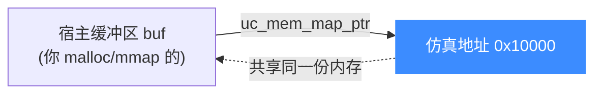
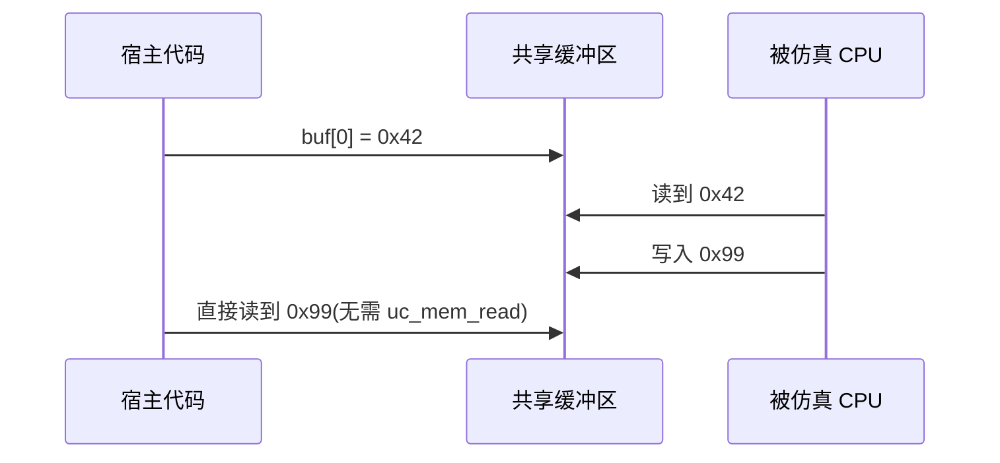

# 零拷贝映射:uc_mem_map_ptr

本页讲清 `uc_mem_map_ptr` 如何把仿真内存直接映射到**宿主进程已有的缓冲区**,实现零拷贝共享,以及由此带来的生命周期约束。读完你能高效地在宿主与仿真之间交换大块数据。

## ⚡ 零拷贝的意义

普通 [uc_mem_map](/memory/map) 由 Unicorn 自己分配内存,宿主想改写内容必须走 [uc_mem_write](/memory/read-write) 拷贝一遍。`uc_mem_map_ptr` 则让仿真内存**直接落在你提供的宿主指针上**,双方共享同一份物理内存,读写彼此立即可见,无需来回拷贝。



## 📥 函数签名

> 📄 声明：[`unicorn.h`](https://github.com/android-security-engineer/unicorn-skills/blob/master/include/unicorn/unicorn.h#L1166) · 实现：[`uc.c`](https://github.com/android-security-engineer/unicorn-skills/blob/master/uc.c#L1409)

```c
uc_err uc_mem_map_ptr(uc_engine *uc, uint64_t address, uint64_t size,
                      uint32_t perms, void *ptr);
```

| 参数 | 说明 |
|------|------|
| `address` | 仿真侧起始地址,**必须 4KB 对齐** |
| `size` | 区域大小,**必须是 4KB 的整数倍** |
| `perms` | [UC_PROT_* 权限位](/memory/permissions) 组合 |
| `ptr` | 宿主内存指针,**须 ≥ size 字节,且至少可读可写**(`PROT_READ \| PROT_WRITE`) |

对齐、重叠检测规则与 `uc_mem_map` 完全一致:未对齐 → `UC_ERR_ARG`,重叠 → `UC_ERR_MAP`。

::: danger 宿主缓冲区必须足够大且可读写
`ptr` 指向的宿主内存必须**不小于 `size`**,且已以至少 `PROT_READ | PROT_WRITE` 映射。否则行为**未定义**(可能段错误或数据损坏)。
:::

## 🔗 数据双向可见



## 🔧 示例

```c
#include <unicorn/unicorn.h>

uc_engine *uc;
uc_open(UC_ARCH_X86, UC_MODE_32, &uc);

// 宿主分配一页,并预填内容
uint8_t *shared = calloc(1, 0x1000);
shared[0] = 0x90;  // nop
shared[1] = 0xf4;  // hlt

// 把这块宿主内存直接映射到仿真地址 0x10000
uc_err err = uc_mem_map_ptr(uc, 0x10000, 0x1000,
                            UC_PROT_ALL, shared);
if (err != UC_ERR_OK) {
    printf("map_ptr 失败: %s\n", uc_strerror(err));
}

// 无需 uc_mem_write,CPU 直接执行 shared 里的机器码
uc_emu_start(uc, 0x10000, 0x10002, 0, 0);

// 仿真结束后,CPU 对该区域的任何写入都已反映在 shared 上
uc_close(uc);
free(shared);   // ⚠️ 必须在引擎不再使用后才释放
```

## ⏳ 生命周期约束

::: warning 谁分配谁释放,顺序不能错
- 宿主缓冲区由**你自己**分配和释放,Unicorn 不接管所有权。
- 缓冲区必须在**引擎使用该映射的整个期间**保持有效。
- 正确顺序:先 [uc_mem_unmap](/memory/unmap) 或 `uc_close`,**再** `free(ptr)`。反过来则引擎会访问已释放内存 → 悬垂指针。
:::

适合的场景:加载大固件镜像、与仿真共享一大块工作缓冲、把仿真内存内容直接交给宿主的其它库处理(如反汇编、哈希)。

## 📂 相关源码

| 文件 | 角色 |
|------|------|
| [`include/unicorn/unicorn.h`](https://github.com/android-security-engineer/unicorn-skills/blob/master/include/unicorn/unicorn.h#L1166) | `uc_mem_map_ptr` 声明 |
| [`uc.c`](https://github.com/android-security-engineer/unicorn-skills/blob/master/uc.c#L1409) | `uc_mem_map_ptr` 实现（挂载宿主指针为零拷贝内存） |
| [`qemu/softmmu/memory.c`](https://github.com/android-security-engineer/unicorn-skills/blob/master/qemu/softmmu/memory.c) | 后备内存 dispatch |

## 相关页面

- [uc_mem_map_ptr API 参考](/api/mem-map-ptr)
- [映射内存](/memory/map) — 普通 `uc_mem_map`
- [主机侧读写](/memory/read-write) — `uc_mem_read/write` 拷贝方式
- [解除映射](/memory/unmap) — 释放前的正确顺序
