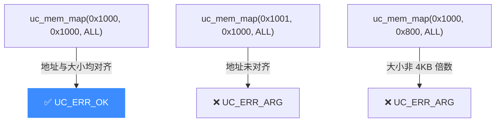
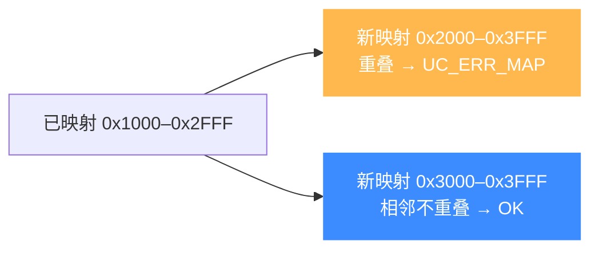

# 映射内存:uc_mem_map

本页详解 `uc_mem_map` 的对齐要求、重叠检测与常见错误。读完你能正确地为仿真代码"开辟"可用的物理内存。

## 📥 函数签名

> 📄 声明：[`unicorn.h`](https://github.com/android-security-engineer/unicorn-skills/blob/master/include/unicorn/unicorn.h#L1140) · 实现：[`uc.c`](https://github.com/android-security-engineer/unicorn-skills/blob/master/uc.c#L1390)

```c
uc_err uc_mem_map(uc_engine *uc, uint64_t address, uint64_t size,
                  uint32_t perms);
```

| 参数 | 说明 |
|------|------|
| `uc` | `uc_open()` 返回的引擎句柄 |
| `address` | 新区域起始地址,**必须 4KB 对齐** |
| `size` | 区域大小,**必须是 4KB 的整数倍** |
| `perms` | [UC_PROT_* 权限位](/memory/permissions) 组合 |

返回 `UC_ERR_OK` 表示成功;参数非法返回 `UC_ERR_ARG`;与已有映射重叠返回 `UC_ERR_MAP`。

## 📐 对齐规则

`address` 与 `size` 都必须对齐到页大小(默认 `0x1000`):



::: tip 页大小可能不是 4KB
部分架构可用 [uc_ctl_set_page_size](/memory/page-size) 调整页大小。此时对齐基准随之改变。默认所有架构均为 4KB。
:::

## 🚫 重叠检测

Unicorn **不允许**两块映射区域地址重叠。若新区域与任一已存在区域(含 `uc_mem_map_ptr`、`uc_mmio_map` 建立的)相交,`uc_mem_map` 返回 `UC_ERR_MAP`。



相邻但不相交(如 `0x2FFF` 结束、`0x3000` 开始)是允许的,它们仍是**两块独立区域**,不会自动合并。

## 🔧 示例

```c
uc_engine *uc;
uc_open(UC_ARCH_X86, UC_MODE_32, &uc);

// 映射 12KB,读+执行(代码段)
uc_err err = uc_mem_map(uc, 0x100000, 0x3000, UC_PROT_READ | UC_PROT_EXEC);
if (err != UC_ERR_OK) {
    printf("映射失败: %s\n", uc_strerror(err));
}

// 再映射一块 4KB 数据段,不与上面重叠
uc_mem_map(uc, 0x200000, 0x1000, UC_PROT_READ | UC_PROT_WRITE);

// 写入机器码(宿主侧,不触发 Hook,也不受权限限制)
uint8_t code[] = { 0x90, 0xf4 };  // nop; hlt
uc_mem_write(uc, 0x100000, code, sizeof(code));
```

## 🧠 映射的是物理地址

无论 MMU 是否启用,`uc_mem_map` 的 `address` 始终是**物理地址**。启用真实 MMU 时,被仿真代码用的是虚拟地址,需页表把 vaddr 翻译到你映射的物理地址。详见 [内存模型总览](/memory/overview) 与 [MMU](/features/mmu)。

::: warning 忘记映射代码段
最常见的错误:`uc_emu_start(begin, ...)` 时 `begin` 所在页未映射 → 取指失败,触发 `UC_MEM_FETCH_UNMAPPED`,仿真以 `UC_ERR_FETCH_UNMAPPED` 退出。开始仿真前务必确认代码、栈、数据区都已映射。
:::

## 📂 相关源码

| 文件 | 角色 |
|------|------|
| [`include/unicorn/unicorn.h`](https://github.com/android-security-engineer/unicorn-skills/blob/master/include/unicorn/unicorn.h#L1140) | `uc_mem_map` 声明 |
| [`uc.c`](https://github.com/android-security-engineer/unicorn-skills/blob/master/uc.c#L1390) | `uc_mem_map` 实现（对齐校验、重叠检测） |
| [`qemu/softmmu/memory.c`](https://github.com/android-security-engineer/unicorn-skills/blob/master/qemu/softmmu/memory.c) | 物理内存区域注册与 dispatch |

## 相关页面

- [uc_mem_map API 参考](/api/mem-map)
- [零拷贝映射](/memory/map-ptr) — `uc_mem_map_ptr`
- [权限位](/memory/permissions) — `perms` 取值
- [解除映射](/memory/unmap) — `uc_mem_unmap`
