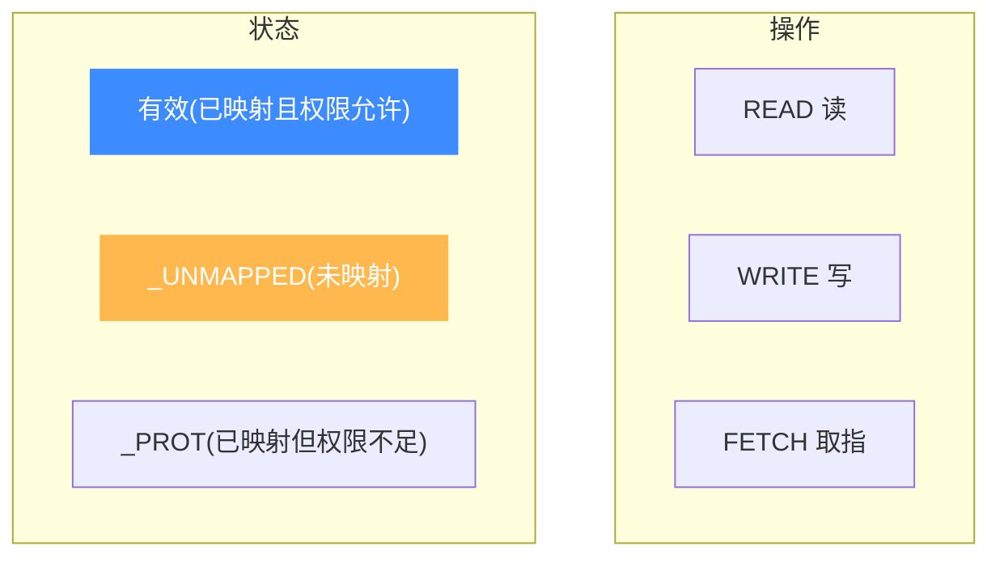
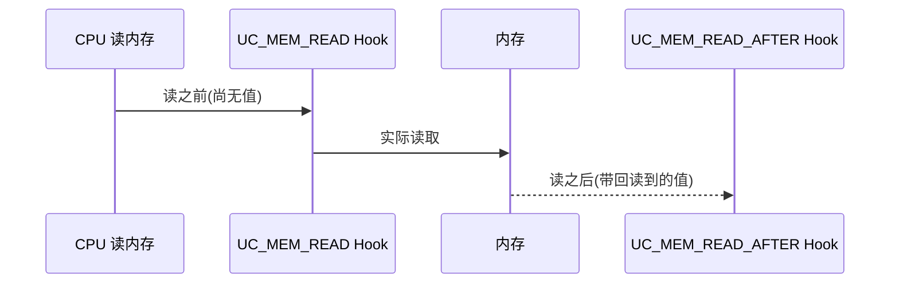

# 内存访问类型:UC_MEM_*

本页讲清 `uc_mem_type` 枚举——它作为内存 Hook 回调的 `type` 参数,告诉你这次访存是**读/写/取指**,以及是否命中了**未映射**或**受保护**内存。读完你能在一个 Hook 里精确分辨各类内存事件。

## 🧩 枚举全表

定义在 [`include/unicorn/unicorn.h`](https://github.com/android-security-engineer/unicorn-skills/blob/master/include/unicorn/unicorn.h#L266),值从 16 起:

```c
typedef enum uc_mem_type {
    UC_MEM_READ = 16,      // 读取内存(成功前)
    UC_MEM_WRITE,          // 写入内存
    UC_MEM_FETCH,          // 取指(执行)
    UC_MEM_READ_UNMAPPED,  // 读未映射内存
    UC_MEM_WRITE_UNMAPPED, // 写未映射内存
    UC_MEM_FETCH_UNMAPPED, // 取指未映射内存
    UC_MEM_WRITE_PROT,     // 写受保护(只读)但已映射的内存
    UC_MEM_READ_PROT,      // 读受保护(不可读)但已映射的内存
    UC_MEM_FETCH_PROT,     // 取指不可执行但已映射的内存
    UC_MEM_READ_AFTER,     // 读取成功之后(拿到实际读到的值)
} uc_mem_type;
```

| 类型 | 值 | 场景 | 结果 |
|------|----|------|------|
| `UC_MEM_READ` | 16 | 正常读,访存**前** | 有效访问 |
| `UC_MEM_WRITE` | 17 | 正常写 | 有效访问 |
| `UC_MEM_FETCH` | 18 | 正常取指 | 有效访问 |
| `UC_MEM_READ_UNMAPPED` | 19 | 读未映射地址 | 失效访问 |
| `UC_MEM_WRITE_UNMAPPED` | 20 | 写未映射地址 | 失效访问 |
| `UC_MEM_FETCH_UNMAPPED` | 21 | 取指未映射地址 | 失效访问 |
| `UC_MEM_WRITE_PROT` | 22 | 写只读页 | 权限违例 |
| `UC_MEM_READ_PROT` | 23 | 读不可读页 | 权限违例 |
| `UC_MEM_FETCH_PROT` | 24 | 执行不可执行页 | 权限违例 |
| `UC_MEM_READ_AFTER` | 25 | 读成功**后**,可拿到值 | 有效访问 |

## 🗂️ 三个维度

每个类型由"**操作 × 状态**"两维度构成:



- **有效访问** → `UC_MEM_READ` / `WRITE` / `FETCH`(及 `READ_AFTER`),由 `UC_HOOK_MEM_VALID` 系列捕获;
- **失效访问** → `*_UNMAPPED` / `*_PROT`,由 `UC_HOOK_MEM_INVALID` 系列捕获。

## 🪝 READ vs READ_AFTER

`UC_MEM_READ` 在读取**发生前**触发,此时值尚未取出;`UC_MEM_READ_AFTER` 在读取**成功后**触发,回调能拿到**实际读到的值**。需要观测被读数据时用后者。



## 🔧 在 Hook 中分辨类型

失效访问回调(取自 `samples/mem_apis.c`):

```c
static bool hook_mem_invalid(uc_engine *uc, uc_mem_type type, uint64_t addr,
                             int size, int64_t value, void *user_data)
{
    switch (type) {
    case UC_MEM_READ_UNMAPPED:
        printf("读未映射内存 0x%" PRIx64 "\n", addr);
        return false;   // 不修复 → 报错退出
    case UC_MEM_WRITE_UNMAPPED:
        printf("写未映射内存 0x%" PRIx64 " 值=0x%" PRIx64 "\n", addr, value);
        return false;
    case UC_MEM_FETCH_PROT:
        printf("执行不可执行内存 0x%" PRIx64 "\n", addr);
        return false;
    default:
        return false;
    }
}
```

::: tip 回调返回值决定后续
对 `*_UNMAPPED` / `*_PROT`,Hook 返回 `true` 表示"已处理,继续"(如动态补映射后重试);返回 `false` 表示放弃,`uc_emu_start` 以对应错误码退出。
:::

::: warning value 仅对写/读后有意义
回调的 `value` 参数:写类事件里是**将写入的值**,`READ_AFTER` 里是**读到的值**;读之前(`UC_MEM_READ`)和取指事件里其内容无意义。
:::

## 📂 相关源码

| 文件 | 角色 |
|------|------|
| [`include/unicorn/unicorn.h`](https://github.com/android-security-engineer/unicorn-skills/blob/master/include/unicorn/unicorn.h#L266) | `uc_mem_type` 枚举（`UC_MEM_READ` / `UC_MEM_WRITE_UNMAPPED` 等） |
| [`uc.c`](https://github.com/android-security-engineer/unicorn-skills/blob/master/uc.c#L1908) | `uc_hook_add` 注册 `UC_HOOK_MEM_*` 回调时传入 `type` |
| [`qemu/softmmu/memory.c`](https://github.com/android-security-engineer/unicorn-skills/blob/master/qemu/softmmu/memory.c) | 访存事件分类与回调触发 |

## 相关页面

- [内存 Hook 体系](/hooks/) — 注册与分发
- [权限位](/memory/permissions) — `*_PROT` 的来源
- [解除映射](/memory/unmap) — `*_UNMAPPED` 的来源
- [内存模型总览](/memory/overview) — 有效/失效访问全景
