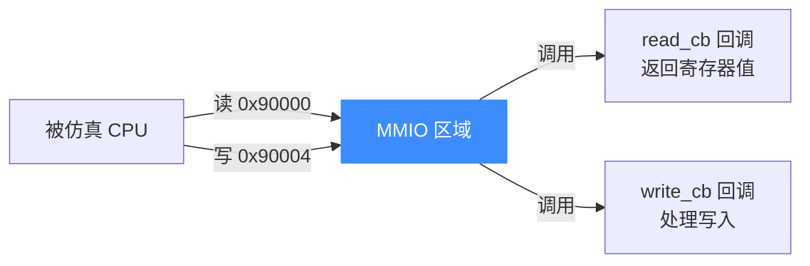
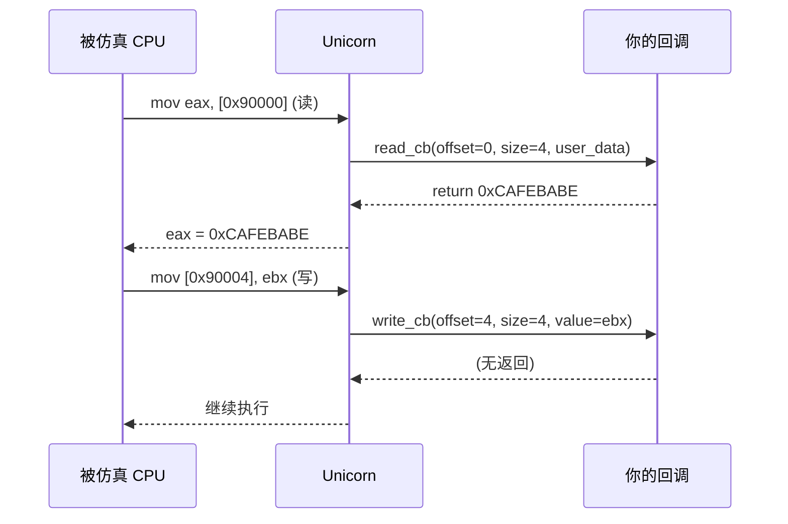

# MMIO:内存映射 IO

本页讲清 `uc_mmio_map` 如何把一段地址范围变成**由回调驱动的外设**:对该范围的读写不落到真实内存,而是转交你的 read/write 回调处理。读完你能用它模拟设备寄存器、内存映射的硬件。

## 🔧 什么是 MMIO

真实系统中,外设寄存器常被映射进物理地址空间——CPU 读写某地址,实际是在和硬件通信。Unicorn 用 `uc_mmio_map` 复现这一机制:该区域**没有后备内存**,每次访问都调用你的回调。



## 📥 函数签名

> 📄 声明：[`unicorn.h`](https://github.com/android-security-engineer/unicorn-skills/blob/master/include/unicorn/unicorn.h#L1189) · 实现：[`uc.c`](https://github.com/android-security-engineer/unicorn-skills/blob/master/uc.c#L1433)

```c
uc_err uc_mmio_map(uc_engine *uc, uint64_t address, uint64_t size,
                   uc_cb_mmio_read_t read_cb,  void *user_data_read,
                   uc_cb_mmio_write_t write_cb, void *user_data_write);
```

| 参数 | 说明 |
|------|------|
| `address` | MMIO 区域起始,**必须 4KB 对齐** |
| `size` | 大小,**必须是 4KB 的整数倍** |
| `read_cb` | 处理读的回调;传 `NULL` 表示只写 |
| `user_data_read` | 传给 `read_cb` 的用户数据 |
| `write_cb` | 处理写的回调;传 `NULL` 表示只读 |
| `user_data_write` | 传给 `write_cb` 的用户数据 |

## 🪝 回调原型

```c
// 读回调:返回读到的值
typedef uint64_t (*uc_cb_mmio_read_t)(uc_engine *uc, uint64_t offset,
                                      unsigned size, void *user_data);

// 写回调:处理写入的值
typedef void (*uc_cb_mmio_write_t)(uc_engine *uc, uint64_t offset,
                                   unsigned size, uint64_t value,
                                   void *user_data);
```

::: tip offset 是相对基址的偏移
回调收到的 `offset` 是**相对 MMIO 区域起始地址**的偏移,而非绝对地址。`size` 是本次访问的宽度(1/2/4/8 字节)。据此可区分不同寄存器。
:::

## 🔁 一次 MMIO 访问的时序



## 🔧 示例:模拟一个设备寄存器

```c
#include <unicorn/unicorn.h>

// 设备状态寄存器
static uint32_t dev_status = 0xCAFEBABE;

static uint64_t mmio_read(uc_engine *uc, uint64_t offset,
                          unsigned size, void *user_data)
{
    printf("MMIO 读 offset=0x%" PRIx64 " size=%u\n", offset, size);
    if (offset == 0x0) {
        return dev_status;       // 0x90000: 状态寄存器
    }
    return 0;
}

static void mmio_write(uc_engine *uc, uint64_t offset,
                       unsigned size, uint64_t value, void *user_data)
{
    printf("MMIO 写 offset=0x%" PRIx64 " value=0x%" PRIx64 "\n",
           offset, value);
    if (offset == 0x4) {
        dev_status = (uint32_t)value;   // 0x90004: 控制寄存器
    }
}

int main(void)
{
    uc_engine *uc;
    uc_open(UC_ARCH_X86, UC_MODE_32, &uc);

    // 把 0x90000 起 4KB 变成 MMIO 外设
    uc_mmio_map(uc, 0x90000, 0x1000,
                mmio_read, NULL,
                mmio_write, NULL);

    // ... 映射代码段并执行,CPU 访问 0x90000 会调回上面的回调
    uc_close(uc);
    return 0;
}
```

::: warning MMIO 区域不能重叠普通映射
`uc_mmio_map` 与 [uc_mem_map](/memory/map) 共享同一地址空间,区域**不可重叠**,否则返回 `UC_ERR_MAP`。MMIO 区域没有真实后备内存,[uc_mem_read](/memory/read-write) 直接读它的行为依实现而定——数据应通过回调交互。
:::

## 📂 相关源码

| 文件 | 角色 |
|------|------|
| [`include/unicorn/unicorn.h`](https://github.com/android-security-engineer/unicorn-skills/blob/master/include/unicorn/unicorn.h#L1189) | `uc_mmio_map` 声明、`uc_cb_mmio_read_t` / `uc_cb_mmio_write_t` 回调签名 |
| [`uc.c`](https://github.com/android-security-engineer/unicorn-skills/blob/master/uc.c#L1433) | `uc_mmio_map` 实现（注册 MMIO 区域与回调） |
| [`qemu/softmmu/memory.c`](https://github.com/android-security-engineer/unicorn-skills/blob/master/qemu/softmmu/memory.c) | MMIO 区域 dispatch 到回调 |

## 相关页面

- [uc_mmio_map API 参考](/api/mmio-map)
- [映射内存](/memory/map) — 普通内存映射
- [主机侧读写](/memory/read-write) — 与 MMIO 的区别
- [内存 Hook](/hooks/) — 另一种拦截访存的方式
