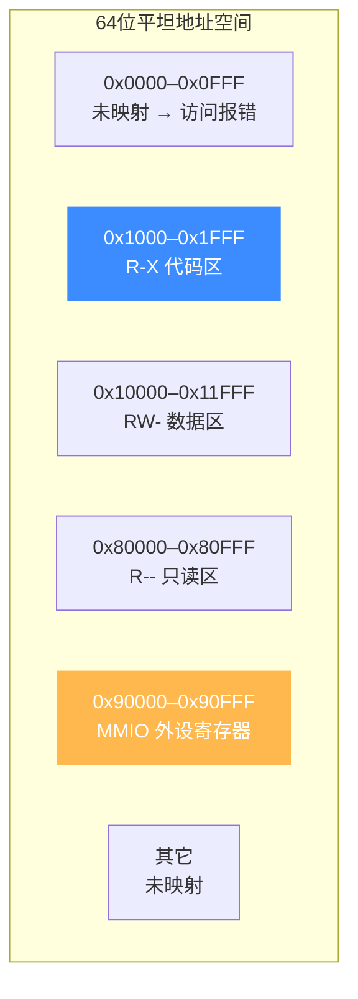
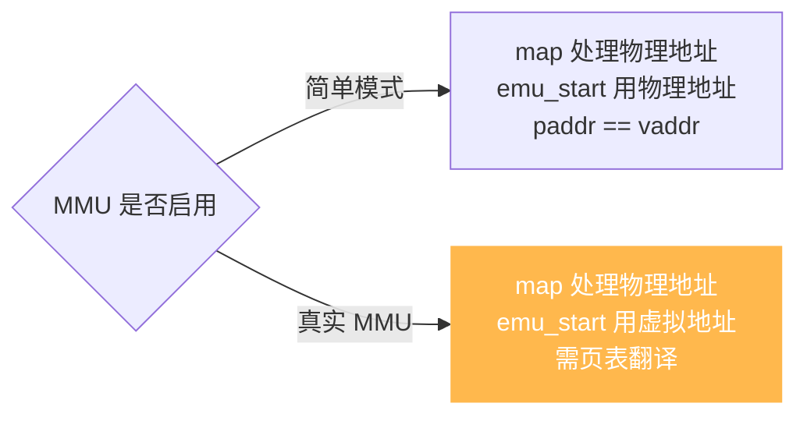

# 内存模型总览

本页讲清 Unicorn 内存的底层模型:它是一组**映射区域(MemoryRegion)**的集合,每块都页对齐、带保护位,并区分**物理地址**与**虚拟地址**。读完你能建立起本区各页的整体图景。

## 🧠 核心心智模型

Unicorn 模拟的是一块**裸芯片的物理内存**:64 位地址空间默认是**空的**,任何访问都会报错。你必须用 [uc_mem_map](/api/mem-map) 一块块把内存"焊"上去。每一次映射产生一个 `uc_mem_region` 结构(见 [`unicorn.h`](https://github.com/android-security-engineer/unicorn-skills/blob/master/include/unicorn/unicorn.h#L487)),记录起止地址与权限:

```c
typedef struct uc_mem_region {
    uint64_t begin; // 区域起始地址(含)
    uint64_t end;   // 区域结束地址(含)
    uint32_t perms; // UC_PROT_* 权限位
} uc_mem_region;
```

多块区域拼起来,构成了仿真进程"能看到"的全部内存。



## 📐 三条铁律

| 约束 | 说明 | 违反后果 |
|------|------|----------|
| **页对齐** | `address` 与 `size` 必须是页大小(默认 4KB=`0x1000`)的整数倍 | 返回 `UC_ERR_ARG` |
| **必须先映射** | 未映射地址无法读写/执行 | 触发 `*_UNMAPPED` Hook |
| **权限受控** | 访问超出 `UC_PROT_*` 的操作被拒 | 触发 `*_PROT` Hook |

## 🗺️ 物理 vs 虚拟地址

这是 Unicorn 2.x 最容易踩的坑。是否启用 MMU 决定了 `uc_mem_map` 和 `uc_emu_start` 用的是哪种地址:



真实 MMU 下,`uc_mem_map` 映射的永远是**物理地址**,而被仿真代码看到的是**虚拟地址**,两者需经页表翻译。详见 [MMU 与虚拟内存](/features/mmu) 与内部实现 [Soft-MMU](/internals/softmmu)。

## 📌 本区导航

| 页面 | 主题 |
|------|------|
| [权限位](/memory/permissions) | `UC_PROT_*` 组合、W^X、权限违例 |
| [映射内存](/memory/map) | `uc_mem_map` 对齐与重叠检测 |
| [零拷贝映射](/memory/map-ptr) | `uc_mem_map_ptr` 与宿主共享内存 |
| [解除映射](/memory/unmap) | `uc_mem_unmap` 与区域切割 |
| [运行期改权限](/memory/protect) | `uc_mem_protect` |
| [枚举映射](/memory/regions) | `uc_mem_regions` |
| [MMIO](/memory/mmio) | 内存映射 IO,模拟外设 |
| [主机侧读写](/memory/read-write) | `uc_mem_read/write` vs CPU 访存 |
| [访问类型](/memory/mem-types) | `UC_MEM_*` 在 Hook 中的含义 |
| [页大小](/memory/page-size) | 默认 4KB 与可调架构 |
| [写时复制与快照](/memory/cow-snapshot) | `uc_context` + 内存快照 |
| [未对齐访问](/memory/unaligned) | `*_UNALIGNED` 错误 |

## 🔧 最小示例

```c
uc_engine *uc;
uc_open(UC_ARCH_X86, UC_MODE_32, &uc);

// 映射 12KB 可读可写可执行的物理内存
uc_mem_map(uc, 0x100000, 0x3000, UC_PROT_ALL);

// 宿主侧写入机器码(不触发 Hook)
uint8_t code[] = { 0x90, 0xf4 };  // nop; hlt
uc_mem_write(uc, 0x100000, code, sizeof(code));

// 从物理地址 0x100000 开始执行
uc_emu_start(uc, 0x100000, 0x100000 + sizeof(code), 0, 0);
uc_close(uc);
```

::: warning 内存不会自动回收
`uc_close` 会释放引擎持有的所有内存映射;但在引擎存活期间,映射一直占用,直到你显式 [uc_mem_unmap](/memory/unmap)。栈、堆等区域 Unicorn **都不预置**,需自己映射。
:::

## 📂 相关源码

| 文件 | 角色 |
|------|------|
| [`include/unicorn/unicorn.h`](https://github.com/android-security-engineer/unicorn-skills/blob/master/include/unicorn/unicorn.h#L487) | `uc_mem_region` 结构、`uc_mem_map` / `uc_mem_regions` 声明 |
| [`uc.c`](https://github.com/android-security-engineer/unicorn-skills/blob/master/uc.c#L1390) | 内存映射/解除/枚举 API 实现 |
| [`qemu/softmmu/memory.c`](https://github.com/android-security-engineer/unicorn-skills/blob/master/qemu/softmmu/memory.c) | `MemoryRegion` 模型与物理内存 dispatch |

## 相关页面

- [内存映射与管理](/features/memory) — 功能层总览
- [MMU 与虚拟内存](/features/mmu) — 物理/虚拟地址翻译
- [权限位](/memory/permissions) — `UC_PROT_*` 详解
- [Soft-MMU 内部实现](/internals/softmmu)
