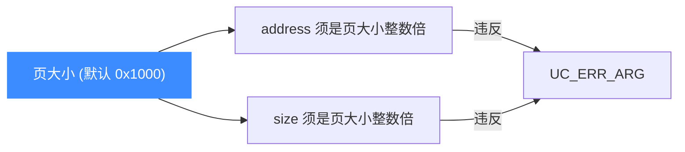
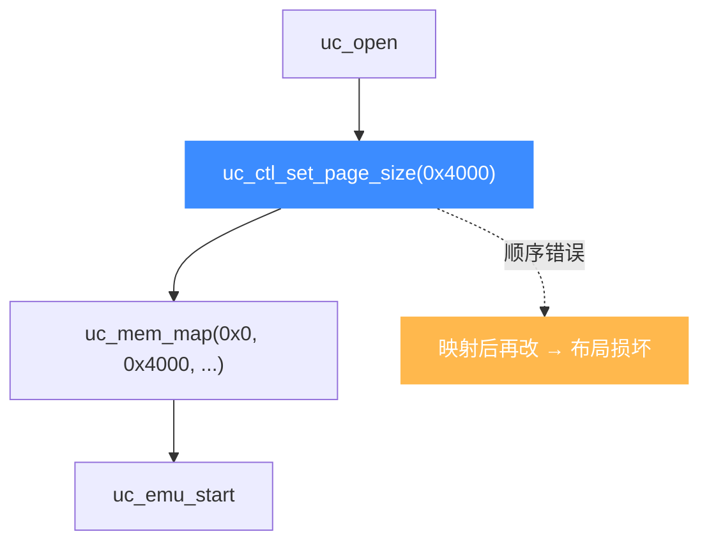

# 页大小与对齐

本页讲清 Unicorn 的页大小(默认 4KB)、如何用 `uc_ctl_set_page_size` 调整(仅部分架构支持),以及页大小如何决定所有内存 API 的对齐要求。读完你能理解"为何地址必须 4KB 对齐",并在需要时改用更大的页。

## 📐 默认 4KB

Unicorn 所有内存 API——[uc_mem_map](/memory/map)、[uc_mem_map_ptr](/memory/map-ptr)、[uc_mem_unmap](/memory/unmap)、[uc_mem_protect](/memory/protect)、[uc_mmio_map](/memory/mmio)——都要求 `address` 与 `size` 按页对齐。默认页大小为 **4KB = `0x1000`**。



## 🔧 读写页大小

[`unicorn.h`](https://github.com/android-security-engineer/unicorn-skills/blob/master/include/unicorn/unicorn.h#L556) 提供了两个 `uc_ctl` 宏:

```c
// 读取当前页大小
uint32_t page_size;
uc_ctl_get_page_size(uc, &page_size);
printf("页大小 = 0x%x\n", page_size);   // 默认 0x1000

// 设置页大小(仅部分架构可调)
uc_ctl_set_page_size(uc, 0x4000);        // 改为 16KB
```

底层展开为:

```c
#define uc_ctl_get_page_size(uc, ptr) \
    uc_ctl(uc, UC_CTL_READ(UC_CTL_UC_PAGE_SIZE, 1), (ptr))
#define uc_ctl_set_page_size(uc, page_size) \
    uc_ctl(uc, UC_CTL_WRITE(UC_CTL_UC_PAGE_SIZE, 1), (page_size))
```

## ⚠️ 仅部分架构可调,且须在映射前

::: warning 设置时机与架构限制
- `uc_ctl_set_page_size` **只对部分架构有效**(如某些 ARM 配置)。x86 等架构页大小固定,尝试更改会返回错误或被忽略——具体依实现而定。
- 必须在**任何内存映射之前**设置。一旦映射了内存,再改页大小会破坏已有布局,应视为非法。
- 新页大小须是 2 的幂。
:::



## 🔧 完整示例

```c
uc_engine *uc;
uc_open(UC_ARCH_ARM, UC_MODE_ARM, &uc);

// 尝试把页大小改为 16KB(须在映射前)
uc_err err = uc_ctl_set_page_size(uc, 0x4000);
if (err != UC_ERR_OK) {
    printf("该架构不支持改页大小: %s\n", uc_strerror(err));
}

// 之后所有映射按新页大小对齐
uc_mem_map(uc, 0x0, 0x4000, UC_PROT_ALL);   // 16KB 对齐
uc_close(uc);
```

::: tip 对齐工具宏
把任意地址向下取整到页边界:`addr & ~(page_size - 1)`;向上取整到整页大小:`(size + page_size - 1) & ~(page_size - 1)`。映射前用它们规整用户输入,可避免 `UC_ERR_ARG`。
:::

## 📂 相关源码

| 文件 | 角色 |
|------|------|
| [`include/unicorn/unicorn.h`](https://github.com/android-security-engineer/unicorn-skills/blob/master/include/unicorn/unicorn.h#L556) | `UC_CTL_UC_PAGE_SIZE` 控制项与 `uc_ctl_get/set_page_size` 宏 |
| [`include/unicorn/unicorn.h`](https://github.com/android-security-engineer/unicorn-skills/blob/master/include/unicorn/unicorn.h#L497) | `UC_QUERY_PAGE_SIZE` 查询项 |
| [`uc.c`](https://github.com/android-security-engineer/unicorn-skills/blob/master/uc.c#L1390) | `uc_mem_map` 按页大小做对齐校验 |

## 相关页面

- [uc_ctl_set_page_size](/ctl/set-page-size) — 控制接口详解
- [get-page-size](/ctl/get-page-size) — 读取当前页大小
- [映射内存](/memory/map) — 对齐要求的落地
- [未对齐访问](/memory/unaligned) — 页内未对齐访存
