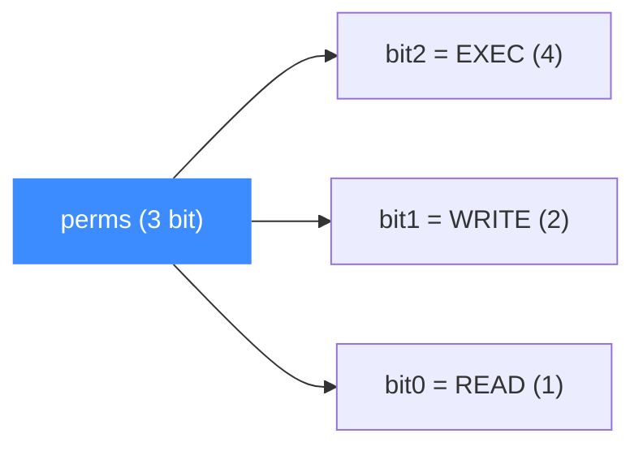
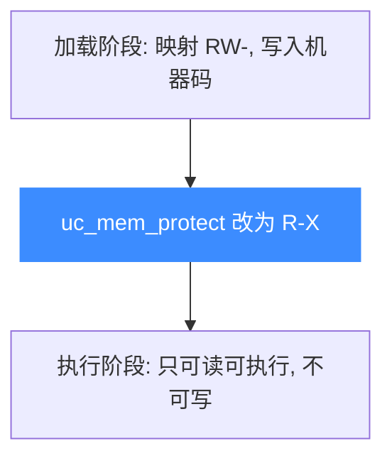
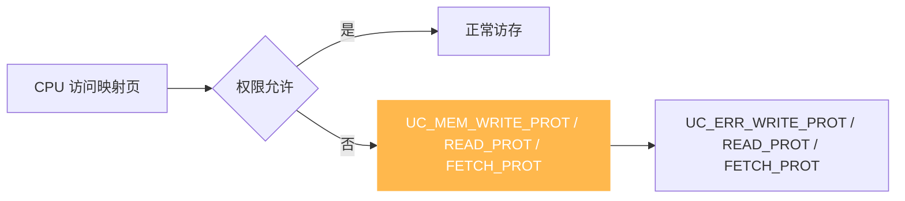

# 内存权限位

本页讲清 `UC_PROT_*` 权限位的取值与按位组合、W^X(写与执行互斥)原则,以及权限违例如何转化为 `*_PROT` 错误与内存 Hook。读完你能为每块内存精确设置读/写/执行权限。

## 🧩 UC_PROT_* 取值

权限位定义在 [`include/unicorn/unicorn.h`](https://github.com/android-security-engineer/unicorn-skills/blob/master/include/unicorn/unicorn.h#L251),是可按位或组合的枚举:

```c
typedef enum uc_prot {
    UC_PROT_NONE  = 0,
    UC_PROT_READ  = 1,
    UC_PROT_WRITE = 2,
    UC_PROT_EXEC  = 4,
    UC_PROT_ALL   = 7,   // READ | WRITE | EXEC
} uc_prot;
```

| 常量 | 值 | 位 | 含义 |
|------|----|----|------|
| `UC_PROT_NONE` | 0 | `000` | 无任何权限,任何访问都违例 |
| `UC_PROT_READ` | 1 | `001` | 可读 |
| `UC_PROT_WRITE` | 2 | `010` | 可写 |
| `UC_PROT_EXEC` | 4 | `100` | 可执行(取指) |
| `UC_PROT_ALL` | 7 | `111` | 读+写+执行 |

## 🗺️ 位图组合

`perms` 是三个独立位的按位或,共 8 种组合:



| 组合 | 位 | 典型用途 |
|------|----|----------|
| `UC_PROT_READ \| UC_PROT_EXEC` | `101` = 5 | 代码段(只读可执行) |
| `UC_PROT_READ \| UC_PROT_WRITE` | `011` = 3 | 数据段、栈、堆 |
| `UC_PROT_READ` | `001` = 1 | 只读常量区 |
| `UC_PROT_ALL` | `111` = 7 | 自修改代码 / 快速原型 |

::: tip 传入非法组合会报错
`uc_mem_map` / `uc_mem_map_ptr` / `uc_mem_protect` 的 `perms` 必须是 `UC_PROT_READ | UC_PROT_WRITE | UC_PROT_EXEC` 的某个组合,否则返回 `UC_ERR_ARG`。
:::

## 🛡️ W^X:写与执行互斥

安全加固中常用 **W^X**(Write XOR Execute):任一页面**要么可写、要么可执行,不能同时**。这样攻击者写入的数据无法被当作代码执行。用 `UC_PROT_*` 表达就是永不同时置 `WRITE` 与 `EXEC`:



先以 `RW` 写入、再 [uc_mem_protect](/memory/protect) 收紧为 `RX`,即可模拟真实系统的代码段保护。

## ❌ 权限违例 → PROT 错误

当被仿真代码的访问超出该页权限,Unicorn 会:

1. 触发对应的 `UC_MEM_*_PROT` 内存 Hook(若已注册);
2. 若无 Hook 处理或 Hook 返回 `false`,`uc_emu_start` 以 `*_PROT` 错误码退出。



| 违例操作 | Hook 类型 | 错误码 |
|----------|-----------|--------|
| 写只读页 | `UC_MEM_WRITE_PROT` | `UC_ERR_WRITE_PROT` |
| 读不可读页 | `UC_MEM_READ_PROT` | `UC_ERR_READ_PROT` |
| 取指不可执行页 | `UC_MEM_FETCH_PROT` | `UC_ERR_FETCH_PROT` |

## 🔧 示例:NX(不可执行)保护

```c
// 只给读+执行,不给写:代码段
uc_mem_map(uc, 0x100000, 0x3000, UC_PROT_READ | UC_PROT_EXEC);

// 若代码试图写入该区域,触发 UC_MEM_WRITE_PROT
// 若跳到一块只 RW 的数据区执行,触发 UC_MEM_FETCH_PROT
```

拦截权限违例的 Hook 回调(取自 `samples/mem_apis.c`):

```c
static bool hook_mem_invalid(uc_engine *uc, uc_mem_type type, uint64_t addr,
                             int size, int64_t value, void *user_data)
{
    switch (type) {
    case UC_MEM_WRITE_PROT:
        printf("写入只读内存 0x%" PRIx64 "\n", addr);
        return false;   // 返回 false → 仿真以错误退出
    case UC_MEM_FETCH_PROT:
        printf("执行不可执行内存 0x%" PRIx64 "\n", addr);
        return false;
    default:
        return false;
    }
}
```

::: warning 主机侧读写绕过权限
[uc_mem_write](/memory/read-write) / `uc_mem_read` 是宿主侧直接操作,**不检查权限、不触发 Hook**。只读页也能被 `uc_mem_write` 改写。权限只约束**被仿真 CPU** 的访存。
:::

## 📂 相关源码

| 文件 | 角色 |
|------|------|
| [`include/unicorn/unicorn.h`](https://github.com/android-security-engineer/unicorn-skills/blob/master/include/unicorn/unicorn.h#L251) | `UC_PROT_NONE/READ/WRITE/EXEC/ALL` 权限位枚举 |
| [`uc.c`](https://github.com/android-security-engineer/unicorn-skills/blob/master/uc.c#L1390) | `uc_mem_map` 接受 `prot` 参数映射内存 |
| [`uc.c`](https://github.com/android-security-engineer/unicorn-skills/blob/master/uc.c#L1713) | `uc_mem_protect` 运行期修改权限 |
| [`qemu/softmmu/memory.c`](https://github.com/android-security-engineer/unicorn-skills/blob/master/qemu/softmmu/memory.c) | 页保护检查 dispatch |

## 相关页面

- [运行期改权限](/memory/protect) — `uc_mem_protect`
- [访问类型枚举](/memory/mem-types) — `UC_MEM_*_PROT` 的含义
- [内存 Hook](/hooks/) — 拦截权限违例
- [uc_mem_map](/api/mem-map) — 映射时设置权限
