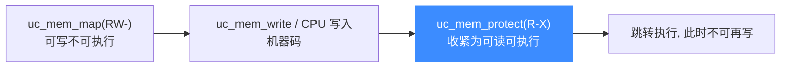
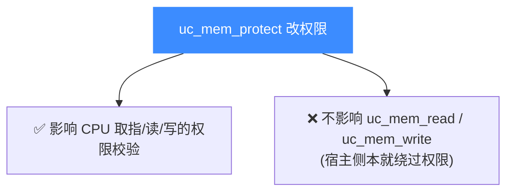

# 运行期改权限:uc_mem_protect

本页讲清 `uc_mem_protect` 如何在仿真过程中修改已映射区域的权限,典型用途是"先 RW 写入数据、再改 RX 执行"。读完你能动态收紧或放宽内存保护,模拟真实系统的页保护变更。

## 📥 函数签名

> 📄 声明：[`unicorn.h`](https://github.com/android-security-engineer/unicorn-skills/blob/master/include/unicorn/unicorn.h#L1230) · 实现：[`uc.c`](https://github.com/android-security-engineer/unicorn-skills/blob/master/uc.c#L1713)

```c
uc_err uc_mem_protect(uc_engine *uc, uint64_t address, uint64_t size,
                      uint32_t perms);
```

| 参数 | 说明 |
|------|------|
| `address` | 目标区域起始,**必须 4KB 对齐** |
| `size` | 大小,**必须是 4KB 的整数倍** |
| `perms` | 新的 [UC_PROT_* 权限位](/memory/permissions) 组合 |

`perms` 必须是 `UC_PROT_READ | UC_PROT_WRITE | UC_PROT_EXEC` 的合法组合,否则返回 `UC_ERR_ARG`。目标范围必须落在已映射区域内。

## 🔄 典型流程:RW → RX

许多加载器(JIT、shellcode 加载)遵循 W^X:先以可写权限填充代码,再改为可执行:



## 🔧 示例(取自 samples/mem_apis.c)

样例在 `UC_HOOK_CODE` 回调里把一块内存改成只读,随后代码写入即触发 `UC_MEM_WRITE_PROT`:

```c
// 初始:整块 12KB 全权限
uc_mem_map(uc, 0x100000, 0x3000, UC_PROT_ALL);

// 运行中(hook_code 内),把 [0x101000, 0x101fff] 改成只读
if (uc_mem_protect(uc, 0x101000, 0x1000, UC_PROT_READ) != UC_ERR_OK) {
    printf("uc_mem_protect 失败\n");
}

// 此后 CPU 若写 [0x101000] → UC_MEM_WRITE_PROT
//   若无 Hook 修复 → uc_emu_start 返回 UC_ERR_WRITE_PROT
```

放宽方向同理——把只读区改回可写:

```c
uc_mem_protect(uc, 0x101000, 0x1000, UC_PROT_READ | UC_PROT_WRITE);
```

## 🧩 只影响被仿真 CPU

`uc_mem_protect` 改变的是**被仿真 CPU** 访问该内存时的权限检查。它:



::: tip 权限变更可细到单页
`uc_mem_protect` 的范围可以只覆盖一块大映射中的**若干页**,不必是整块区域。底层按页管理权限,因此能对区域内不同页面设置不同保护。
:::

::: warning 范围必须已映射且对齐
若 `[address, address+size)` 触及未映射地址,或地址/大小未按页对齐,调用失败(`UC_ERR_ARG` 或相关错误)。改权限前可用 [uc_mem_regions](/memory/regions) 核对布局。
:::

## 📂 相关源码

| 文件 | 角色 |
|------|------|
| [`include/unicorn/unicorn.h`](https://github.com/android-security-engineer/unicorn-skills/blob/master/include/unicorn/unicorn.h#L1230) | `uc_mem_protect` 声明 |
| [`uc.c`](https://github.com/android-security-engineer/unicorn-skills/blob/master/uc.c#L1713) | `uc_mem_protect` 实现（按页修改权限） |
| [`qemu/softmmu/memory.c`](https://github.com/android-security-engineer/unicorn-skills/blob/master/qemu/softmmu/memory.c) | 页保护更新 dispatch |

## 相关页面

- [uc_mem_protect API 参考](/api/mem-protect)
- [权限位](/memory/permissions) — W^X 与 `UC_PROT_*`
- [访问类型枚举](/memory/mem-types) — `*_PROT` 违例类型
- [映射内存](/memory/map) — 初次设置权限
