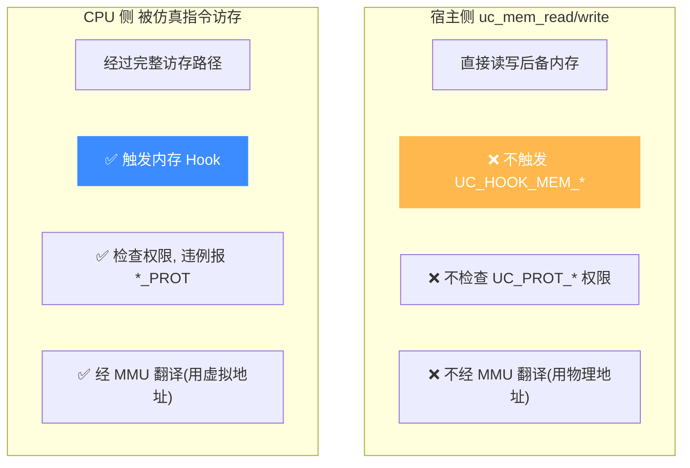

# 主机侧读写 vs CPU 访存

本页讲清一个关键区别:`uc_mem_read` / `uc_mem_write` 是**宿主侧**的直接内存操作,而被仿真代码执行时的访存是**CPU 侧**操作。前者**不触发 Hook、不检查权限、不经 MMU**,后者全都经过。混淆两者是新手常见困惑之源。

## 📥 两个函数

> 📄 `uc_mem_write`：声明 [`unicorn.h`](https://github.com/android-security-engineer/unicorn-skills/blob/master/include/unicorn/unicorn.h#L933) · 实现 [`uc.c`](https://github.com/android-security-engineer/unicorn-skills/blob/master/uc.c#L952)
> 📄 `uc_mem_read`：声明 [`unicorn.h`](https://github.com/android-security-engineer/unicorn-skills/blob/master/include/unicorn/unicorn.h#L950) · 实现 [`uc.c`](https://github.com/android-security-engineer/unicorn-skills/blob/master/uc.c#L913)

```c
uc_err uc_mem_write(uc_engine *uc, uint64_t address,
                    const void *bytes, uint64_t size);
uc_err uc_mem_read(uc_engine *uc, uint64_t address,
                   void *bytes, uint64_t size);
```

| 函数 | 方向 | 作用 |
|------|------|------|
| `uc_mem_write` | 宿主 → 仿真内存 | 把 `bytes` 的 `size` 字节写入仿真地址 |
| `uc_mem_read` | 仿真内存 → 宿主 | 从仿真地址读 `size` 字节到 `bytes` |

`bytes` 缓冲区须至少 `size` 字节。`address` 必须落在已 [映射](/memory/map) 的区域内,否则返回错误。

## ⚖️ 核心差异



| 维度 | `uc_mem_read/write`(宿主侧) | CPU 指令访存 |
|------|------------------------------|--------------|
| 触发内存 Hook | ❌ 否 | ✅ 是 |
| 权限检查 | ❌ 否(可写只读页) | ✅ 是 |
| MMU 翻译 | ❌ 否,直接用物理地址 | ✅ 是,虚拟地址经页表 |
| 用途 | 加载代码、检视结果 | 模拟真实程序行为 |

::: warning 只读页也能被 uc_mem_write 改写
因为宿主侧写入**绕过权限检查**,即便某页标记为 `UC_PROT_READ`,`uc_mem_write` 仍能成功写入。权限只约束被仿真 CPU。这既是便利(方便打补丁),也是陷阱(别指望它验证权限)。
:::

## 🔧 典型用法:先写代码,再执行

```c
uc_mem_map(uc, 0x100000, 0x1000, UC_PROT_READ | UC_PROT_EXEC);

// 宿主侧写入机器码 —— 注意:目标页没有 WRITE 权限,
// 但 uc_mem_write 绕过检查,依然成功
uint8_t code[] = { 0x90, 0xf4 };  // nop; hlt
uc_mem_write(uc, 0x100000, code, sizeof(code));

uc_emu_start(uc, 0x100000, 0x100002, 0, 0);

// 仿真结束后,宿主侧读回内存内容检视
uint8_t out[2];
uc_mem_read(uc, 0x100000, out, sizeof(out));
printf("首字节 = 0x%02x\n", out[0]);
```

在 `UC_HOOK_CODE` 里读当前指令字节也用 `uc_mem_read`(取自 [`samples/mem_apis.c`](https://github.com/android-security-engineer/unicorn-skills/blob/master/samples/mem_apis.c)):

```c
static void hook_code(uc_engine *uc, uint64_t addr, uint32_t size, void *ud)
{
    unsigned char buf[256];
    if (uc_mem_read(uc, addr, buf, size) == UC_ERR_OK) {
        printf("PC=0x%" PRIx64 " opcode=0x%02x\n", addr, buf[0]);
    }
}
```

## 🧠 MMU 场景下要用 vmem 系列

启用真实 MMU 后,`uc_mem_read/write` 用的仍是**物理地址**。若你手上只有**虚拟地址**,需改用会经 MMU 翻译的 [uc_vmem_read](/api/vmem-read) / `uc_vmem_write`,它们按页表把虚拟地址翻成物理地址再访问。

```c
// 虚拟地址读:需目标页已按对应权限映射
uc_vmem_read(uc, vaddr, UC_PROT_READ, buf, size);
```

## 📂 相关源码

| 文件 | 角色 |
|------|------|
| [`include/unicorn/unicorn.h`](https://github.com/android-security-engineer/unicorn-skills/blob/master/include/unicorn/unicorn.h#L933) | `uc_mem_write` / `uc_mem_read` 声明 |
| [`uc.c`](https://github.com/android-security-engineer/unicorn-skills/blob/master/uc.c#L952) | `uc_mem_write` 实现 |
| [`uc.c`](https://github.com/android-security-engineer/unicorn-skills/blob/master/uc.c#L913) | `uc_mem_read` 实现 |
| [`samples/mem_apis.c`](https://github.com/android-security-engineer/unicorn-skills/blob/master/samples/mem_apis.c) | Hook 内用 `uc_mem_read` 读指令字节的示例 |

## 相关页面

- [uc_mem_read API 参考](/api/mem-read)
- [uc_mem_write API 参考](/api/mem-write)
- [权限位](/memory/permissions) — 为何宿主侧绕过权限
- [MMU 与虚拟内存](/features/mmu) — 何时用 vmem 系列
