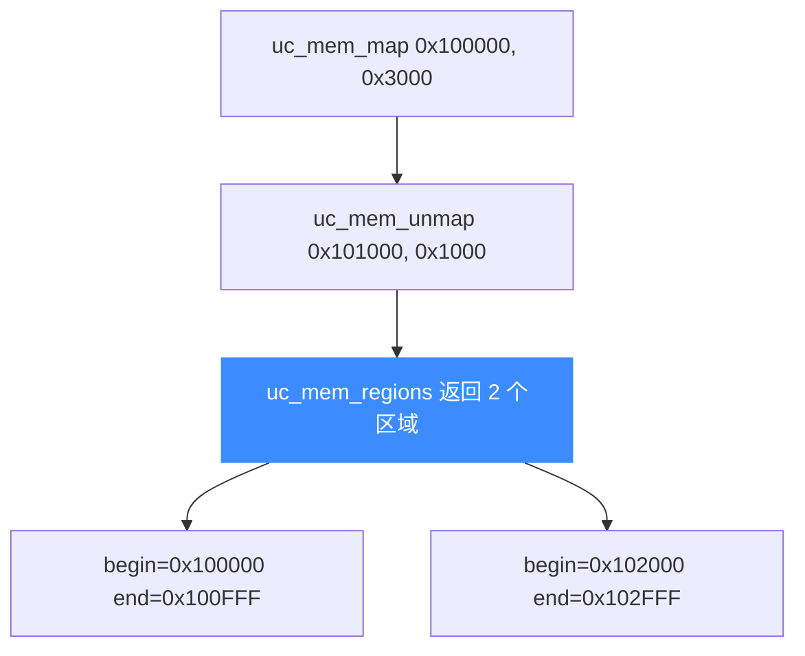

# 枚举映射:uc_mem_regions

本页讲清 `uc_mem_regions` 如何列出引擎当前所有的内存映射区域,以及返回数组的内存管理约定。读完你能在运行期检视完整的内存布局。

## 📤 函数签名

> 📄 声明：[`unicorn.h`](https://github.com/android-security-engineer/unicorn-skills/blob/master/include/unicorn/unicorn.h#L1248) · 实现：[`uc.c`](https://github.com/android-security-engineer/unicorn-skills/blob/master/uc.c#L2168)

```c
uc_err uc_mem_regions(uc_engine *uc, uc_mem_region **regions,
                      uint32_t *count);
```

| 参数 | 说明 |
|------|------|
| `regions` | 输出:指向 `uc_mem_region` 数组的指针,**由 Unicorn 分配** |
| `count` | 输出:数组中区域的数量 |

每个元素是一个区域描述符:

```c
typedef struct uc_mem_region {
    uint64_t begin; // 起始地址(含)
    uint64_t end;   // 结束地址(含)
    uint32_t perms; // UC_PROT_* 权限位
} uc_mem_region;
```

::: warning 返回数组必须手动释放
`regions` 指向的数组由 Unicorn 用内部分配器分配。用完后**必须**调用 `uc_free(regions)` 释放,否则内存泄漏。不要用 `free()`。
:::

## 🗺️ 枚举包含哪些区域

`uc_mem_regions` 列出由 [uc_mem_map](/memory/map)、[uc_mem_map_ptr](/memory/map-ptr) 建立的所有区域。由于 [uc_mem_unmap](/memory/unmap) 会切割区域,一次映射可能对应多个 region:



## 🔧 示例

```c
#include <unicorn/unicorn.h>

uc_mem_region *regions = NULL;
uint32_t count = 0;

uc_err err = uc_mem_regions(uc, &regions, &count);
if (err == UC_ERR_OK) {
    for (uint32_t i = 0; i < count; i++) {
        printf("区域 %u: 0x%" PRIx64 " - 0x%" PRIx64 "  perms=%u\n",
               i, regions[i].begin, regions[i].end, regions[i].perms);
    }
    uc_free(regions);   // 必须释放
}
```

`perms` 是 [UC_PROT_* 位](/memory/permissions) 的按位或,可如下解读:

```c
uint32_t p = regions[i].perms;
printf("%c%c%c\n",
       (p & UC_PROT_READ)  ? 'r' : '-',
       (p & UC_PROT_WRITE) ? 'w' : '-',
       (p & UC_PROT_EXEC)  ? 'x' : '-');
```

## 📌 用途

- **调试**:仿真出错时打印当前布局,确认代码/栈/数据是否都已映射;
- **快照/序列化**:遍历所有区域,配合 [uc_mem_read](/memory/read-write) 导出内存内容;
- **动态分页**:在 `UNMAPPED` Hook 里先查现有区域,决定如何补映射。

::: tip 大小 = end − begin + 1
`end` 是**含**的最后一个字节地址,故区域字节数为 `end - begin + 1`。对一块 4KB 区域,`end = begin + 0xFFF`。
:::

## 📂 相关源码

| 文件 | 角色 |
|------|------|
| [`include/unicorn/unicorn.h`](https://github.com/android-security-engineer/unicorn-skills/blob/master/include/unicorn/unicorn.h#L1248) | `uc_mem_regions` 声明 |
| [`include/unicorn/unicorn.h`](https://github.com/android-security-engineer/unicorn-skills/blob/master/include/unicorn/unicorn.h#L487) | `uc_mem_region` 结构定义 |
| [`uc.c`](https://github.com/android-security-engineer/unicorn-skills/blob/master/uc.c#L2168) | `uc_mem_regions` 实现（收集当前所有映射） |

## 相关页面

- [uc_mem_regions API 参考](/api/mem-regions)
- [解除映射](/memory/unmap) — 区域如何被切割
- [权限位](/memory/permissions) — 解读 `perms`
- [内存模型总览](/memory/overview) — 区域集合模型
