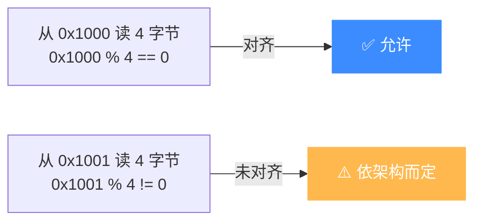

# 未对齐访问与 *_UNALIGNED 错误

本页讲清什么是"未对齐访问",Unicorn 在何种情况下返回 `UC_ERR_READ_UNALIGNED` / `WRITE_UNALIGNED` / `FETCH_UNALIGNED`,以及不同架构对未对齐访问的容忍度差异。读完你能诊断这类错误并按架构规避。

## 🧠 什么是未对齐

**数据对齐**指访问地址是数据宽度的整数倍:读 4 字节应从 4 的倍数地址开始,读 2 字节应从偶地址开始。**未对齐访问**(unaligned / misaligned access)违反这一点,例如从 `0x1001` 读一个 32 位整数。



::: tip 别和页对齐混淆
这里说的是**访问宽度对齐**(2/4/8 字节边界),与 [uc_mem_map](/memory/map) 要求的**页对齐**(4KB 边界)是两回事。页对齐失败报 `UC_ERR_ARG`,访问未对齐报 `*_UNALIGNED`。
:::

## ❌ 三种未对齐错误

`uc_err` 中三个专门的错误码:

| 错误码 | 触发 | 说明 |
|--------|------|------|
| `UC_ERR_READ_UNALIGNED` | 未对齐读 | Unaligned read |
| `UC_ERR_WRITE_UNALIGNED` | 未对齐写 | Unaligned write |
| `UC_ERR_FETCH_UNALIGNED` | 未对齐取指 | Unaligned fetch |

当被仿真代码执行了目标架构**不允许**的未对齐访存,`uc_emu_start` 以对应错误码退出。

```mermaid
graph TD
    ACC["CPU 未对齐访存"] --> ARCH{该架构是否允许}
    ARCH -->|允许(如 x86)| OK["正常完成, 可能拆分为多次访问"]
    ARCH -->|禁止(如部分 ARM/MIPS)| ERR["UC_ERR_*_UNALIGNED<br/>或架构异常"]
    style ERR fill:#ffb84d,color:#fff,stroke:none
```

## 🏛️ 架构容忍度差异

不同 CPU 架构对未对齐访问的态度天差地别:

| 架构 | 未对齐访问 |
|------|-----------|
| **x86 / x86_64** | 大多容忍,硬件自动处理(可能有性能损失) |
| **ARM / AArch64** | 依配置:某些访问允许,某些(如独占、部分对齐要求指令)禁止 |
| **MIPS** | 传统上严格,未对齐访存产生地址错误异常 |
| **其它 RISC** | 多数要求对齐,具体依实现而定 |

::: warning 取指未对齐尤其危险
`UC_ERR_FETCH_UNALIGNED` 常见于跳到了非法地址(如把数据当代码、ARM Thumb/ARM 状态位没设对)。检查 `uc_emu_start` 的 `begin` 与跳转目标是否满足该架构的指令对齐要求(如 ARM 指令 4 字节对齐、Thumb 2 字节对齐)。
:::

## 🪝 未对齐可能拆分访存

在启用 MMU 或某些配置下,一次未对齐访问可能被**拆成多次对齐的子访问**。这会导致同一条指令的内存 Hook 被**多次调用**——若你在 Hook 里计数或记录,需注意这点(详见 [MMU](/features/mmu) 中的说明)。

## 🔧 示例:捕获未对齐错误

```c
uc_err err = uc_emu_start(uc, 0x1000, 0x2000, 0, 0);
switch (err) {
case UC_ERR_READ_UNALIGNED:
    printf("未对齐读,检查数据结构对齐\n"); break;
case UC_ERR_WRITE_UNALIGNED:
    printf("未对齐写\n"); break;
case UC_ERR_FETCH_UNALIGNED:
    printf("未对齐取指,检查跳转目标/指令集状态\n"); break;
case UC_ERR_OK:
    break;
default:
    printf("其它错误: %s\n", uc_strerror(err));
}
```

## 📂 相关源码

| 文件 | 角色 |
|------|------|
| [`include/unicorn/unicorn.h`](https://github.com/android-security-engineer/unicorn-skills/blob/master/include/unicorn/unicorn.h#L189) | `UC_ERR_READ_UNALIGNED` / `UC_ERR_WRITE_UNALIGNED` / `UC_ERR_FETCH_UNALIGNED` 错误码枚举 |
| [`uc.c`](https://github.com/android-security-engineer/unicorn-skills/blob/master/uc.c#L1076) | `uc_emu_start` 返回未对齐错误码 |
| [`qemu/target/<arch>/`](https://github.com/android-security-engineer/unicorn-skills/blob/master/qemu/target) | 各架构对齐检查逻辑（x86 宽容、MIPS/ARM 严格） |

## 相关页面

- [UC_ERR_READ_UNALIGNED](/errors/read-unaligned) — 错误码详解
- [页大小与对齐](/memory/page-size) — 页对齐(不同概念)
- [MMU 与虚拟内存](/features/mmu) — 拆分访存与多次 Hook
- [访问类型枚举](/memory/mem-types) — 各类内存事件
