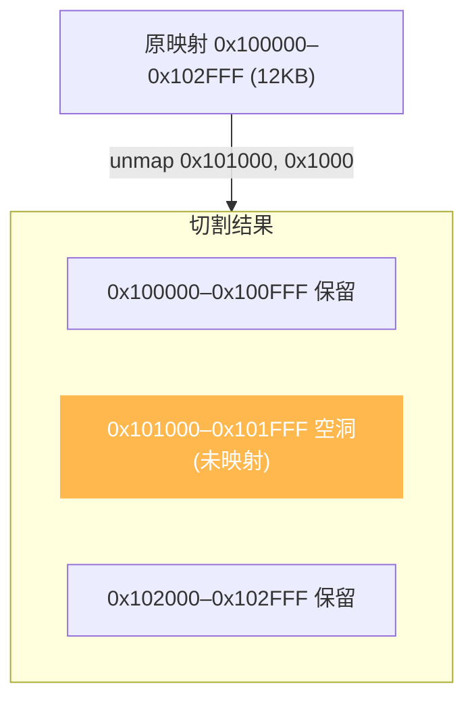

# 解除映射:uc_mem_unmap

本页讲清 `uc_mem_unmap` 如何删除一块内存映射,以及从**区域中间**解除映射时的"区域切割"行为。读完你能安全地回收内存并理解由此产生的区域碎片。

## 📤 函数签名

> 📄 声明：[`unicorn.h`](https://github.com/android-security-engineer/unicorn-skills/blob/master/include/unicorn/unicorn.h#L1209) · 实现：[`uc.c`](https://github.com/android-security-engineer/unicorn-skills/blob/master/uc.c#L1836)

```c
uc_err uc_mem_unmap(uc_engine *uc, uint64_t address, uint64_t size);
```

| 参数 | 说明 |
|------|------|
| `address` | 要解除的区域起始地址,**必须 4KB 对齐** |
| `size` | 要解除的大小,**必须是 4KB 的整数倍** |

未对齐返回 `UC_ERR_ARG`;成功返回 `UC_ERR_OK`。解除后,该地址范围回到**未映射**状态,再被 CPU 访问会触发 `*_UNMAPPED` Hook。

## ✂️ 区域切割

`uc_mem_unmap` 的地址范围**不必**与原映射边界对齐。若你从一块大区域的中间挖掉一段,Unicorn 会把原区域**切割**成两块独立区域:



切割后,[uc_mem_regions](/memory/regions) 枚举时会看到**两个** `uc_mem_region` 而非一个——这正是 [`unicorn.h`](https://github.com/android-security-engineer/unicorn-skills/blob/master/include/unicorn/unicorn.h#L1209) 中"memory regions may be split by uc_mem_unmap()"注释的含义。

## 🔧 示例(取自 samples/mem_apis.c)

在 `UC_HOOK_CODE` 回调里,遇到特定指令时解除一块映射,随后代码再访问该区域即失败:

```c
// 映射 12KB 全权限
uc_mem_map(uc, 0x100000, 0x3000, UC_PROT_ALL);

// ... 运行中,在 hook_code 里执行:
if (uc_mem_unmap(uc, 0x101000, 0x1000) != UC_ERR_OK) {
    printf("uc_mem_unmap 失败\n");
}

// 之后 CPU 若写 [0x101000] → 触发 UC_MEM_WRITE_UNMAPPED
// 若无 Hook 处理,uc_emu_start 返回 UC_ERR_WRITE_UNMAPPED
```

对应的失效访问会被 `UC_HOOK_MEM_INVALID` 捕获:

```c
static bool hook_mem_invalid(uc_engine *uc, uc_mem_type type, uint64_t addr,
                             int size, int64_t value, void *user_data)
{
    if (type == UC_MEM_WRITE_UNMAPPED) {
        printf("写入已解除映射的内存 0x%" PRIx64 "\n", addr);
    }
    return false;   // 不修复 → 仿真以错误退出
}
```

## 🧹 与 uc_mem_map_ptr 的配合

若被解除的区域是用 [uc_mem_map_ptr](/memory/map-ptr) 映射的宿主缓冲区,`uc_mem_unmap` 只断开映射关系,**不会** `free` 你的宿主内存。正确顺序:先 `uc_mem_unmap`(或 `uc_close`),再自己 `free(ptr)`。

::: warning 解除范围不能超出实际映射
若 `[address, address+size)` 覆盖了**未映射**的空洞,或跨越了从未映射的地址,`uc_mem_unmap` 会失败。解除前可用 [uc_mem_regions](/memory/regions) 确认当前布局。
:::

## 📂 相关源码

| 文件 | 角色 |
|------|------|
| [`include/unicorn/unicorn.h`](https://github.com/android-security-engineer/unicorn-skills/blob/master/include/unicorn/unicorn.h#L1209) | `uc_mem_unmap` 声明 |
| [`uc.c`](https://github.com/android-security-engineer/unicorn-skills/blob/master/uc.c#L1836) | `uc_mem_unmap` 实现（区域切割逻辑） |
| [`qemu/softmmu/memory.c`](https://github.com/android-security-engineer/unicorn-skills/blob/master/qemu/softmmu/memory.c) | 物理内存区域删除 dispatch |

## 相关页面

- [uc_mem_unmap API 参考](/api/mem-unmap)
- [枚举映射](/memory/regions) — 查看切割后的区域
- [映射内存](/memory/map) — `uc_mem_map`
- [访问类型枚举](/memory/mem-types) — `*_UNMAPPED` 含义
