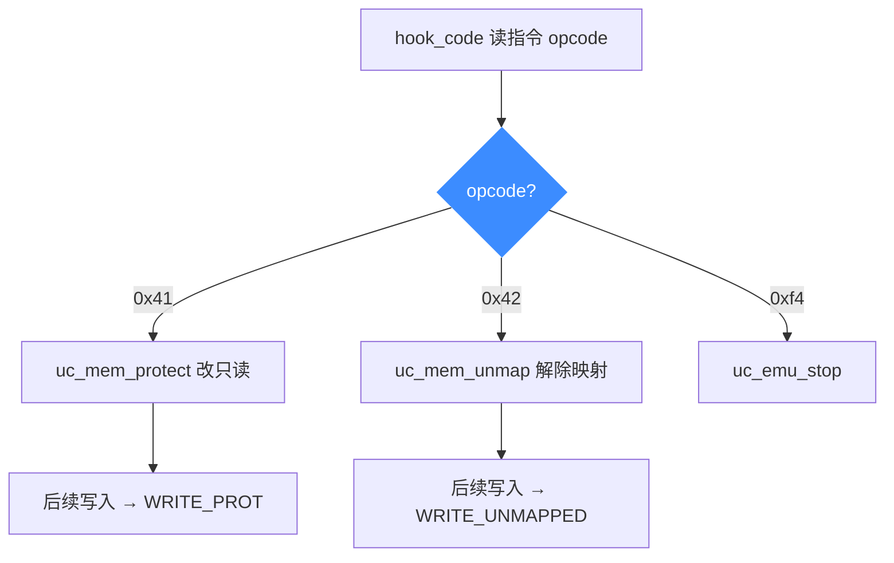

# mem_apis.c 走读 · 内存权限与映射管理

[`mem_apis.c`](https://github.com/android-security-engineer/unicorn-skills/blob/master/samples/mem_apis.c) 是内存管理三件套的实战演示：`uc_mem_protect`（改权限）、`uc_mem_unmap`（解除映射）以及 NX（不可执行）保护。它用一个巧妙的技巧——**让被仿真代码里的某条指令去触发 Hook 修改内存布局**，然后观察后续访问是否崩溃。

## 🎯 演示要点

- NX 演示：只给 `UC_PROT_READ | UC_PROT_EXEC` 的页写数据会怎样
- 权限演示：运行中 `uc_mem_protect` 把页改成只读后再写入
- 解除映射演示：运行中 `uc_mem_unmap` 后再访问该地址
- 每个演示都跑"正常"和"触发错误"两遍对照

## 🧩 用指令 opcode 驱动内存操作

核心技巧在 `hook_code`：它读出当前指令首字节，用 opcode 分派不同的内存操作：

```c
static void hook_code(uc_engine *uc, uint64_t addr, uint32_t size, void *ud)
{
    uint8_t opcode; unsigned char buf[256];
    uc_mem_read(uc, addr, buf, size);
    opcode = buf[0];
    switch (opcode) {
    case 0x41: // inc ecx → 把 0x101000 页改成只读
        uc_mem_protect(uc, 0x101000, 0x1000, UC_PROT_READ);
        break;
    case 0x42: // inc edx → 解除 0x101000 页映射
        uc_mem_unmap(uc, 0x101000, 0x1000);
        break;
    case 0xf4: // hlt → 停止仿真
        uc_emu_stop(uc);
        break;
    }
}
```

于是"是否触发错误"只取决于把代码首字节设成 `0x41`/`0x42` 还是普通的 `inc eax`（`0x40`）。

::: tip 为什么用 inc ecx / inc edx 当开关
这两条都是 1 字节无害指令，塞进代码流不影响执行，却能被 `hook_code` 识别出来，充当"在运行中改内存布局"的触发器。这是把控制逻辑编码进被仿真指令流的经典手法。
:::

## 🔧 NX 演示

页只映射为 `READ | EXEC`（无 WRITE），代码结构是三页跳转 + `hlt`：

```c
uc_mem_map(uc, 0x100000, 0x3000, UC_PROT_READ | UC_PROT_EXEC);
// page0 全填 inc eax，末尾 jmp page2；page2 jmp page1；page1 末尾 hlt
```

- `do_nx_demo(false)`：全是 `inc eax`，顺利跑完 → SUCCESSFUL EXECUTION。
- `do_nx_demo(true)`：把 page1 首字节改成 `0x41`(inc ecx)，Hook 触发 `uc_mem_protect` 把 `0x101000` 改只读——但该页正在被执行，触发保护错误。

## 🧠 权限与解除映射演示

`WRITE_DEMO` 依次向 `0x102000`、`0x100ffc`、`0x101000` 写 dword：

- **perms_test**：把首字节设 `0x41`，Hook 将 `0x101000` 改只读；随后写 `0x101000` 触发 `UC_MEM_WRITE_PROT`。
- **unmap_test**：把首字节设 `0x42`，Hook 解除 `0x101000` 映射；随后写该地址触发 `UC_MEM_WRITE_UNMAPPED`。

非法访问由 `hook_mem_invalid` 捕获并按 `uc_mem_type` 分类打印（返回 `false` 表示不修复、让仿真失败）。



## 📤 预期输出（节选）

```text
NX demo - step 1: show that code runs to completion
BEGINNING EXECUTION
SUCCESSFUL EXECUTION
NX demo - step 2: show that code fails without UC_PROT_EXEC
...
Permissions demo - step 2: ...
not ok - Write to non-writeable memory at 0x101000, ...
FAILED EXECUTION
Unmap demo - step 2: ...
not ok - Write to invalid memory at 0x101000, ...
FAILED EXECUTION
```

对照两步能清楚看到：同一段代码，仅因运行中改了内存属性，后续访问就从成功变成失败。

::: tip 延伸练习
1. 在 `hook_mem_invalid` 里对 `UC_MEM_WRITE_UNMAPPED` 返回 `true` 并当场 `uc_mem_map` 补映射，看能否"救活"仿真。
2. 给某页加上 `UC_PROT_WRITE` 后重试 perms 演示，确认不再报错。
3. 用 `uc_mem_regions` 打印当前所有映射区，验证 unmap 前后的变化。
:::

## 📂 相关源码

| 文件 | 角色 |
|------|------|
| [`samples/mem_apis.c`](https://github.com/android-security-engineer/unicorn-skills/blob/master/samples/mem_apis.c) | 本页走读的内存权限与映射管理示例 |
| [`include/unicorn/unicorn.h`](https://github.com/android-security-engineer/unicorn-skills/blob/master/include/unicorn/unicorn.h#L1209) | `uc_mem_unmap` / `uc_mem_protect` 声明 |
| [`include/unicorn/unicorn.h`](https://github.com/android-security-engineer/unicorn-skills/blob/master/include/unicorn/unicorn.h#L251) | `UC_PROT_READ/WRITE/EXEC` 权限位枚举 |
| [`uc.c`](https://github.com/android-security-engineer/unicorn-skills/blob/master/uc.c#L1713) | `uc_mem_protect` 实现（运行时改保护位） |

## 相关页面

- [内存模型总览](/memory/overview)
- [uc_mem_protect — 修改权限](/api/mem-protect)
- [uc_mem_unmap — 解除映射](/api/mem-unmap)
- [UC_HOOK_MEM_INVALID — 非法访问](/hooks/mem-invalid)
