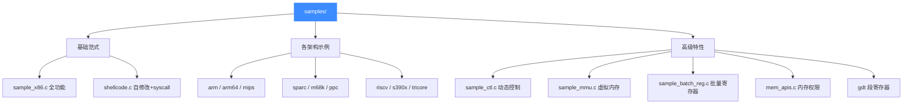
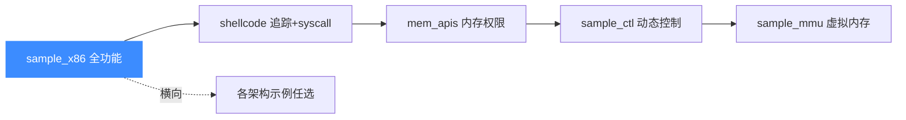

# 示例源码走读 · 总览

本页带你俯瞰 Unicorn 官方 `samples/` 目录：每个 `.c` 演示什么、如何编译运行、以及一张完整索引表。读完你就知道该从哪个示例入手学习。

## 🎯 samples/ 是什么

`samples/` 是 Unicorn 仓库自带的**可编译真实示例**，每个文件都是一个独立的 `main()` 程序，把某一类能力（某架构、某 Hook、某 API）浓缩成最小可运行范例。它们既是学习素材，也是回归测试的一部分（`sample_all.sh` 会串跑一遍）。



## 🔧 如何编译运行

`samples/Makefile` 依赖上层 `config.mk` 与已编译好的 `libunicorn`。推荐先按 [编译与安装](/guide/compile) 构建整个项目——CMake 会顺带把 samples 一起编出来：

```bash
mkdir build && cd build
cmake .. -DCMAKE_BUILD_TYPE=Release
make
# 可执行文件出现在 build 目录，直接运行：
./sample_x86 -32
```

::: tip 只想手工编一个
链接已安装的 `libunicorn` 即可，Makefile 里的核心就是这一行 `link-dynamic`：

```bash
gcc sample_arm.c -I../include -L.. -lunicorn -lpthread -lm -o sample_arm
./sample_arm
```
:::

::: warning 架构裁剪
`Makefile` 会读取 `config.log`，**只编译已启用架构**对应的示例。若某个 `sample_xxx` 没被编出来，先确认构建时启用了该架构。
:::

## 📌 全部示例索引

| 源码 | 架构 / 主题 | 演示重点 | 走读页 |
|------|------------|----------|--------|
| [`sample_x86.c`](https://github.com/android-security-engineer/unicorn-skills/blob/master/samples/sample_x86.c) | X86 16/32/64 | 最全示例：多模式 + 各类 Hook + MMIO + SMC | [打开](/samples/sample-x86) |
| [`sample_x86_32_gdt_and_seg_regs.c`](https://github.com/android-security-engineer/unicorn-skills/blob/master/samples/sample_x86_32_gdt_and_seg_regs.c) | X86-32 | 手工构建 GDT、设置段寄存器 | [打开](/samples/sample-x86-gdt) |
| [`shellcode.c`](https://github.com/android-security-engineer/unicorn-skills/blob/master/samples/shellcode.c) | X86-32 | 自修改代码 + 指令级追踪 + syscall | [打开](/samples/shellcode) |
| [`sample_arm.c`](https://github.com/android-security-engineer/unicorn-skills/blob/master/samples/sample_arm.c) | ARM | ARM/Thumb、大小端、ITE、协处理器寄存器 | [打开](/samples/sample-arm) |
| [`sample_arm64.c`](https://github.com/android-security-engineer/unicorn-skills/blob/master/samples/sample_arm64.c) | ARM64 | 高地址取栈、SCTLR、MRS Hook、PAC | [打开](/samples/sample-arm64) |
| [`sample_mips.c`](https://github.com/android-security-engineer/unicorn-skills/blob/master/samples/sample_mips.c) | MIPS | 大端 / 小端两种模式 | [打开](/samples/sample-mips) |
| [`sample_sparc.c`](https://github.com/android-security-engineer/unicorn-skills/blob/master/samples/sample_sparc.c) | SPARC | 全局寄存器加法 | [打开](/samples/sample-sparc) |
| [`sample_m68k.c`](https://github.com/android-security-engineer/unicorn-skills/blob/master/samples/sample_m68k.c) | M68K | 全套数据 / 地址寄存器读写 | [打开](/samples/sample-m68k) |
| [`sample_ppc.c`](https://github.com/android-security-engineer/unicorn-skills/blob/master/samples/sample_ppc.c) | PowerPC | 大端加法运算 | [打开](/samples/sample-ppc) |
| [`sample_riscv.c`](https://github.com/android-security-engineer/unicorn-skills/blob/master/samples/sample_riscv.c) | RISC-V | 分段执行、单步、超时、缺页恢复、返回 | [打开](/samples/sample-riscv) |
| [`sample_s390x.c`](https://github.com/android-security-engineer/unicorn-skills/blob/master/samples/sample_s390x.c) | S390X | 大端寄存器传送 | [打开](/samples/sample-s390x) |
| [`sample_tricore.c`](https://github.com/android-security-engineer/unicorn-skills/blob/master/samples/sample_tricore.c) | TriCore | 立即数装载 | [打开](/samples/sample-tricore) |
| [`sample_batch_reg.c`](https://github.com/android-security-engineer/unicorn-skills/blob/master/samples/sample_batch_reg.c) | X86-64 | 批量寄存器读写、INSN Hook | [打开](/samples/sample-batch-reg) |
| [`sample_ctl.c`](https://github.com/android-security-engineer/unicorn-skills/blob/master/samples/sample_ctl.c) | X86-32 | `uc_ctl` 查询、多出口、TB 缓存 | [打开](/samples/sample-ctl) |
| [`sample_mmu.c`](https://github.com/android-security-engineer/unicorn-skills/blob/master/samples/sample_mmu.c) | X86-64 | CPU / 虚拟两种 TLB、上下文快照 | [打开](/samples/sample-mmu) |
| [`mem_apis.c`](https://github.com/android-security-engineer/unicorn-skills/blob/master/samples/mem_apis.c) | X86-32 | NX、权限修改、解除映射 | [打开](/samples/mem-apis) |

## ✅ 建议学习路径



先吃透 `sample_x86.c` 这条主线（映射内存 → 写码 → 注册 Hook → `uc_emu_start` → 读寄存器），其余示例都是在这个骨架上替换架构或叠加特性。

## 📂 相关源码

| 文件 | 角色 |
|------|------|
| [`samples/`](https://github.com/android-security-engineer/unicorn-skills/blob/master/samples) | 全部官方示例所在目录 |
| [`samples/Makefile`](https://github.com/android-security-engineer/unicorn-skills/blob/master/samples/Makefile) | 示例编译规则、按架构裁剪 |
| [`include/unicorn/unicorn.h`](https://github.com/android-security-engineer/unicorn-skills/blob/master/include/unicorn/unicorn.h) | 所有示例共用的公共 API 头文件 |
| [`CMakeLists.txt`](https://github.com/android-security-engineer/unicorn-skills/blob/master/CMakeLists.txt) | `UNICORN_BUILD_TESTS` 控制是否编译 samples |

## 相关页面

- [第一个模拟程序](/guide/first-program)
- [Hook 插桩体系](/features/hooks)
- [多架构支持](/features/architectures)
- [编译与安装](/guide/compile)
