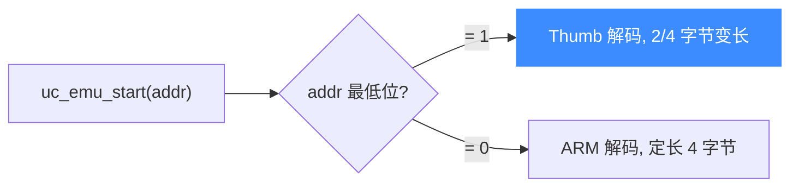

# sample_arm.c 走读 · ARM

[`sample_arm.c`](https://github.com/android-security-engineer/unicorn-skills/blob/master/samples/sample_arm.c) 用一连串子测试覆盖 ARM 架构的方方面面：ARM/Thumb 双指令集、大小端、Thumb 的 IT/ITE 条件块、以及协处理器寄存器读取。本页挑主线讲清 Unicorn 上 ARM 仿真的门道。

## 🎯 演示要点

- ARM 模式与 Thumb 模式的切换（`UC_MODE_ARM` / `UC_MODE_THUMB`）
- Thumb 入口地址的**最低位置 1**约定
- 大端变体 `armeb` / `thumbeb`
- 整块执行 vs 逐指令单步（ITE 条件块）
- 通过 `uc_arm_cp_reg` 读取协处理器寄存器 SCTLR

## 🧩 基础：test_arm

标准五步流程，初值 R2=0x6789、R3=0x3333，代码本身是一条 nop：

```c
#define ARM_CODE "\x00\xf0\x20\xe3"   // nop
#define ADDRESS 0x10000

uc_open(UC_ARCH_ARM, UC_MODE_ARM, &uc);
uc_mem_map(uc, ADDRESS, 2 * 1024 * 1024, UC_PROT_ALL);
uc_mem_write(uc, ADDRESS, ARM_CODE, sizeof(ARM_CODE) - 1);

uc_reg_write(uc, UC_ARM_REG_R0, &r0);
uc_reg_write(uc, UC_ARM_REG_R2, &r2);
uc_reg_write(uc, UC_ARM_REG_R3, &r3);

uc_hook_add(uc, &trace1, UC_HOOK_BLOCK, hook_block, NULL, 1, 0);
uc_hook_add(uc, &trace2, UC_HOOK_CODE,  hook_code,  NULL, ADDRESS, ADDRESS);
uc_emu_start(uc, ADDRESS, ADDRESS + sizeof(ARM_CODE) - 1, 0, 0);
```

注意 `hook_code` 用 `ADDRESS, ADDRESS` 限定区间——只在这一条指令上触发。

## 🔧 Thumb 模式：地址最低位是开关

`test_thumb` 的关键差异在启动地址：Unicorn 用 **PC 最低位为 1** 表示进入 Thumb 态：

```c
uc_open(UC_ARCH_ARM, UC_MODE_THUMB, &uc);
uc_mem_write(uc, ADDRESS, THUMB_CODE, sizeof(THUMB_CODE) - 1);
// 注意 ADDRESS | 1 —— 告诉引擎按 Thumb 解码
uc_emu_start(uc, ADDRESS | 1, ADDRESS + sizeof(THUMB_CODE) - 1, 0, 0);
```

::: warning Thumb 入口
忘了 `| 1` 会让引擎按 ARM 定长 4 字节解码 Thumb 指令，结果全乱。所有 Thumb 子测试都遵守这一约定。
:::



## 🧠 整块 vs 单步：ITE 条件块

`test_thumb_ite` 把同一段 `cmp/it ne/mov` 条件代码跑两遍——一次整块执行，一次逐指令单步（`uc_emu_start(..., 1)` 每次只走 1 条），再对比 R2/R3 是否一致：

```c
if (!step) {
    uc_emu_start(uc, ADDRESS | 1, ADDRESS + len - 1, 0, 0);   // 整块
} else {
    int addr = ADDRESS;
    for (i = 0; i < len / 2; i++) {
        uc_emu_start(uc, addr | 1, ADDRESS + len - 1, 0, 1);  // 单步
        uc_reg_read(uc, UC_ARM_REG_PC, &addr);                // PC 推进
    }
}
```

这是 Unicorn 对 IT 块单步正确性的一个回归验证：两种方式结果必须相同。

## 🔩 协处理器寄存器：test_read_sctlr

ARM 的系统寄存器通过 `uc_arm_cp_reg` 结构 + `UC_ARM_REG_CP_REG` 伪寄存器访问，填 `cp/crn/crm/opc1/opc2` 定位：

```c
uc_arm_cp_reg reg;
reg.cp = 15; reg.is64 = 0; reg.sec = 0;
reg.crn = 1; reg.crm = 0; reg.opc1 = 0; reg.opc2 = 0;  // SCTLR
uc_reg_read(uc, UC_ARM_REG_CP_REG, &reg);
printf(">>> SCTLR = 0x%" PRIx32 "\n", (uint32_t)reg.val);
```

另有 `test_thumb_mrs` 演示先 `uc_ctl_set_cpu_model(uc, UC_CPU_ARM_CORTEX_M33)` 选定 CPU 型号，再执行 `mrs r0, control`。

## 📤 预期输出（节选）

```text
Emulate ARM code
>>> Tracing basic block at 0x10000, block size = 0x4
>>> Tracing instruction at 0x10000, instruction size = 0x4
>>> Emulation done. Below is the CPU context
>>> R0 = 0x1234
>>> R1 = 0x37
==========================
Emulate THUMB code
...
>>> SP = 0x1228
```

::: tip 延伸练习
1. 把 `ARM_CODE` 换成注释里的 `mov r0, #0x37; sub r1, r2, r3`，验证 R1 = R2 - R3。
2. 去掉 Thumb 启动地址的 `| 1`，观察解码错乱后的错误。
3. 读取更多协处理器寄存器（如 ACTLR），对照 ARM 手册解释各位含义。
:::

## 📂 相关源码

| 文件 | 角色 |
|------|------|
| [`samples/sample_arm.c`](https://github.com/android-security-engineer/unicorn-skills/blob/master/samples/sample_arm.c) | 本页走读的 ARM 示例 |
| [`include/unicorn/arm.h`](https://github.com/android-security-engineer/unicorn-skills/blob/master/include/unicorn/arm.h) | `UC_ARM_REG_*` 寄存器枚举、协处理器寄存器定义 |
| [`include/unicorn/unicorn.h`](https://github.com/android-security-engineer/unicorn-skills/blob/master/include/unicorn/unicorn.h#L1088) | `uc_hook_add` / `uc_emu_start` / `uc_ctl_set_cpu_model` API 声明 |

## 相关页面

- [ARM 架构专题](/arch/arm/)
- [UC_HOOK_BLOCK — 基本块](/hooks/block)
- [uc_ctl_set_cpu_model — 设置 CPU 型号](/ctl/set-cpu-model)
- [字节序处理](/features/endianness)
