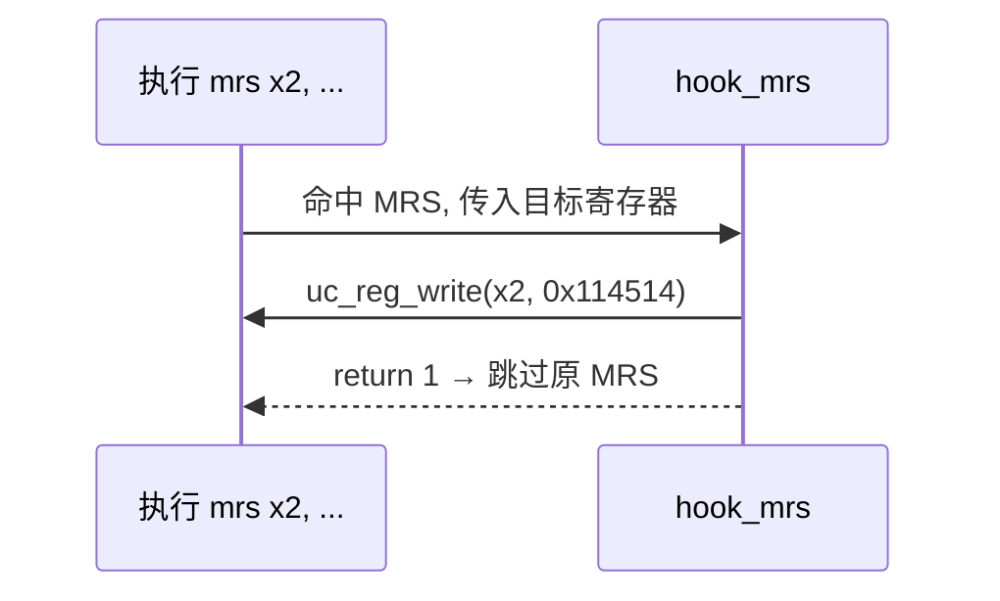

# sample_arm64.c 走读 · ARM64 / AArch64

[`sample_arm64.c`](https://github.com/android-security-engineer/unicorn-skills/blob/master/samples/sample_arm64.c) 除了常规的寄存器/大小端演示，还覆盖了几个 AArch64 的高级话题：从高地址栈取数、读系统寄存器 SCTLR_EL1/EL2、用 `UC_HOOK_INSN` 拦截 `MRS`、以及指针认证 PAC。本页把这些串起来。

## 🎯 演示要点

- 基础加载/存储 + 大小端验证（`test_arm64` / `test_arm64eb`）
- 从极高地址（`0x10000000000000`）读取栈数据
- 用 `uc_arm64_cp_reg` 读 SCTLR_EL1 / SCTLR_EL2
- `UC_HOOK_INSN` + `UC_ARM64_INS_MRS` 拦截系统寄存器读
- 指针认证（PAC）：`paciza` 指令加标签

## 🧩 基础：test_arm64

代码是 `str w11, [x13]` / `ldrb w15, [x13]`，验证小端下 X15 应为 0x78：

```c
#define ARM64_CODE "\xab\x05\x00\xb8\xaf\x05\x40\x38"

uc_open(UC_ARCH_ARM64, UC_MODE_ARM, &uc);
uc_mem_map(uc, ADDRESS, 2 * 1024 * 1024, UC_PROT_ALL);
uc_mem_write(uc, ADDRESS, ARM64_CODE, sizeof(ARM64_CODE) - 1);

uc_reg_write(uc, UC_ARM64_REG_X11, &x11);   // 0x12345678
uc_reg_write(uc, UC_ARM64_REG_X13, &x13);   // 指向 ADDRESS+8
uc_emu_start(uc, ADDRESS, ADDRESS + sizeof(ARM64_CODE) - 1, 0, 0);
uc_reg_read(uc, UC_ARM64_REG_X15, &x15);    // 期望 0x78
```

`test_arm64eb` 用 `UC_MODE_ARM + UC_MODE_BIG_ENDIAN` 打开大端，验证同一逻辑在大端下的结果。

## 🔧 高地址取栈：test_arm64_mem_fetch

把 SP 设到 `0x10000000000000`，让 `LDR X1, [SP]` 从这个高地址读数据，验证 64 位地址空间无碍：

```c
uint64_t data_address = 0x10000000000000;
uc_mem_map(uc, data_address, 0x30000, UC_PROT_ALL);
uc_reg_write(uc, UC_ARM64_REG_SP, &sp);              // sp = data_address
uc_mem_write(uc, data_address, "\xc8\xc8\xc8\xc8\xc8\xc8\xc8\xc8", 8);
// 先执行 msr x0, CurrentEL 取异常级，再执行 ldr x1,[sp]
```

## 🪝 拦截 MRS：test_arm64_hook_mrs

`UC_HOOK_INSN` 在 AArch64 上可拦截 `MRS`。回调签名带 `cp_reg`，可直接改写目标寄存器再**返回 1 跳过**原指令：

```c
static uint32_t hook_mrs(uc_engine *uc, uc_arm64_reg reg,
                         const uc_arm64_cp_reg *cp_reg, void *user_data)
{
    uint64_t r_x2 = 0x114514;
    uc_reg_write(uc, reg, &r_x2);   // 把要读进的目标寄存器改成自定义值
    return 1;                        // 返回非 0 = 跳过该指令
}

uc_hook_add(uc, &hk, UC_HOOK_INSN, hook_mrs, NULL, 1, 0, UC_ARM64_INS_MRS);
```



## 🧠 系统寄存器与 PAC

`test_arm64_sctlr` 通过填 `op0/op1/crn/crm/op2` 定位并读取 SCTLR_EL1、SCTLR_EL2：

```c
uc_arm64_cp_reg reg;
reg.crn = 1; reg.crm = 0; reg.op0 = 0b11; reg.op1 = 0; reg.op2 = 0;  // SCTLR_EL1
uc_reg_read(uc, UC_ARM64_REG_CP_REG, &reg);
```

`test_arm64_pac` 更进一步：选 `UC_CPU_ARM64_MAX`，逐个配置 SCR_EL3 / SCTLR_EL1 / HCR_EL2 的使能位，再执行 `paciza x1`，检查 X1 是否被加上了 PAC 标签（不再等于原值即成功）。

::: tip 为何要一堆系统寄存器配置
PAC 默认关闭。示例注释指明需置位 `NS/RW/API`（SCR_EL3）、`EnIA/EnIB`（SCTLR_EL1）、`HCR.API`（HCR_EL2）三处，才能让 `paci*` 指令真正生效。
:::

## 📤 预期输出（节选）

```text
>>> Emulate ARM64 fetching stack data from high address 10000000000000
>>> x0(Exception Level)=1
>>> X1 = 0xc8c8c8c8c8c8c8c8
-------------------------
Emulate ARM64 code
>>> As little endian, X15 should be 0x78:
>>> X15 = 0x78
-------------------------
Hook MRS instruction.
>>> Hook MSR instruction. Write 0x114514 to X2.
>>> X2 = 0x114514
-------------------------
Try ARM64 PAC
SUCCESS: PAC tag found.
```

::: tip 延伸练习
1. 关掉 PAC 的某一个使能位，观察 `paciza` 是否还生效（预期 "No PAC tag added"）。
2. 用 MRS Hook 伪造 `CurrentEL`，把仿真"欺骗"成运行在 EL2。
3. 把大端子测试的初值改掉，手算大小端下 X15 的差异。
:::

## 📂 相关源码

| 文件 | 角色 |
|------|------|
| [`samples/sample_arm64.c`](https://github.com/android-security-engineer/unicorn-skills/blob/master/samples/sample_arm64.c) | 本页走读的 ARM64 示例 |
| [`include/unicorn/arm64.h`](https://github.com/android-security-engineer/unicorn-skills/blob/master/include/unicorn/arm64.h) | `UC_ARM64_REG_*` 枚举、`uc_arm64_cp_reg` 系统寄存器结构 |
| [`include/unicorn/unicorn.h`](https://github.com/android-security-engineer/unicorn-skills/blob/master/include/unicorn/unicorn.h#L1088) | `uc_hook_add` / `uc_reg_read` / `uc_ctl_set_cpu_model` API 声明 |

## 相关页面

- [ARM64 / AArch64 架构专题](/arch/arm64/)
- [UC_HOOK_INSN — 特定指令](/hooks/insn)
- [uc_ctl_set_cpu_model — 设置 CPU 型号](/ctl/set-cpu-model)
- [寄存器读写](/features/registers)
