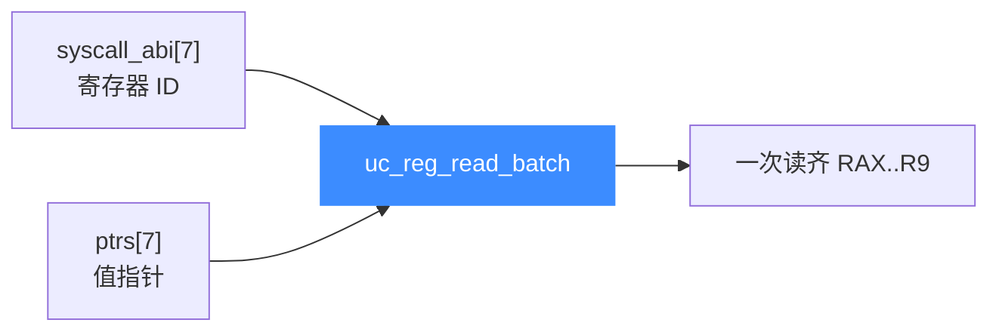

# sample_batch_reg.c 走读 · 批量寄存器读写

[`sample_batch_reg.c`](https://github.com/android-security-engineer/unicorn-skills/blob/master/samples/sample_batch_reg.c) 专门演示 Unicorn 的**批量寄存器 API**：`uc_reg_write_batch` / `uc_reg_read_batch`。一次调用读写多个寄存器，比逐个 `uc_reg_read/write` 更省事、更高效——尤其适合在 syscall Hook 里一次性抓取整套调用约定寄存器。

## 🎯 演示要点

- 用一个 `int[]` 描述"要操作哪些寄存器"
- 用一个 `void*[]` 描述"值从哪来/写到哪去"
- `uc_reg_write_batch` 一次写 7 个寄存器
- `uc_reg_read_batch` 一次读 7 个寄存器
- 在 `UC_HOOK_INSN`(syscall) 里批量抓取 x86-64 系统调用约定寄存器

## 🧩 两个平行数组

批量 API 的核心是**寄存器 ID 数组**与**指针数组**一一对应：

```c
int syscall_abi[] = {UC_X86_REG_RAX, UC_X86_REG_RDI, UC_X86_REG_RSI,
                     UC_X86_REG_RDX, UC_X86_REG_R10, UC_X86_REG_R8,
                     UC_X86_REG_R9};

uint64_t vals[7] = {200, 10, 11, 12, 13, 14, 15};
void *ptrs[7];

// 建立一次指针映射，之后读写复用
for (i = 0; i < 7; i++)
    ptrs[i] = &vals[i];
```

::: tip 为什么要指针数组
Unicorn 支持任意宽度的寄存器类型，无法用单一整型数组承载。因此批量 API 收一个 `void**`——每个元素指向该寄存器值的存储位置。好处：这个指针数组只需建一次，读写都能复用。
:::

## 🔧 批量写、批量读

```c
// 一次写入 7 个寄存器（值取自 vals）
uc_reg_write_batch(uc, syscall_abi, ptrs, 7);

// 清零后一次读回 7 个寄存器（结果写回 vals）
memset(vals, 0, sizeof(vals));
uc_reg_read_batch(uc, syscall_abi, ptrs, 7);
// 此时 vals 恢复为 {200, 10, 11, 12, 13, 14, 15}
```

## 🪝 在 syscall Hook 里批量抓寄存器

被仿真的 shellcode 依次把 `rax=100, rdi=1, rsi=2, rdx=3, r10=4, r8=5, r9=6` 装好后执行 `syscall`。Hook 用一次批量读把整套 ABI 寄存器抓出来：

```c
void hook_syscall(uc_engine *uc, void *user_data)
{
    uc_reg_read_batch(uc, syscall_abi, ptrs, 7);   // 一次读齐 7 个
    printf("syscall: {");
    for (int i = 0; i < 7; i++)
        printf(i ? ", %" PRIu64 : "%" PRIu64, vals[i]);
    printf("}\n");
}

uc_hook_add(uc, &sys_hook, UC_HOOK_INSN, hook_syscall, NULL,
            1, 0, UC_X86_INS_SYSCALL);
```



## 📤 预期输出

```text
reg_write_batch({200, 10, 11, 12, 13, 14, 15})
reg_read_batch = {200, 10, 11, 12, 13, 14, 15}

running syscall shellcode
syscall: {100, 1, 2, 3, 4, 5, 6}
```

前两行验证批量写后再读能拿回原值；最后一行是 shellcode 执行到 `syscall` 时，Hook 抓到的实际寄存器状态。

::: tip 延伸练习
1. 把 `syscall_abi` 扩到包含 `RIP`，观察 syscall 时的指令地址。
2. 用 `uc_reg_write_batch` 在 Hook 里**修改** syscall 参数，实现"参数劫持"。
3. 对比逐个 `uc_reg_read` 与一次 `uc_reg_read_batch` 的代码量与可读性。
:::

## 📂 相关源码

| 文件 | 角色 |
|------|------|
| [`samples/sample_batch_reg.c`](https://github.com/android-security-engineer/unicorn-skills/blob/master/samples/sample_batch_reg.c) | 本页走读的批量寄存器读写示例 |
| [`include/unicorn/x86.h`](https://github.com/android-security-engineer/unicorn-skills/blob/master/include/unicorn/x86.h) | `UC_X86_REG_*` 寄存器枚举 |
| [`include/unicorn/unicorn.h`](https://github.com/android-security-engineer/unicorn-skills/blob/master/include/unicorn/unicorn.h#L866) | `uc_reg_read_batch` / `uc_reg_write_batch` 声明 |

## 相关页面

- [uc_reg_read_batch — 批量读寄存器](/api/reg-read-batch)
- [批量寄存器 API](/features/batch-api)
- [UC_HOOK_INSN — 特定指令](/hooks/insn)
- [示例总览](/samples/overview)
