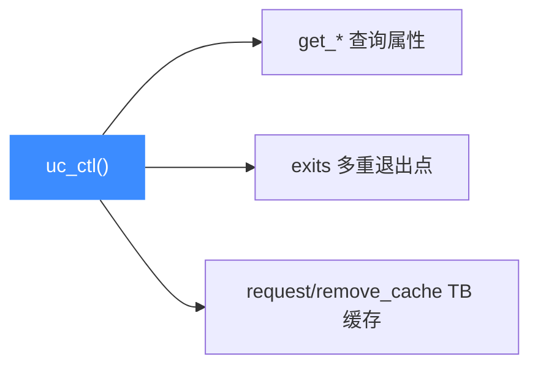

# sample_ctl.c 走读 · uc_ctl 控制接口

[`sample_ctl.c`](https://github.com/android-security-engineer/unicorn-skills/blob/master/samples/sample_ctl.c) 集中演示 `uc_ctl()` 这一"万能控制旋钮"。`uc_ctl` 是 Unicorn 用来读取属性、调节行为的统一入口，`uc_ctl_*` 都是它的薄封装宏。示例分三部分：查询属性、多重退出点、TB 缓存精细控制。

## 🎯 演示要点

- `uc_ctl_get_*`：查询 mode / arch / timeout / page size
- `uc_ctl_exits_enable` + `uc_ctl_set_exits`：设置多个退出点
- `UC_HOOK_EDGE_GENERATED`：追踪新生成的控制流边
- `uc_ctl_request_cache` / `uc_ctl_remove_cache`：手动管理翻译块（TB）缓存

## 🧩 一、查询属性

`uc_ctl_get_*` 都是 `uc_ctl()` 的宏封装，用来读只读属性：

```c
int mode, arch;
uint32_t pagesize;
uint64_t timeout;

uc_ctl_get_mode(uc, &mode);
uc_ctl_get_arch(uc, &arch);
uc_ctl_get_timeout(uc, &timeout);
uc_ctl_get_page_size(uc, &pagesize);
printf(">>> mode = %d, arch = %d, timeout=%llu, pagesize=%u\n", ...);
```

## 🔧 二、多重退出点

默认 `uc_emu_start` 只有一个结束地址。开启 exits 后可以设置**一组**退出点，让引擎命中任意一个就停：

```c
uint64_t exits[] = {ADDRESS + 6, ADDRESS + 8};

uc_ctl_exits_enable(uc);          // 先启用
uc_ctl_set_exits(uc, exits, 2);   // 再设置退出点数组

// 注意 uc_emu_start 的 begin/end 传 0，改由 exits 控制何时停
uc_emu_start(uc, ADDRESS, 0, 0, 0);   // 停在 ADDRESS+6
// ... 读 eax/ebx ...
uc_emu_start(uc, ADDRESS, 0, 0, 0);   // 再跑一次，停在 ADDRESS+8
```

被执行的 `X86_JUMP_CODE` 含一个条件跳转，两个退出点分别对应"跳转成立"和"顺序执行"两条路径的落点。

::: tip 退出点 vs 结束地址
开启 exits 后，`uc_emu_start` 的 `until` 参数被忽略，转而由 `uc_ctl_set_exits` 设的地址集合决定停机。这对模糊测试里"给定若干候选终点"的场景很有用。
:::

## 🧠 三、TB 缓存精细控制

`test_uc_ctl_tb_cache` 填满 8 个 TB 的 NOP 代码，对比三种情形的执行耗时：

```c
// 1) 无缓存基准
standard = time_emulation(uc, ADDRESS, ADDRESS + sizeof(code) - 1);

// 2) 为全部 8 个 TB 主动请求缓存
for (int i = 0; i < TB_COUNT; i++) {
    uc_ctl_request_cache(uc, ADDRESS + i * TCG_MAX_INSNS, &tb);
    printf(">>> TB cached at 0x%llx, %u insns, %u bytes\n",
           tb.pc, tb.icount, tb.size);
}
cached = time_emulation(...);

// 3) 逐个移除缓存后再跑
for (int i = 0; i < TB_COUNT; i++)
    uc_ctl_remove_cache(uc, ADDRESS + i * TCG_MAX_INSNS,
                            ADDRESS + i * TCG_MAX_INSNS + 1);
evicted = time_emulation(...);
```



## 📤 预期输出（节选）

```text
Reading some properties by uc_ctl.
>>> mode = 4, arch = 1, timeout=0, pagesize=4096
====================
Using multiple exits by uc_ctl.
>>> Getting a new edge from 0x10005 to 0x10008.
>>> eax = 0 and ebx = 1 after the first emulation
>>> eax = 1 and ebx = 1 after the second emulation
====================
Controling the TB cache in a finer granularity by uc_ctl.
>>> TB is cached at 0x10000 which has 512 instructions with 512 bytes.
...
>>> Run time: First time: ..., Cached: ..., Cache evicted: ...
```

::: tip 延伸练习
1. 用 `uc_ctl_set_cpu_model` 换一个 CPU 型号，再执行含 SIMD 的代码看是否被接受。
2. 把退出点改到跳转指令中间地址，观察引擎能否命中。
3. 比较三次耗时，理解 TB 缓存对热路径重复执行的加速作用。
:::

## 📂 相关源码

| 文件 | 角色 |
|------|------|
| [`samples/sample_ctl.c`](https://github.com/android-security-engineer/unicorn-skills/blob/master/samples/sample_ctl.c) | 本页走读的 `uc_ctl` 控制接口示例 |
| [`include/unicorn/unicorn.h`](https://github.com/android-security-engineer/unicorn-skills/blob/master/include/unicorn/unicorn.h#L567) | `UC_CTL_UC_USE_EXITS` / `UC_CTL_UC_EXITS` 等 `uc_ctl_*` 控制项与宏 |
| [`include/unicorn/unicorn.h`](https://github.com/android-security-engineer/unicorn-skills/blob/master/include/unicorn/unicorn.h#L778) | `uc_ctl` 统一入口声明 |
| [`uc.c`](https://github.com/android-security-engineer/unicorn-skills/blob/master/uc.c#L2623) | `uc_ctl` 控制项分发实现 |

## 相关页面

- [uc_ctl 控制接口总览](/ctl/)
- [UC_HOOK_EDGE_GENERATED — 控制流边](/hooks/edge-generated)
- [JIT 编译（TCG）](/features/jit)
- [示例总览](/samples/overview)
