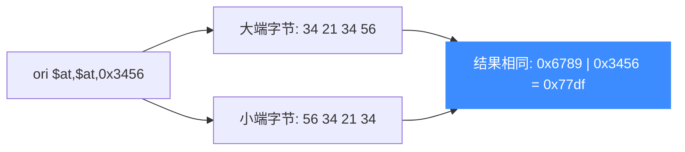

# sample_mips.c 走读 · MIPS

[`sample_mips.c`](https://github.com/android-security-engineer/unicorn-skills/blob/master/samples/sample_mips.c) 是最小巧的架构示例之一：同一条 `ori` 指令分别在**大端**和**小端**两种模式下跑一遍，直观展示 Unicorn 如何用同一套 API 处理字节序差异。

## 🎯 演示要点

- `UC_MODE_MIPS32` 配合 `UC_MODE_BIG_ENDIAN` / `UC_MODE_LITTLE_ENDIAN`
- 同一逻辑指令、不同字节序下的机器码差异
- 标准五步仿真流程 + BLOCK/CODE 追踪

## 🧩 大端与小端的机器码

关键点：同一条 `ori $at, $at, 0x3456`，大端和小端的字节序列正好相反：

```c
#define MIPS_CODE_EB "\x34\x21\x34\x56" // 大端: ori $at, $at, 0x3456
#define MIPS_CODE_EL "\x56\x34\x21\x34" // 小端: ori $at, $at, 0x3456
```

大端子测试用 `UC_MODE_BIG_ENDIAN` 打开引擎并写入 `MIPS_CODE_EB`：

```c
uc_open(UC_ARCH_MIPS, UC_MODE_MIPS32 + UC_MODE_BIG_ENDIAN, &uc);
uc_mem_map(uc, ADDRESS, 2 * 1024 * 1024, UC_PROT_ALL);
uc_mem_write(uc, ADDRESS, MIPS_CODE_EB, sizeof(MIPS_CODE_EB) - 1);

uc_reg_write(uc, UC_MIPS_REG_1, &r1);   // $at 初值 0x6789
uc_hook_add(uc, &trace1, UC_HOOK_BLOCK, hook_block, NULL, 1, 0);
uc_hook_add(uc, &trace2, UC_HOOK_CODE,  hook_code,  NULL, ADDRESS, ADDRESS);
uc_emu_start(uc, ADDRESS, ADDRESS + sizeof(MIPS_CODE_EB) - 1, 0, 0);
uc_reg_read(uc, UC_MIPS_REG_1, &r1);    // 0x6789 | 0x3456 = 0x77df
```

小端子测试 `test_mips_el` 只把两处换成 `UC_MODE_LITTLE_ENDIAN` + `MIPS_CODE_EL`，其余完全一致。



::: tip 字节序影响的是编码不是语义
`ori` 是逻辑或，运算结果与字节序无关。字节序改变的是**指令在内存中的排布**，因此两种模式必须喂不同的机器码字节，才能解码成同一条指令。
:::

## 📤 预期输出

```text
Emulate MIPS code (big-endian)
>>> Tracing basic block at 0x10000, block size = 0x4
>>> Tracing instruction at 0x10000, instruction size = 0x4
>>> Emulation done. Below is the CPU context
>>> R1 = 0x77df
===========================
Emulate MIPS code (little-endian)
...
>>> R1 = 0x77df
```

`$at`（1 号寄存器）初值 `0x6789` 与立即数 `0x3456` 按位或，得 `0x77df`——两种字节序结果一致。

::: tip 延伸练习
1. 把立即数 Hook 成打印：在 `hook_code` 里读出 `UC_MIPS_REG_1`，观察执行前后的值变化。
2. 换用 `UC_MODE_MIPS64` 尝试 64 位 MIPS，注意寄存器宽度。
3. 故意给大端引擎喂小端字节，看解码出的是什么指令。
:::

## 📂 相关源码

| 文件 | 角色 |
|------|------|
| [`samples/sample_mips.c`](https://github.com/android-security-engineer/unicorn-skills/blob/master/samples/sample_mips.c) | 本页走读的 MIPS 示例 |
| [`include/unicorn/mips.h`](https://github.com/android-security-engineer/unicorn-skills/blob/master/include/unicorn/mips.h) | `UC_MIPS_REG_*` 寄存器枚举 |
| [`include/unicorn/unicorn.h`](https://github.com/android-security-engineer/unicorn-skills/blob/master/include/unicorn/unicorn.h#L735) | `uc_open` / `uc_emu_start` / `uc_reg_read` API 声明 |

## 相关页面

- [MIPS 架构专题](/arch/mips/)
- [字节序处理](/features/endianness)
- [uc_open — 创建引擎](/api/open)
- [示例总览](/samples/overview)
