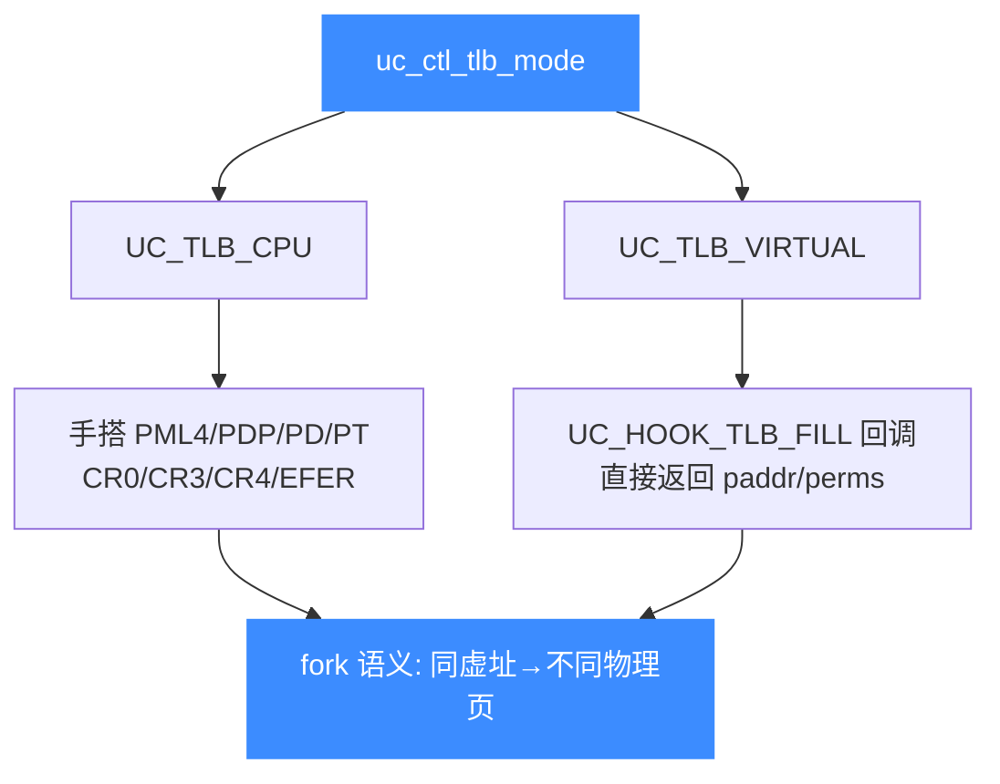

# sample_mmu.c 走读 · MMU 与虚拟内存

[`sample_mmu.c`](https://github.com/android-security-engineer/unicorn-skills/blob/master/samples/sample_mmu.c) 是全套示例里最硬核的一篇：它在 x86-64 上开启**分页 MMU**，手工搭建四级页表，模拟一次 `fork()`——父/子进程共用同一段代码却映射到不同物理页。示例用两种方式实现同一效果：`UC_TLB_CPU`（真实页表遍历）与 `UC_TLB_VIRTUAL`（回调式软 TLB）。

## 🎯 演示要点

- `uc_ctl_tlb_mode`：切换 `UC_TLB_CPU` / `UC_TLB_VIRTUAL` 两种 MMU 模式
- CPU 模式：手写 PML4/PDP/PD/PT 四级页表 + 设置 CR0/CR3/CR4/EFER
- 虚拟模式：用 `UC_HOOK_TLB_FILL` 回调直接返回物理地址
- 用 `uc_context_save/restore` 在父子进程间切换上下文
- 内存 Hook 在 MMU 翻译**之后**触发（钉的是物理地址）

## 🧩 CPU 模式：手搭页表

`cpu_tlb()` 选 `UC_TLB_CPU`，然后逐级写入页表项，并打开分页所需的控制位：

```c
uc_ctl_tlb_mode(uc, UC_TLB_CPU);
// ... 映射 code(0x0) / parent(0x1000) / child(0x2000) / tlb(0x3000) ...

// x86_mmu_prepare_tlb: 写 PML4E/PDPE/PDE，设 CR3=tlb_base
uc_reg_write(uc, UC_X86_REG_CR3, &tlb_base);
cr0 |= 1;             // 保护模式
cr0 |= 1l << 31;      // 开启分页
cr4 |= 1l << 5;       // PAE 物理地址扩展
msr.value |= 1l << 8; // EFER.LME 长模式
```

叶级页表项由 `x86_mmu_pt_set` 写入，把虚拟地址映射到指定物理页：

```c
static void x86_mmu_pt_set(uc_engine *uc, uint64_t vaddr, uint64_t paddr,
                           uint64_t tlb_base)
{
    uint64_t pto = ((vaddr & 0x1ff000) >> 12) * 8;
    uint32_t pte = paddr | 1 | (1 << 2);   // present + user
    uc_mem_write(uc, tlb_base + 0x3000 + pto, &pte, sizeof(pte));
}
```

改完页表必须 `uc_ctl_flush_tlb(uc)` 刷新，翻译才会生效。

## 🔧 虚拟模式：TLB_FILL 回调

`virtual_tlb()` 走另一条路：不建页表，改用 `UC_HOOK_TLB_FILL` 回调，直接告诉引擎"这个虚拟地址落到哪个物理地址、什么权限"：

```c
uc_ctl_tlb_mode(uc, UC_TLB_VIRTUAL);

static bool virtual_tlb_callback(uc_engine *uc, uint64_t addr, uc_mem_type type,
                                 uc_tlb_entry *result, void *user_data)
{
    bool *parent_done = user_data;
    switch (addr & ~0xfffULL) {
    case 0x2000:
        result->paddr = 0x0; result->perms = UC_PROT_EXEC; return true;
    case 0x4000:
        result->paddr = *parent_done ? 0x2000 : 0x1000;   // 父/子切换物理页
        result->perms = UC_PROT_READ | UC_PROT_WRITE; return true;
    }
    return false;
}
uc_hook_add(uc, &h3, UC_HOOK_TLB_FILL, virtual_tlb_callback, &parent_done, 1, 0);
```

同一个虚拟地址 `0x4000`，父进程阶段映射到 `0x1000`，子进程阶段映射到 `0x2000`——这正是 `fork` 后写时"各写各的物理页"的语义。



## 🧠 父子进程与上下文切换

两种模式流程一致：先跑"父"到 `syscall`（`x86_mmu_syscall_callback` 里 `rax==57` 视为 fork），`uc_context_save` 存档；再切换页表/标志位、`uc_context_restore`，从同一 `rip` 跑"子"。最后读 `0x1000`（父内存）与 `0x2000`（子内存）验证两者写入了各自的值。

::: warning 内存 Hook 钉物理地址
示例注释强调：内存 Hook 在 MMU 翻译**之后**触发，因此 `UC_HOOK_MEM_WRITE` 的地址区间 `[0x1000, 0x3000]` 用的是**物理地址**，而不是代码里写的虚拟地址。
:::

## 📤 预期输出（节选）

```text
Emulate x86 amd64 code with mmu enabled and switch mappings
map code
...
run the parrent
write at 0x1000: 0x3c
...
parrent result == 60
child result == 42
Emulate x86 amd64 code with virtual mmu
tlb lookup for address: 0x2000
...
parrent result == 60
child result == 42
```

父内存最终是 `60`（父进程写入），子内存是 `42`（子进程写入），证明两条路径映射到了不同物理页。

::: tip 延伸练习
1. 对照 `cpu_tlb` 与 `virtual_tlb`，总结手搭页表与回调式 TLB 各自的适用场景。
2. 在 `virtual_tlb_callback` 里对某地址返回 `false`，观察触发的缺页错误类型。
3. 去掉 `uc_ctl_flush_tlb` 调用，验证不刷新 TLB 时旧映射仍然生效。
:::

## 📂 相关源码

| 文件 | 角色 |
|------|------|
| [`samples/sample_mmu.c`](https://github.com/android-security-engineer/unicorn-skills/blob/master/samples/sample_mmu.c) | 本页走读的 MMU 与虚拟内存示例 |
| [`include/unicorn/x86.h`](https://github.com/android-security-engineer/unicorn-skills/blob/master/include/unicorn/x86.h) | `UC_X86_REG_CR0/CR3` 等控制寄存器枚举 |
| [`include/unicorn/unicorn.h`](https://github.com/android-security-engineer/unicorn-skills/blob/master/include/unicorn/unicorn.h#L536) | `uc_tlb_type` 枚举（`UC_TLB_CPU` / `UC_TLB_VIRTUAL`） |
| [`qemu/softmmu/unicorn_vtlb.c`](https://github.com/android-security-engineer/unicorn-skills/blob/master/qemu/softmmu/unicorn_vtlb.c) | `UC_TLB_VIRTUAL` 软 TLB 实现 |

## 相关页面

- [MMU 与虚拟内存](/features/mmu)
- [内存模型总览](/memory/overview)
- [UC_HOOK_TLB_FILL — TLB 填充](/hooks/tlb-fill)
- [uc_ctl_tlb_mode — 切换 TLB 模式](/ctl/tlb-mode)
