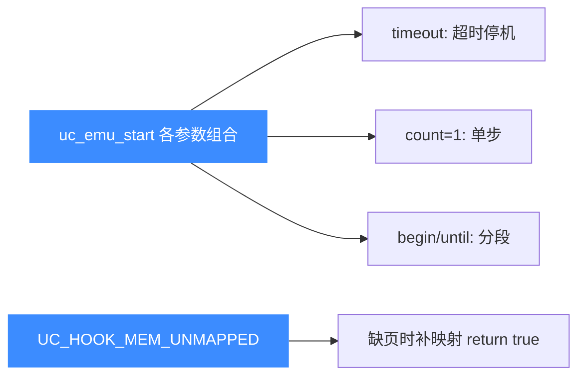

# sample_riscv.c 走读 · RISC-V

[`sample_riscv.c`](https://github.com/android-security-engineer/unicorn-skills/blob/master/samples/sample_riscv.c) 是本套示例里子测试最多的架构样例之一：从基础加法，到分段执行、提前停止、单步、超时、64 位存储、非法指令恢复、函数返回，共 8 个 `test_*`。它系统性地展示了 `uc_emu_start` 各种参数组合与 Hook 的配合。

## 🎯 演示要点

- 基础执行 `test_riscv`：两条 `addi` 修改 `a0 / a1`
- 分段执行 `test_riscv2`：把一段代码拆成多次 `uc_emu_start`
- 提前停止 `test_riscv3`：在 CODE Hook 里 `uc_emu_stop`
- 单步 / 超时 / 64 位 `sd` / 非法指令自动补内存 / `ret` 与 `c.ret`

## 🧩 基础：test_riscv

代码是两条 `addi`（RISCV32 模式）：

```c
// addi a0, zero, 1 ; addi a1, a1, 0x20
#define RISCV_CODE "\x13\x05\x10\x00\x93\x85\x05\x02"

uc_open(UC_ARCH_RISCV, UC_MODE_RISCV32, &uc);
uc_mem_map(uc, ADDRESS, 2 * 1024 * 1024, UC_PROT_ALL);
uc_mem_write(uc, ADDRESS, RISCV_CODE, sizeof(RISCV_CODE) - 1);

uint32_t a0 = 0x1234, a1 = 0x7890;
uc_reg_write(uc, UC_RISCV_REG_A0, &a0);
uc_reg_write(uc, UC_RISCV_REG_A1, &a1);
uc_emu_start(uc, ADDRESS, ADDRESS + sizeof(RISCV_CODE) - 1, 0, 0);
// a0 = 1（zero+1）, a1 = 0x7890 + 0x20 = 0x78b0
```

## 🔧 分段与提前停止

`test_riscv2` 把两条指令拆成两次 `uc_emu_start`，验证"接着上次 PC 继续"：

```c
uc_emu_start(uc, ADDRESS,     ADDRESS + 4, 0, 0);   // 只跑第 1 条
uc_emu_start(uc, ADDRESS + 4, ADDRESS + 8, 0, 0);   // 再跑第 2 条
```

`test_riscv3` 则在 CODE Hook（`hook_code3`）里，一旦地址等于入口就 `uc_emu_stop`——演示从回调中主动终止仿真。

::: tip 单步与超时用的都是 uc_emu_start 参数
`test_riscv_step` 用 `uc_emu_start(uc, ADDRESS, ADDRESS+12, 0, 1)` 的最后一个参数 `count=1` 实现单步（只执行 1 条），执行后校验 `PC == 0x10004`。`test_riscv_timeout` 用第 4 个参数 `timeout=1000`（微秒）+ 全零非法代码，验证超时后 PC 不推进（停在 `0x10000`）。
:::

## 🧠 非法指令自动补内存：hook_memalloc

`test_recover_from_illegal` 展示一个很实用的模式——用 `UC_HOOK_MEM_UNMAPPED` 回调在访问缺页时**当场映射内存并返回 true**，让仿真自愈：

```c
static bool hook_memalloc(uc_engine *uc, uc_mem_type type, uint64_t address,
                          int size, int64_t value, void *user_data)
{
    uint64_t aligned = address & 0xFFFFFFFFFFFFF000ULL;
    int aligned_size = ((int)(size / 0x1000) + 1) * 0x1000;
    uc_mem_map(uc, aligned, aligned_size, UC_PROT_ALL);
    return true;   // 已补映射 → 从缺页中恢复
}
uc_hook_add(uc, &mem_alloc, UC_HOOK_MEM_UNMAPPED, hook_memalloc, NULL, 1, 0);
```

先从错误地址 `0x1000` 执行会得到 `UC_ERR_INSN_INVALID`；再从正确地址跑就正常。



## 🪝 函数返回：ret 与 c.ret

`test_riscv_func_return` 先把返回地址寄存器 `RA` 设成 `0x10006`，再分别执行 `ret`（`00008067`）和压缩指令 `c.ret`（`8082`），验证执行后 `PC == RA`——说明 Unicorn 正确处理了标准与压缩两种返回指令。

## 📤 预期输出（节选）

```text
Emulate RISCV code: recover_from_illegal
>>> Allocating block at 0x1000 (0x1000), block size = 0x1 (0x1000)
...
------------------
Emulate RISCV code
>>> A0 = 0x1
>>> A1 = 0x78b0
...
Emulate RISCV code: return from func
Good, PC == RA
========
Good, PC == RA
```

::: tip 延伸练习
1. 把 `test_riscv_step` 的 `count` 改成 2，一次单步走两条，观察 PC 落点。
2. 给 `test_riscv_timeout` 换一段真实死循环，验证超时确实中断了执行。
3. 在 `hook_memalloc` 里返回 `false`，确认仿真退回到 `UC_ERR` 而不再自愈。
:::

## 📂 相关源码

| 文件 | 角色 |
|------|------|
| [`samples/sample_riscv.c`](https://github.com/android-security-engineer/unicorn-skills/blob/master/samples/sample_riscv.c) | 本页走读的 RISC-V 示例 |
| [`include/unicorn/riscv.h`](https://github.com/android-security-engineer/unicorn-skills/blob/master/include/unicorn/riscv.h) | `UC_RISCV_REG_*` 寄存器枚举 |
| [`include/unicorn/unicorn.h`](https://github.com/android-security-engineer/unicorn-skills/blob/master/include/unicorn/unicorn.h#L1047) | `uc_emu_start` / `uc_hook_add` / `uc_query` API 声明 |

## 相关页面

- [RISC-V 架构专题](/arch/riscv/)
- [UC_HOOK_MEM_UNMAPPED — 未映射合集](/hooks/mem-unmapped)
- [超时与指令计数](/features/timeout)
- [uc_emu_start — 启动仿真](/api/emu-start)
