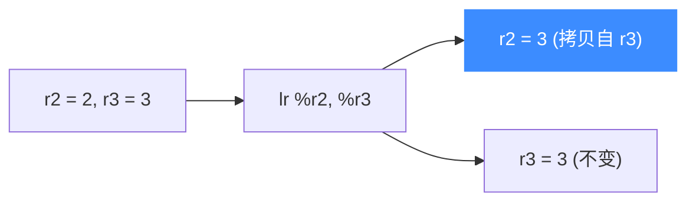

# sample_s390x.c 走读 · IBM S390X

[`sample_s390x.c`](https://github.com/android-security-engineer/unicorn-skills/blob/master/samples/sample_s390x.c) 演示在 Unicorn 上仿真 IBM System/390（s390x，即 z/Architecture）。它执行一条 `lr %r2, %r3`——把寄存器 `%r3` 的内容拷贝到 `%r2`，是理解大端主机架构仿真的最小样例。

## 🎯 演示要点

- `UC_ARCH_S390X` + `UC_MODE_BIG_ENDIAN`（z 架构固定大端）
- 通用寄存器 `%r2 / %r3` 的读写（`uint64_t` 宽度）
- `lr`（load register）的寄存器间拷贝语义

## 🧩 关键代码走读

只映射 1MB 内存（比其他示例的 2MB 小），代码是两字节的 `lr`：

```c
#define S390X_CODE "\x18\x23" // lr %r2, %r3
#define ADDRESS 0x10000

uc_open(UC_ARCH_S390X, UC_MODE_BIG_ENDIAN, &uc);
uc_mem_map(uc, ADDRESS, 1024 * 1024, UC_PROT_ALL);   // 1MB
uc_mem_write(uc, ADDRESS, S390X_CODE, sizeof(S390X_CODE) - 1);

uint64_t r2 = 2, r3 = 3;
uc_reg_write(uc, UC_S390X_REG_R2, &r2);
uc_reg_write(uc, UC_S390X_REG_R3, &r3);

uc_hook_add(uc, &trace1, UC_HOOK_BLOCK, hook_block, NULL, 1, 0);
uc_hook_add(uc, &trace2, UC_HOOK_CODE,  hook_code,  NULL, 1, 0);

uc_emu_start(uc, ADDRESS, ADDRESS + sizeof(S390X_CODE) - 1, 0, 0);
uc_reg_read(uc, UC_S390X_REG_R2, &r2);   // r2 被 r3 覆盖 → 3
uc_reg_read(uc, UC_S390X_REG_R3, &r3);   // r3 不变 → 3
```

`lr` 是纯拷贝：执行后 `%r2` 从初值 `2` 变成 `%r3` 的值 `3`，而 `%r3` 保持不变。



::: tip 寄存器宽度用 uint64_t
s390x 是 64 位架构，示例用 `uint64_t` 存放寄存器值。若误用 32 位 `int`，`uc_reg_read/write` 会读写错误的字节数。
:::

## 📤 预期输出

```text
Emulate S390X code
>>> Tracing basic block at 0x10000, block size = 0x2
>>> Tracing instruction at 0x10000, instruction size = 0x2
>>> Emulation done. Below is the CPU context
>>> R2 = 0x3		>>> R3 = 0x3
```

`%r2` 被 `%r3` 覆盖为 `3`，验证 `lr` 拷贝生效。

::: tip 延伸练习
1. 把 `lr` 换成 `ar %r2, %r3`（加法）的机器码，验证 `%r2 = %r2 + %r3`。
2. 在 `hook_code` 里读出两个寄存器，打印拷贝前的状态。
3. 追加第二条指令，观察 BLOCK Hook 报告的 `block size` 变化。
:::

## 📂 相关源码

| 文件 | 角色 |
|------|------|
| [`samples/sample_s390x.c`](https://github.com/android-security-engineer/unicorn-skills/blob/master/samples/sample_s390x.c) | 本页走读的 s390x 示例 |
| [`include/unicorn/s390x.h`](https://github.com/android-security-engineer/unicorn-skills/blob/master/include/unicorn/s390x.h) | `UC_S390X_REG_*` 寄存器枚举 |
| [`include/unicorn/unicorn.h`](https://github.com/android-security-engineer/unicorn-skills/blob/master/include/unicorn/unicorn.h#L735) | `uc_open` / `uc_emu_start` / `uc_reg_read` API 声明 |

## 相关页面

- [s390x 架构专题](/arch/s390x/)
- [UC_HOOK_CODE — 每条指令](/hooks/code)
- [寄存器读写](/features/registers)
- [示例总览](/samples/overview)
