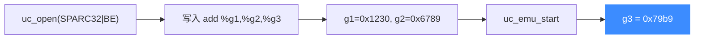

# sample_sparc.c 走读 · SPARC

[`sample_sparc.c`](https://github.com/android-security-engineer/unicorn-skills/blob/master/samples/sample_sparc.c) 是一枚"教科书级"的最小示例：初始化 SPARC32 引擎，执行一条 `add %g1, %g2, %g3`，读出 `%g3` 验证结果。适合作为理解 Unicorn 五步流程的入门样板。

## 🎯 演示要点

- `UC_ARCH_SPARC` + `UC_MODE_SPARC32 | UC_MODE_BIG_ENDIAN`
- 全局寄存器 `%g1 / %g2 / %g3` 的读写
- BLOCK / CODE 两级追踪 Hook

## 🧩 关键代码走读

一条大端编码的加法指令，把 `%g1 + %g2` 写入 `%g3`：

```c
#define SPARC_CODE "\x86\x00\x40\x02" // add %g1, %g2, %g3;
#define ADDRESS 0x10000

uc_open(UC_ARCH_SPARC, UC_MODE_SPARC32 | UC_MODE_BIG_ENDIAN, &uc);
uc_mem_map(uc, ADDRESS, 2 * 1024 * 1024, UC_PROT_ALL);
uc_mem_write(uc, ADDRESS, SPARC_CODE, sizeof(SPARC_CODE) - 1);

int g1 = 0x1230, g2 = 0x6789, g3 = 0x5555;
uc_reg_write(uc, UC_SPARC_REG_G1, &g1);
uc_reg_write(uc, UC_SPARC_REG_G2, &g2);
uc_reg_write(uc, UC_SPARC_REG_G3, &g3);   // 会被结果覆盖

uc_hook_add(uc, &trace1, UC_HOOK_BLOCK, hook_block, NULL, 1, 0);
uc_hook_add(uc, &trace2, UC_HOOK_CODE,  hook_code,  NULL, 1, 0);

uc_emu_start(uc, ADDRESS, ADDRESS + sizeof(SPARC_CODE) - 1, 0, 0);
uc_reg_read(uc, UC_SPARC_REG_G3, &g3);    // 0x1230 + 0x6789 = 0x79b9
```

`%g3` 初值 `0x5555` 无关紧要——它会被 `add` 的结果整个覆盖。



::: tip 为什么是大端
SPARC 是传统的大端架构，示例固定用 `UC_MODE_BIG_ENDIAN`。机器码 `86 00 40 02` 正是大端顺序下 `add %g1,%g2,%g3` 的编码。
:::

## 📤 预期输出

```text
Emulate SPARC code
>>> Tracing basic block at 0x10000, block size = 0x4
>>> Tracing instruction at 0x10000, instruction size = 0x4
>>> Emulation done. Below is the CPU context
>>> G3 = 0x79b9
```

`0x1230 + 0x6789 = 0x79b9`，与预期一致。

::: tip 延伸练习
1. 把源码里注释的非法指令 `"\xbb\x70\x00\x00"` 换上，观察 `uc_emu_start` 返回的错误码。
2. 改用 `UC_MODE_SPARC64`（若构建支持），验证 64 位寄存器宽度。
3. 在 `hook_code` 里读出 `%g1/%g2`，打印加法前的操作数。
:::

## 📂 相关源码

| 文件 | 角色 |
|------|------|
| [`samples/sample_sparc.c`](https://github.com/android-security-engineer/unicorn-skills/blob/master/samples/sample_sparc.c) | 本页走读的 SPARC 示例 |
| [`include/unicorn/sparc.h`](https://github.com/android-security-engineer/unicorn-skills/blob/master/include/unicorn/sparc.h) | `UC_SPARC_REG_*` 寄存器枚举 |
| [`include/unicorn/unicorn.h`](https://github.com/android-security-engineer/unicorn-skills/blob/master/include/unicorn/unicorn.h#L735) | `uc_open` / `uc_emu_start` / `uc_reg_read` API 声明 |

## 相关页面

- [SPARC 架构专题](/arch/sparc/)
- [UC_HOOK_CODE — 每条指令](/hooks/code)
- [uc_reg_read — 读寄存器](/api/reg-read)
- [示例总览](/samples/overview)
