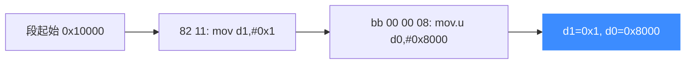

# sample_tricore.c 走读 · Infineon TriCore

[`sample_tricore.c`](https://github.com/android-security-engineer/unicorn-skills/blob/master/samples/sample_tricore.c) 演示 Unicorn 对 Infineon TriCore（常见于汽车 ECU/MCU）架构的支持。它连续执行两条 `mov`，分别给数据寄存器 `d1`、`d0` 赋立即数，展示变长指令与小端 TriCore 的基本用法。

## 🎯 演示要点

- `UC_ARCH_TRICORE` + `UC_MODE_LITTLE_ENDIAN`
- 一段包含**两条变长指令**的代码（2 字节 + 4 字节）
- CODE Hook 用区间 `[ADDRESS, ADDRESS+len-1]` 覆盖整段
- 数据寄存器 `D0 / D1` 的读回

## 🧩 关键代码走读

代码是 6 字节，含两条指令：

```c
#define CODE "\x82\x11\xbb\x00\x00\x08" // mov d1, #0x1; mov.u d0, #0x8000
#define ADDRESS 0x10000

uc_open(UC_ARCH_TRICORE, UC_MODE_LITTLE_ENDIAN, &uc);
uc_mem_map(uc, ADDRESS, 2 * 1024 * 1024, UC_PROT_ALL);
uc_mem_write(uc, ADDRESS, CODE, sizeof(CODE) - 1);

uc_hook_add(uc, &trace1, UC_HOOK_BLOCK, hook_block, NULL, 1, 0);
// CODE Hook 覆盖整段代码区间
uc_hook_add(uc, &trace2, UC_HOOK_CODE, hook_code, NULL,
            ADDRESS, ADDRESS + sizeof(CODE) - 1);

uc_emu_start(uc, ADDRESS, ADDRESS + sizeof(CODE) - 1, 0, 0);

uint32_t d0 = 0, d1 = 0;
uc_reg_read(uc, UC_TRICORE_REG_D0, &d0);   // 0x8000
uc_reg_read(uc, UC_TRICORE_REG_D1, &d1);   // 0x1
```

- `\x82\x11` → `mov d1, #0x1`（2 字节短指令）
- `\xbb\x00\x00\x08` → `mov.u d0, #0x8000`（4 字节长指令）

TriCore 指令长度可变，Unicorn 会按编码自动识别，CODE Hook 会为每条各触发一次。



::: tip 变长指令与 Hook 计数
本示例的 CODE Hook 会触发**两次**：一次在 `0x10000`（size=0x2），一次在 `0x10002`（size=0x4）。这直观说明 Unicorn 逐条解码变长指令的能力。
:::

## 📤 预期输出

```text
Emulate TriCore code
>>> Tracing basic block at 0x10000, block size = 0x6
>>> Tracing instruction at 0x10000, instruction size = 0x2
>>> Tracing instruction at 0x10002, instruction size = 0x4
>>> Emulation done. Below is the CPU context
>>> d0 = 0x8000
>>> d1 = 0x1
```

::: tip 延伸练习
1. 单独执行第一条（把结束地址设成 `ADDRESS+2`），确认只有 `d1` 被赋值。
2. 追加一条 `add d2, d0, d1`，验证 TriCore 加法与三寄存器格式。
3. 把 `mov.u` 换成普通 `mov`，比较符号扩展与零扩展在高位上的差异。
:::

## 📂 相关源码

| 文件 | 角色 |
|------|------|
| [`samples/sample_tricore.c`](https://github.com/android-security-engineer/unicorn-skills/blob/master/samples/sample_tricore.c) | 本页走读的 TriCore 示例 |
| [`include/unicorn/tricore.h`](https://github.com/android-security-engineer/unicorn-skills/blob/master/include/unicorn/tricore.h) | `UC_TRICORE_REG_*` 寄存器枚举 |
| [`include/unicorn/unicorn.h`](https://github.com/android-security-engineer/unicorn-skills/blob/master/include/unicorn/unicorn.h#L735) | `uc_open` / `uc_emu_start` / `uc_reg_read` API 声明 |

## 相关页面

- [TriCore 架构专题](/arch/tricore/)
- [UC_HOOK_CODE — 每条指令](/hooks/code)
- [UC_HOOK_BLOCK — 基本块](/hooks/block)
- [示例总览](/samples/overview)
