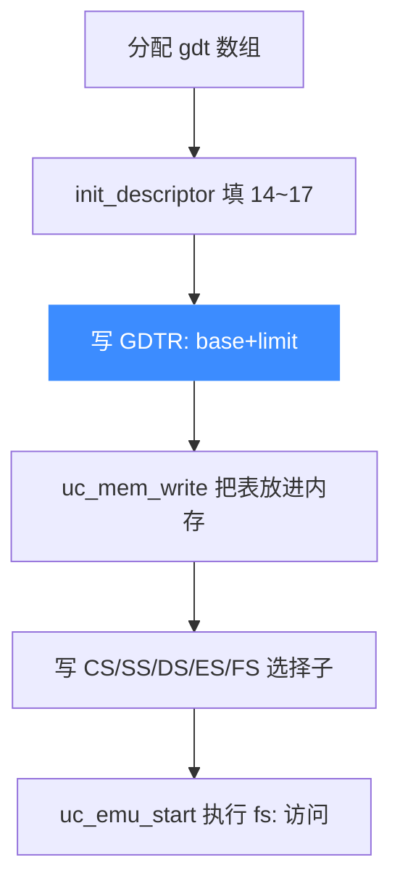

# sample_x86_32_gdt_and_seg_regs.c 走读 · GDT 与段寄存器

本示例（[`sample_x86_32_gdt_and_seg_regs.c`](https://github.com/android-security-engineer/unicorn-skills/blob/master/samples/sample_x86_32_gdt_and_seg_regs.c)）演示一件 X86 底层的活儿：**手工构建一张 GDT（全局描述符表），把它装进内存并设置 `GDTR`，再赋值各段选择子**，最后让代码通过 `fs:` 段前缀访问内存。读完你会理解 Unicorn 里段寄存器是如何生效的。

## 🎯 演示要点

- 用位域结构体 `SegmentDescriptor` 拼出段描述符
- 通过 `uc_x86_mmr` + `UC_X86_REG_GDTR` 设置 GDT 基址/界限
- 设置 `CS/SS/DS/ES/FS` 段选择子的顺序与权限约束
- 用 `UC_HOOK_MEM_WRITE` 观察 `fs:` 前缀写入落到的物理地址

## 🧩 段描述符结构

示例用 `#pragma pack(push, 1)` 紧凑排布一个 8 字节描述符，`init_descriptor` 负责填基址、界限与权限位：

```c
static void init_descriptor(struct SegmentDescriptor *desc, uint32_t base,
                            uint32_t limit, uint8_t is_code)
{
    desc->desc = 0;
    desc->base0 = base & 0xffff;
    desc->base1 = (base >> 16) & 0xff;
    desc->base2 = base >> 24;
    if (limit > 0xfffff) {          // 界限超过 20 位 → 打开 4KB 粒度
        limit >>= 12;
        desc->granularity = 1;
    }
    desc->limit0 = limit & 0xffff;
    desc->limit1 = limit >> 16;
    desc->dpl = 3;                  // 特权级 3（用户态）
    desc->present = 1;
    desc->db = 1;                   // 32 位段
    desc->type = is_code ? 0xb : 3; // 代码段 vs 数据段
    desc->system = 1;
}
```

## 🔧 装载 GDT 并设段寄存器

关键顺序：**先把 GDT 写进内存并设置 `GDTR`，再动任何段寄存器**。示例把描述符放在下标 14~17：

```c
uc_x86_mmr gdtr;
gdtr.base  = gdt_address;                                   // 0xc0000000
gdtr.limit = 31 * sizeof(struct SegmentDescriptor) - 1;

init_descriptor(&gdt[14], 0, 0xfffff000, 1);        // 代码段
init_descriptor(&gdt[15], 0, 0xfffff000, 0);        // 数据段
init_descriptor(&gdt[16], 0x7efdd000, 0xfff, 0);    // 模拟 fs 的单页段
init_descriptor(&gdt[17], 0, 0xfffff000, 0);        // ring0 数据段
gdt[17].dpl = 0;

uc_reg_write(uc, UC_X86_REG_GDTR, &gdtr);                       // 先设 GDTR
uc_mem_write(uc, gdt_address, gdt, 31 * sizeof(*gdt));          // 再写表
```

选择子的低 3 位是 RPL/TI，因此 `r_fs = 0x83` 指向的正是**下标 16**（0x83 >> 3 = 16）：

```c
int r_cs = 0x73, r_ss = 0x88, r_ds = 0x7b, r_es = 0x7b, r_fs = 0x83;
uc_reg_write(uc, UC_X86_REG_SS, &r_ss);   // SS 要求 rpl==cpl==dpl==0
uc_reg_write(uc, UC_X86_REG_CS, &r_cs);
uc_reg_write(uc, UC_X86_REG_FS, &r_fs);
```

::: warning SS 的特殊约束
示例注释点明：设置 `SS` 时必须 `rpl == cpl && dpl == cpl`。引擎启动时 cpl==0，所以 `gdt[17]` 特意设成 `dpl=0`，选择子 `0x88` 的 RPL 也是 0。
:::



## 📤 预期输出

被执行的代码把两个 dword 压栈，并通过 `fs:0` / `fs:4` 写入。`fs` 段基址是 `0x7efdd000`，因此写入实际落到该物理页。示例用 `assert` 校验：

```text
Executing at 0x1000000, ilen = 0x5
...
mem write at 0x7efdd000, size = 4, value = 0x1234567
mem write at 0x7efdd004, size = 4, value = 0x89abcdef
ef cd ab 89 67 45 23 01
success
```

栈上是小端的 `0x89abcdef`/`0x01234567`，而 `fs:` 写入被段基址重定位到 `0x7efdd000` —— 段机制生效的直接证据。

::: tip 延伸练习
1. 把 `gdt[16]` 的界限从 `0xfff` 改小，观察越界访问触发的错误码。
2. 增加一个下标，构造一个只读数据段，向它写入并捕获 `UC_MEM_WRITE_PROT`。
3. 打印 `SEGBASE`/`SEGLIMIT` 宏解出的值，验证描述符编码是否符合预期。
:::

## 📂 相关源码

| 文件 | 角色 |
|------|------|
| [`samples/sample_x86_32_gdt_and_seg_regs.c`](https://github.com/android-security-engineer/unicorn-skills/blob/master/samples/sample_x86_32_gdt_and_seg_regs.c) | 本页走读的 GDT 与段寄存器示例 |
| [`include/unicorn/x86.h`](https://github.com/android-security-engineer/unicorn-skills/blob/master/include/unicorn/x86.h) | `UC_X86_REG_GDTR` / `UC_X86_REG_*` 段寄存器枚举、`uc_x86_mmr` 结构 |
| [`include/unicorn/unicorn.h`](https://github.com/android-security-engineer/unicorn-skills/blob/master/include/unicorn/unicorn.h#L1088) | `uc_reg_write` / `uc_hook_add` / `uc_mem_map` API 声明 |

## 相关页面

- [X86 架构专题](/arch/x86/)
- [uc_reg_write — 写寄存器](/api/reg-write)
- [UC_HOOK_MEM_WRITE — 内存写](/hooks/mem-write)
- [内存模型总览](/memory/overview)
