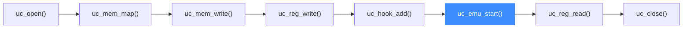

# sample_x86.c 走读 · X86 全功能

[`sample_x86.c`](https://github.com/android-security-engineer/unicorn-skills/blob/master/samples/sample_x86.c) 是 samples 里最庞大、最全的示例：一个文件覆盖 16/32/64 位三种模式，几乎演示了所有 Hook 类型、MMIO、自修改代码、缺页自动映射。本页按它的骨架把这些能力串起来。

## 🎯 演示要点

- X86 三种位宽：`test_x86_16` / `test_i386` / `test_x86_64`
- 代码级 Hook：`UC_HOOK_BLOCK`、`UC_HOOK_CODE`
- 内存级 Hook：`UC_HOOK_MEM_READ/WRITE`、`UC_HOOK_MEM_UNMAPPED`
- 指令级 Hook：`UC_HOOK_INSN` 拦截 `in` / `out` / `syscall`
- 缺页自动映射、MMIO 设备仿真、SMC 自修改代码

## 🧩 主骨架：test_i386

绝大多数示例都是这套五步流程，`test_i386` 是标准范本：

```c
// INC ecx; DEC edx; PXOR xmm0, xmm1
#define X86_CODE32 "\x41\x4a\x66\x0f\xef\xc1"
#define ADDRESS 0x1000000

err = uc_open(UC_ARCH_X86, UC_MODE_32, &uc);      // ① 建引擎
uc_mem_map(uc, ADDRESS, 2 * 1024 * 1024, UC_PROT_ALL);          // ② 映射内存
uc_mem_write(uc, ADDRESS, X86_CODE32, sizeof(X86_CODE32) - 1);  // ③ 写机器码

uc_reg_write(uc, UC_X86_REG_ECX, &r_ecx);         // ④ 设初始寄存器
uc_reg_write(uc, UC_X86_REG_EDX, &r_edx);
uc_hook_add(uc, &trace1, UC_HOOK_BLOCK, hook_block, NULL, 1, 0);
uc_hook_add(uc, &trace2, UC_HOOK_CODE,  hook_code,  NULL, 1, 0);

err = uc_emu_start(uc, ADDRESS, ADDRESS + sizeof(X86_CODE32) - 1, 0, 0);  // ⑤ 跑
uc_reg_read(uc, UC_X86_REG_ECX, &r_ecx);          // 读回结果
```

- `UC_PROT_ALL` = 读 + 写 + 执行，示例图省事全开。
- Hook 的最后两个参数 `1, 0`（begin > end）表示**全地址生效**。
- 注意这里连 `XMM0/XMM1` 寄存器都用 `uint64_t[2]` 写入，验证 SSE 状态也能设置。



## 🪝 Hook 回调长什么样

代码级回调签名统一是 `(uc, address, size, user_data)`。示例的 `hook_code` 顺手读了 EFLAGS：

```c
static void hook_code(uc_engine *uc, uint64_t address, uint32_t size,
                      void *user_data)
{
    int eflags;
    printf(">>> Tracing instruction at 0x%" PRIx64 ", size = 0x%x\n",
           address, size);
    uc_reg_read(uc, UC_X86_REG_EFLAGS, &eflags);
    printf(">>> --- EFLAGS is 0x%x\n", eflags);
}
```

## 📥 缺页自动映射：test_miss_code

`hook_memalloc` 是 `UC_HOOK_MEM_UNMAPPED` 回调，遇到未映射地址就地补映射并写入代码，返回 `true` 让仿真继续：

```c
static bool hook_memalloc(uc_engine *uc, uc_mem_type type, uint64_t address,
                          int size, int64_t value, void *user_data)
{
    uint64_t aligned = address & 0xFFFFFFFFFFFFF000ULL;
    uc_mem_map(uc, aligned, 0x1000, UC_PROT_ALL);
    uc_mem_write(uc, aligned, X86_CODE32, sizeof(X86_CODE32) - 1);
    return true;   // 已处理，继续执行
}
```

## 🔧 指令级 Hook：in / out / syscall

`UC_HOOK_INSN` 只支持极少数指令。示例用它把 X86 端口 IO 和系统调用接管到宿主：

```c
uc_hook_add(uc, &t3, UC_HOOK_INSN, hook_in,  NULL, 1, 0, UC_X86_INS_IN);
uc_hook_add(uc, &t4, UC_HOOK_INSN, hook_out, NULL, 1, 0, UC_X86_INS_OUT);
// 64 位下：
uc_hook_add(uc, &t1, UC_HOOK_INSN, hook_syscall, NULL, 1, 0, UC_X86_INS_SYSCALL);
```

`hook_in` 的**返回值**就是 CPU 读到的端口数据；`hook_syscall` 里检查 `RAX==0x100` 后把它改写成 `0x200`，模拟一次系统调用返回。

## 🧠 进阶片段一览

`sample_x86.c` 共 18 个 `test_*` 函数，按下表分类覆盖了 X86 仿真的各类场景：

| 测试函数 | 演示 | 关键 API |
|----------|------|----------|
| `test_x86_16` | 16 位实模式 | `UC_MODE_16` |
| `test_i386` | 32 位标准范本 | `uc_emu_start` + CODE/BLOCK Hook |
| `test_x86_64` | 64 位长模式 | `UC_MODE_64` |
| `test_i386_map_ptr` | 零拷贝映射宿主内存 | `uc_mem_map_ptr` |
| `test_i386_jump` | 跨地址跳转 | 分支指令 + BLOCK Hook |
| `test_i386_loop` | 无限循环靠指令计数停 | `uc_emu_start(..., count)` |
| `test_i386_invalid_mem_read` | 读未映射触发 Hook | `UC_HOOK_MEM_READ_UNMAPPED` |
| `test_i386_invalid_mem_write` | 写未映射触发 Hook | `UC_HOOK_MEM_WRITE_UNMAPPED` |
| `test_i386_jump_invalid` | 跳到未映射地址 | 取指未映射处理 |
| `test_i386_invalid_mem_read_in_tb` | TB 内访问未映射 | 块内异常恢复 |
| `test_i386_inout` | 端口 IO 拦截 | `UC_HOOK_INSN` + `UC_X86_INS_IN/OUT` |
| `test_x86_64_syscall` | 拦截 syscall 改 RAX | `UC_HOOK_INSN` + `UC_X86_INS_SYSCALL` |
| `test_i386_context_save` | 保存 / 恢复 CPU 状态 | `uc_context_*` |
| `test_i386_invalid_c6c7` | 非法指令处理 | `UC_HOOK_INSN_INVALID` |
| `test_i386_smc_xor` | 自修改代码，count 需设 2 | `uc_emu_start(..., 2)` |
| `test_i386_mmio` | 内存映射设备 | `uc_mmio_map` + 读写回调 |
| `test_i386_hook_mem_invalid` | 统一非法访问处理 | `UC_HOOK_MEM_INVALID` |
| `test_miss_code` | 缺页自动映射补码 | `UC_HOOK_MEM_UNMAPPED` + 就地 `uc_mem_map` |

::: warning SMC 的坑
自修改代码会触发翻译块（TB）重生，示例注释明确指出：那条 XOR **实际执行两次**（第一次不生效）。若用指令计数控制仿真，`count` 要设成 2。见 [JIT 编译（TCG）](/features/jit)。
:::

## 📤 预期输出（节选）

`./sample_x86` 会依次跑完所有子测试，i386 段大致如下：

```text
Emulate i386 code
>>> Tracing basic block at 0x1000000, block size = 0x6
>>> Tracing instruction at 0x1000000, instruction size = 0x1
>>> --- EFLAGS is 0x2
...
>>> Emulation done. Below is the CPU context
>>> ECX = 0x1235
>>> EDX = 0x788f
>>> XMM0 = 0x88...
```

::: tip 延伸练习
1. 把 `hook_code` 里加一句 `if (address == 0x1000009) uc_emu_stop(uc);`，实现一个软件断点。
2. 让 `hook_in` 根据端口号返回不同数据，模拟多个虚拟设备。
3. 用 `UC_HOOK_MEM_WRITE` + 区间限定，做一个 watchpoint，只监控栈顶写入。
:::

## 📂 相关源码

| 文件 | 角色 |
|------|------|
| [`samples/sample_x86.c`](https://github.com/android-security-engineer/unicorn-skills/blob/master/samples/sample_x86.c) | 本页走读的 X86 全功能示例 |
| [`include/unicorn/x86.h`](https://github.com/android-security-engineer/unicorn-skills/blob/master/include/unicorn/x86.h) | `UC_X86_REG_*` 寄存器枚举、`UC_X86_INS_*` 指令 ID |
| [`include/unicorn/unicorn.h`](https://github.com/android-security-engineer/unicorn-skills/blob/master/include/unicorn/unicorn.h#L1088) | `uc_hook_add` / `uc_mmio_map` / `uc_mem_map` 等 API 声明 |

## 相关页面

- [Hook 插桩体系](/features/hooks)
- [uc_mmio_map — 映射 MMIO](/api/mmio-map)
- [X86 架构专题](/arch/x86/)
- [shellcode.c 走读](/samples/shellcode)
