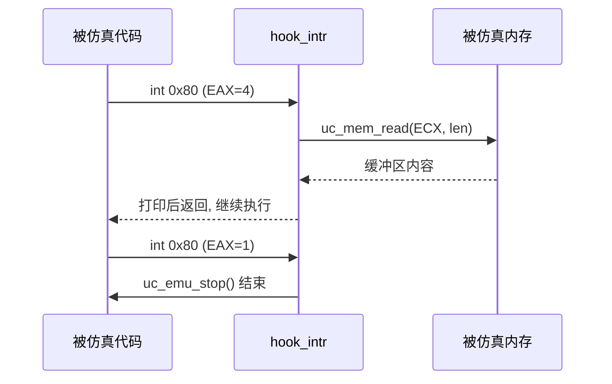

# shellcode.c 走读 · 自修改代码 + syscall 追踪

本示例（[`shellcode.c`](https://github.com/android-security-engineer/unicorn-skills/blob/master/samples/shellcode.c)）模拟一段 Linux i386 shellcode：它会**自修改**（运行时改写自己的字节），并通过 `int 0x80` 发起系统调用。示例用指令级 Hook 逐条反汇编，用中断 Hook 亲手实现 `sys_write` / `sys_exit`。这是把 Unicorn 当"沙箱"分析恶意代码的经典雏形。

## 🎯 演示要点

- `UC_HOOK_CODE`：逐条指令追踪，并读出当前字节
- `UC_HOOK_INTR`：接管 `int 0x80` 软中断，自行分派 syscall
- 自修改代码在仿真中的正常执行
- 从被仿真内存里读取字符串缓冲区（`sys_write` 的 buffer）

## 🧩 指令追踪回调

`hook_code` 每条指令触发一次，读出 EIP 并把该指令的原始字节 dump 出来——相当于一个极简反汇编前端：

```c
static void hook_code(uc_engine *uc, uint64_t address, uint32_t size,
                      void *user_data)
{
    int r_eip;
    uint8_t tmp[16];
    printf("Tracing instruction at 0x%" PRIx64 ", size = 0x%x\n", address, size);
    uc_reg_read(uc, UC_X86_REG_EIP, &r_eip);
    printf("*** EIP = %x ***: ", r_eip);

    size = MIN(sizeof(tmp), size);
    if (!uc_mem_read(uc, address, tmp, size)) {
        for (uint32_t i = 0; i < size; i++)
            printf("%x ", tmp[i]);
        printf("\n");
    }
}
```

## 🪝 亲手实现 syscall：hook_intr

`UC_HOOK_INTR` 在 `int` 指令触发时回调，参数是中断号 `intno`。示例只处理 Linux 的 `0x80`，按 `EAX` 分派：

```c
static void hook_intr(uc_engine *uc, uint32_t intno, void *user_data)
{
    int32_t r_eax, r_ecx, r_eip;
    uint32_t r_edx, size;
    unsigned char buffer[256];

    if (intno != 0x80) return;                 // 只认 Linux syscall
    uc_reg_read(uc, UC_X86_REG_EAX, &r_eax);
    uc_reg_read(uc, UC_X86_REG_EIP, &r_eip);

    switch (r_eax) {
    case 1:  // sys_exit
        uc_emu_stop(uc);
        break;
    case 4:  // sys_write：ECX=buf, EDX=len
        uc_reg_read(uc, UC_X86_REG_ECX, &r_ecx);
        uc_reg_read(uc, UC_X86_REG_EDX, &r_edx);
        size = MIN(sizeof(buffer) - 1, r_edx);
        if (!uc_mem_read(uc, r_ecx, buffer, size)) {
            buffer[size] = '\0';
            printf(">>> SYS_WRITE. content = '%s'\n", buffer);
        }
        break;
    }
}
```

- `sys_exit` → 直接 `uc_emu_stop` 结束仿真。
- `sys_write` → 从 `ECX` 指向的**被仿真内存**里 `uc_mem_read` 出缓冲区并打印。



## 🔧 装配与启动

两个 Hook 都用 `1, 0`（begin>end）覆盖全地址；栈指针 `ESP` 指向映射区高处：

```c
uc_mem_map(uc, ADDRESS, 2 * 1024 * 1024, UC_PROT_ALL);
uc_mem_write(uc, ADDRESS, X86_CODE32_SELF, sizeof(X86_CODE32_SELF) - 1);
uc_reg_write(uc, UC_X86_REG_ESP, &r_esp);

uc_hook_add(uc, &trace1, UC_HOOK_CODE, hook_code, NULL, 1, 0);
uc_hook_add(uc, &trace2, UC_HOOK_INTR, hook_intr, NULL, 1, 0);

uc_emu_start(uc, ADDRESS, ADDRESS + sizeof(X86_CODE32_SELF) - 1, 0, 0);
```

::: tip 自修改代码
`X86_CODE32_SELF` 的头部会在运行时改写后续字节（经典 shellcode 解码器手法）。Unicorn 基于 QEMU TCG，会自动检测代码页被写、丢弃旧翻译块并重新翻译，所以自修改能正确执行——无需你做任何额外处理。参见 [JIT 编译（TCG）](/features/jit)。
:::

## 📤 预期输出（节选）

```text
Emulate i386 code

>>> Start tracing this Linux code
Tracing instruction at 0x1000000, instruction size = 0x2
*** EIP = 1000000 ***: eb 1c
...
>>> 0x...: interrupt 0x80, SYS_WRITE. buffer = 0x..., content = '/bin/sh'
>>> 0x...: interrupt 0x80, SYS_EXIT. quit!

>>> Emulation done.
```

（实际打印的字节流取决于自修改后的指令；`SYS_EXIT` 触发后 `uc_emu_stop` 收尾。）

::: tip 延伸练习
1. 把 `uc_emu_start` 的最后一个参数改成 `12`，只执行 12 条指令，观察自修改是否已完成。
2. 在 `hook_intr` 里补上 `sys_read`，从宿主 stdin 灌数据回被仿真内存。
3. 用 `UC_HOOK_MEM_WRITE` 限定代码区间，捕获 shellcode 改写自身的那一刻。
:::

## 📂 相关源码

| 文件 | 角色 |
|------|------|
| [`samples/shellcode.c`](https://github.com/android-security-engineer/unicorn-skills/blob/master/samples/shellcode.c) | 本页走读的自修改 + syscall 追踪示例 |
| [`include/unicorn/x86.h`](https://github.com/android-security-engineer/unicorn-skills/blob/master/include/unicorn/x86.h) | `UC_X86_REG_EIP/EAX/ECX/EDX/ESP` 寄存器枚举 |
| [`include/unicorn/unicorn.h`](https://github.com/android-security-engineer/unicorn-skills/blob/master/include/unicorn/unicorn.h#L1088) | `uc_hook_add` / `uc_emu_start` / `uc_emu_stop` / `uc_mem_read` API 声明 |

## 相关页面

- [UC_HOOK_CODE — 每条指令](/hooks/code)
- [UC_HOOK_INTR — 中断/异常](/hooks/intr)
- [中断与异常](/features/interrupts)
- [sample_x86.c 走读](/samples/sample-x86)
