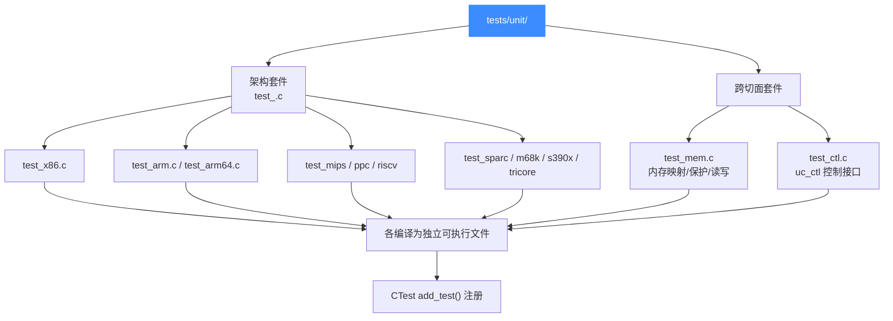
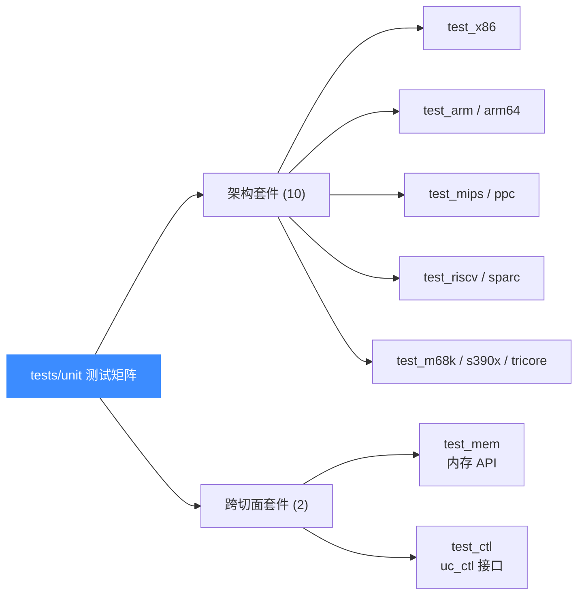

# 测试套件总览

本页讲清 `tests/unit/` 下 12 个 C 单元测试如何组织、用什么框架写断言、如何通过 CMake/CTest 注册和运行。读完你能新增一条用例、定位某个架构的测试、并知道怎么在本地把套件跑起来。

## 📌 概述

Unicorn 的单元测试位于 `tests/unit/`，组织原则简单：

- **一个架构一个文件** —— `test_<arch>.c`（如 `test_x86.c`、`test_arm.c`），覆盖该架构的指令译码、寄存器读写、Hook、内存等行为。
- **两个跨切面套件** —— `test_mem.c`（内存映射 / 保护 / 读写 API，与架构无关）与 `test_ctl.c`（`uc_ctl` 控制接口，如 TLB 模式、超时、CPU 模型）。

所有套件都是普通 C 程序：每个文件编译成一个独立可执行文件（`test_x86`、`test_mem`…），由 acutest 框架驱动，再经 CTest 注册。新增功能时**优先在此添加测试**，而非丢进 `regress/`。



## 🧩 测试矩阵

12 个套件按"被测对象"排成一张矩阵：10 个架构 + 2 个横切关注点。每个套件链接到对应的详解页。



## 🔧 acutest 框架与 unicorn_test.h

每个测试文件首行 `#include "unicorn_test.h"`，后者再引入 [acutest.h](https://github.com/mity/acutest)（vendored 在 `tests/unit/acutest.h`）与 `<unicorn/unicorn.h>`。acutest 提供测试注册与断言原语，`unicorn_test.h` 在其上叠了一层 Unicorn 专属宏。

### 关键宏

| 宏 | 定义处 | 作用 |
|----|--------|------|
| `TEST_CHECK(cond)` | `acutest.h` | 断言 `cond` 为真；失败时记录文件名/行号 |
| `TEST_MSG(fmt, ...)` | `acutest.h` | 在最近的 `TEST_CHECK` 失败时附加诊断信息 |
| `TEST_CASE(name)` | `acutest.h` | 在单个测试函数内分段子用例（如循环里逐项验证） |
| `TEST_LIST` | `acutest.h` | 文件末尾的测试注册表，`{name, func}` 数组 |
| `uc_assert_err(expect, err)` | `unicorn_test.h` | 断言 `err == expect`，失败时打印 `uc_strerror(err)` |
| `OK(stat)` | `unicorn_test.h` | `uc_assert_err(UC_ERR_OK, stat)`，最常用 |
| `LEINT32/LEINT64/BEINT32/BEINT64` | `unicorn_test.h` | 按宿主字节序归一化，跨大小端对比内存值 |

### 典型用例写法

下面是 `test_mem.c` 里一条真实用例，展示了 `OK` / `uc_assert_err` / `TEST_CHECK` 三件套的配合：

```c
#include "unicorn_test.h"

static void test_map_correct(void)
{
    uc_engine *uc;

    OK(uc_open(UC_ARCH_X86, UC_MODE_64, &uc));
    OK(uc_mem_map(uc, 0x40000, 0x1000 * 16, UC_PROT_ALL)); // [0x40000, 0x50000]
    // 重叠映射应返回错误，而不是崩溃
    uc_assert_err(UC_ERR_MAP,
                  uc_mem_map(uc, 0x45000, 0x1000 * 16, UC_PROT_ALL));
    OK(uc_mem_map(uc, 0x50000, 0x5000, UC_PROT_ALL));

    OK(uc_close(uc));
}
```

架构套件的写法类似，但会喂入真实机器码并断言寄存器/内存结果（取自 `test_x86.c`）：

```c
static void test_x86_lazy_mapping(void)
{
    uc_engine *uc;
    uc_hook mem_hook, block_hook;
    int block_count = 0;

    OK(uc_open(UC_ARCH_X86, UC_MODE_32, &uc));
    OK(uc_hook_add(uc, &mem_hook, UC_HOOK_MEM_FETCH_UNMAPPED,
                   test_x86_lazy_mapping_mem_callback, NULL, 1, 0));
    OK(uc_hook_add(uc, &block_hook, UC_HOOK_BLOCK,
                   test_x86_lazy_mapping_block_callback, &block_count, 1, 0));

    OK(uc_emu_start(uc, 0x1000, 0x1002, 0, 0));
    TEST_CHECK(block_count == 1);
    OK(uc_close(uc));
}
```

### 注册表 TEST_LIST

每个文件末尾用 `TEST_LIST` 把所有 `test_*` 函数登记进 acutest。acutest 只编译注册表里出现的条目；列表必须以零记录结尾：

```c
TEST_LIST = {
    {"test_x86_in", test_x86_in},
    {"test_x86_out", test_x86_out},
    {"test_x86_mem_hook_all", test_x86_mem_hook_all},
    // ... 更多条目
    {NULL, NULL}  // 列表终止
};
```

::: tip 为何要重复一遍名字
`TEST_LIST` 的字符串名是命令行过滤用的标识（`./test_x86 test_x86_in` 只跑这一条），函数指针才是真正回调。acutest 不做字符串到符号的反射，所以两者都要手写。
:::

## 💻 运行测试

### 前置：开测试编译

CMake 顶层开关 `UNICORN_BUILD_TESTS`（默认在顶层项目时 `ON`）控制是否编译测试与示例。若你把 Unicorn 作为子目录引入，需显式打开它：

```bash
mkdir build && cd build
cmake .. -DCMAKE_BUILD_TYPE=Release -DUNICORN_BUILD_TESTS=ON
make
```

::: warning 想跑某架构的测试，得先编该架构
`test_x86` 只有在 `UNICORN_ARCH` 包含 `x86` 时才会被编译并链接到 x86 后端。裁剪 `UNICORN_ARCH="x86"` 能极大加速单架构开发周期，但代价是其它架构的 `test_<arch>` 二进制不会生成。默认 `UNICORN_ARCH` 含全部 9 个架构。
:::

### 用 CTest 跑全部

`enable_testing()` + `add_test()` 在 `CMakeLists.txt`（约 1488–1518 行）把每个测试二进制注册成 CTest 用例。在 `build/` 下：

```bash
ctest                        # 跑全部注册用例
ctest -R test_arm            # 只跑名字匹配 test_arm 的
ctest --output-on-failure    # 失败时打印实际输出，调试必备
ctest -j8                    # 并行 8 个
```

`-R` 接正则，所以 `ctest -R "test_x86|test_mem"` 能一次跑多个套件。

### 直接跑单个二进制

CTest 之外，可执行文件本身也是 acutest 驱动的 CLI，支持按名过滤：

```bash
./test_x86                       # 跑 test_x86 全部用例
./test_x86 test_x86_in           # 只跑 test_x86_in 这一条
./test_x86 --list                # 列出该文件所有用例名
```

这对开发单条用例、或在 GDB/LLDB 下复现失败场景最有用——你不必等 CTest 调度。

## 🔧 与 CMake / CTest 的注册关系

`CMakeLists.txt` 把所有测试文件名收集进 `UNICORN_TEST_FILE` 列表（约 1272–1346 行），再统一处理：

```cmake
# 收集测试源文件：每个开启的架构追加一个 test_<arch>，再加两个跨切面
set(UNICORN_TEST_FILE test_x86)   # 仅当 x86 在 UNICORN_ARCH 中
# ... test_arm, test_arm64, test_m68k, test_mips, test_sparc,
#     test_ppc, test_riscv, test_s390x, test_tricore
set(UNICORN_TEST_FILE ${UNICORN_TEST_FILE} test_mem)
set(UNICORN_TEST_FILE ${UNICORN_TEST_FILE} test_ctl)

if(UNICORN_BUILD_TESTS)
    enable_testing()
    foreach(TEST_FILE ${UNICORN_TEST_FILE})
        add_executable(${TEST_FILE}
            ${CMAKE_CURRENT_SOURCE_DIR}/tests/unit/${TEST_FILE}.c)
        target_compile_options(${TEST_FILE} PRIVATE ${UNICORN_COMPILE_OPTIONS})
        target_link_libraries(${TEST_FILE} PRIVATE ${SAMPLES_LIB})
        add_test(${TEST_FILE} ${TEST_FILE})   # ← CTest 注册点
    endforeach()
endif()
```

要点：

- **可执行名 = 源文件名** —— `test_x86.c` → `test_x86`，`add_test` 用同名注册到 CTest，因此 `ctest -R test_x86` 与 `./test_x86` 完全对应。
- **链接 `SAMPLES_LIB`** —— 测试和示例共用同一份链接库（即 `libunicorn`），保证符号一致。
- **架构条件编译** —— `test_<arch>` 只在该架构开启时进入列表；`test_mem` / `test_ctl` 始终编译（它们多用 x64 作为驱动架构，不依赖被测架构后端）。
- **Android 部署** —— 若设置了 `ANDROID_ABI`，CMake 会生成 `adb.sh`，把每个二进制 `adb push` 到设备并执行，便于在真机上回归。

::: details TARGET_READ_INLINED 特殊处理
对 `aarch64` / `ppc` 目标，CMake 给测试追加 `target_compile_definitions(... TARGET_READ_INLINED)`。该宏影响读内存内联路径，部分用例（如 `test_x86_unaligned_access`）会据此用 `#if` 条件编译，避免在大小端/内联策略不匹配时误报。详见各架构测试文件内的 `#if !defined(TARGET_READ_INLINED) ...` 守卫。
:::

## ⚠️ 新增用例清单

加一条新测试时，按这个清单走最稳：

1. 选对文件：架构相关 → `test_<arch>.c`；纯 API 行为 → `test_mem.c` 或 `test_ctl.c`。
2. 写 `static void test_<name>(void)`，内部用 `OK(...)` 包裹每个可能失败的 API 调用，用 `TEST_CHECK(...)` 断言最终结果，必要时 `TEST_MSG(...)` 给诊断。
3. 在文件末尾 `TEST_LIST` 里追加 `{"test_<name>", test_<name>}`。
4. `cmake --build build` 重新编译该二进制，`./test_<file> test_<name>` 单独验证。
5. 提 PR 时附上测试，CI 的 `build-uc2` 会自动跑 `ctest`。

## 📖 全部 12 个套件索引

| 套件 | 源文件 | 类别 | 详解页 |
|------|--------|------|--------|
| X86 | `test_x86.c` | 架构 | [test-x86](/tests/test-x86) |
| ARM | `test_arm.c` | 架构 | [test-arm](/tests/test-arm) |
| ARM64 | `test_arm64.c` | 架构 | [test-arm64](/tests/test-arm64) |
| MIPS | `test_mips.c` | 架构 | [test-mips](/tests/test-mips) |
| PowerPC | `test_ppc.c` | 架构 | [test-ppc](/tests/test-ppc) |
| RISC-V | `test_riscv.c` | 架构 | [test-riscv](/tests/test-riscv) |
| SPARC | `test_sparc.c` | 架构 | [test-sparc](/tests/test-sparc) |
| M68K | `test_m68k.c` | 架构 | [test-m68k](/tests/test-m68k) |
| S390X | `test_s390x.c` | 架构 | [test-s390x](/tests/test-s390x) |
| TriCore | `test_tricore.c` | 架构 | [test-tricore](/tests/test-tricore) |
| 内存 | `test_mem.c` | 跨切面 | [test-mem](/tests/test-mem) |
| 控制接口 | `test_ctl.c` | 跨切面 | [test-ctl](/tests/test-ctl) |

## 相关页面

- [测试与基准（指南）](/guide/testing)
- [编译与构建](/guide/compile)
- [uc_ctl 控制接口总览](/ctl/)
- [内存模型](/memory/overview)
