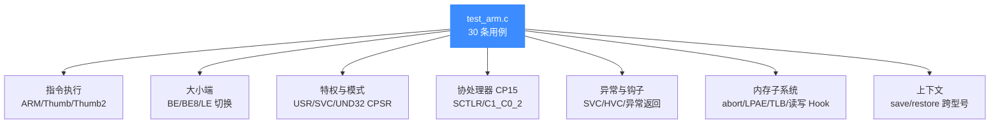
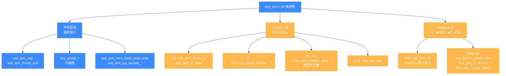

# ARM 测试套件

本页对应源码 `tests/unit/test_arm.c`,逐一讲解 ARM 架构在 Unicorn 中的 30 条单元测试覆盖了哪些能力、如何运行、典型用例验证了什么。读完你能知道 ARM 后端被回归保护到什么程度,以及自己写 ARM 测试时该模仿哪些写法。

## 📌 概述

`test_arm.c` 是所有架构测试中规模最大、覆盖最全的套件,共 **30 条用例**,登记在文件末尾的 `TEST_LIST` 数组中(由 `acutest` 框架驱动)。它不是简单跑几条机器码就结束,而是把 32 位 ARM 的指令集、执行模式、特权级、协处理器、内存与异常钩子、上下文保存等维度都拉了一遍。



套件依赖一个公共构造函数 `uc_common_setup()`,几乎所有用例都先调它来 `uc_open` + `uc_ctl_set_cpu_model` + `uc_mem_map` + `uc_mem_write`,把"建引擎、选型号、映射代码段、写机器码"四步打包,这样每条用例只关心自己要验证的那一点:

```c
static void uc_common_setup(uc_engine **uc, uc_arch arch, uc_mode mode,
                            const char *code, uint64_t size, uc_cpu_arm cpu)
{
    OK(uc_open(arch, mode, uc));
    OK(uc_ctl_set_cpu_model(*uc, cpu));
    OK(uc_mem_map(*uc, code_start, code_len, UC_PROT_ALL));
    OK(uc_mem_write(*uc, code_start, code, size));
}
```

## 💻 典型用例讲解

下面挑 6 条有代表性的用例,说明它们各自验证了 ARM 后端的什么能力。

### 1. `test_arm_thumb_sub` — Thumb 指令集与 SP 调整

```c
char code[] = "\x83\xb0"; // sub    sp, #0xc
int r_sp = 0x1234;
uc_common_setup(&uc, UC_ARCH_ARM, UC_MODE_THUMB, code, sizeof(code) - 1,
                UC_CPU_ARM_CORTEX_A15);
OK(uc_reg_write(uc, UC_ARM_REG_SP, &r_sp));
OK(uc_emu_start(uc, code_start | 1, ...));  // |1 表示 Thumb
OK(uc_reg_read(uc, UC_ARM_REG_SP, &r_sp));
TEST_CHECK(r_sp == 0x1228);  // 0x1234 - 0xc
```

验证点:`UC_MODE_THUMB` 下能正确执行 16 位 Thumb 机器码,且入口地址 `code_start | 1` 的最低位语义被尊重(ARM 用 PC 最低位区分 ARM/Thumb 状态)。`sub sp, #0xc` 把 `0x1234` 减到 `0x1228`,顺带证明通用寄存器读写在 Thumb 态正常。

### 2. `test_arm_thumb_ite` — IT 块条件执行

这条用例盯着 Thumb 的 `ITE`(If-Then-Else)指令块——`itete ne` 之后跟的四条指令要根据 `cmp r2, r3` 的标志位选择性执行。用例用 `UC_HOOK_CODE` 钩子统计实际执行的指令数:

```c
OK(uc_hook_add(uc, &hook, UC_HOOK_CODE, test_arm_thumb_ite_count_callback,
               &count, 1, 0));
OK(uc_emu_start(uc, code_start | 1, ...));
TEST_CHECK(count == 4);   // IT 块内只执行了 4 条
```

它还做了第二轮逐条执行(`uc_emu_start(..., 1)`)验证单步语义,确认 `r2 == 0x68`、`r3 == 0x78` 与全量执行结果一致。这保护的是 TCG 翻译块对 Thumb IT 块的条件分支生成正确性。

### 3. `test_arm_und32_to_svc32` — 异常模式切换与 SPSR 恢复

```c
r_cpsr = 0x40000093; // SVC32,备份 SP=0x12345678
r_cpsr = 0x4000009b; // UND32,设 SPSR=SVC, LR=返回点
OK(uc_emu_start(uc, code_start, ..., 3));  // 执行 3 条,含 MOVS pc, lr
OK(uc_reg_read(uc, UC_ARM_REG_SP, &r_sp));
TEST_CHECK(r_sp == 0x12345678);  // 切回 SVC32 后 SP 恢复
```

验证 `MOVS pc, lr` 这条异常返回指令能把 CPSR 从 UND32 切回 SVC32,并且**银行化的 SP 被正确恢复**到 SVC 模式下原来的值。这是 ARM 特权/异常模型最核心的行为之一,源码注释引用了 issue #1494。

### 4. `test_arm_switch_endian` — 运行时 CPSR.E 端序切换

```c
// ldr r0, [r1],同一份内存,先小端读
TEST_CHECK(r_r0 == 0xe5910000);
r_cpsr |= (1 << 9);          // 置位 CPSR.E (E 位)
OK(uc_reg_write(uc, UC_ARM_REG_CPSR, &r_cpsr));
OK(uc_emu_start(...));
TEST_CHECK(r_r0 == 0x000091e5);  // 再读,字节序反过来
```

它证明 Unicorn 支持 ARMv6+ 的运行时端序切换:同一条 `ldr` 指令,仅靠改 CPSR 第 9 位(E),对同一片内存读出相反的字节序。与之配套的还有 `test_armeb_sub` / `test_armeb_be8_sub` / `test_armeb_be32_thumb2`,分别覆盖 `UC_MODE_BIG_ENDIAN`、BE8、BE32 三种静态端序。

### 5. `test_arm_v7_lpae` — 虚拟 TLB 与 LPAE 长描述符翻译

```c
OK(uc_ctl_tlb_mode(uc, UC_TLB_VIRTUAL));
OK(uc_hook_add(uc, &hook_tlb, UC_HOOK_TLB_FILL,
               test_arm_v7_lpae_hook_tlb, ...));  // 把 vaddr 偏移到 0x100000000
OK(uc_hook_add(uc, &hook_read, UC_HOOK_MEM_READ, ...));
OK(uc_emu_start(uc, 0x1000, ...));
TEST_CHECK(reg == 0xe5901000);
```

这是最"硬核"的一条:开启 `UC_TLB_VIRTUAL` 模式后,Unicorn 不再直接查物理内存,而是回调 `UC_HOOK_TLB_FILL` 让用户决定虚拟地址翻译到哪个物理地址。钩子里 `result->paddr = addr + 0x100000000` 把访客虚拟地址映射到 4GB 之外的物理页,随后 `UC_HOOK_MEM_READ` 验证实际命中的正是那块物理内存。覆盖的是 ARMv7 LPAE(长描述符)两阶段地址翻译能力。

### 6. `test_arm_context_save` — 上下文跨 CPU 型号迁移

```c
OK(uc_context_alloc(uc, &ctx));
OK(uc_context_save(uc, ctx));           // 存 Cortex-R5 的上下文
// ... 新建一个 Cortex-A7 的引擎 ...
OK(uc_context_restore(uc2, ctx));        // 把 R5 的上下文灌进 A7
```

验证 `uc_context_save` / `uc_context_restore` 捕获与还原的不只是通用寄存器,还包括内部 TB 相关标志(`hflags`)——上下文从一个 CPU 型号实例迁移到另一个型号实例后仍能继续执行,这说明 `hflags_rebuilt` 逻辑在 restore 路径上正确重建了。配套的 `test_arm_hflags_rebuilt` 进一步直接验证 CPSR/SP/LR 在模式切换 + 异常中断后能恢复到预期值。

## 🧩 按 CPU 型号依赖切分的用例矩阵

上面的分类图按能力域切，下面这张按"用例依赖哪个 CPU 型号"切：Cortex-A 系（A-class）、Cortex-M 系（M-class，走 `UC_MODE_MCLASS`）、以及不挑型号的通用用例。这一维度决定了复制用例时该带上哪个 `uc_ctl_set_cpu_model`。



复制用例时的硬约束：Cortex-M 系必须带 `UC_MODE_MCLASS`，与 A/R profile 的特权模型不同，不能混用；`test_arm_context_save` 跨型号迁移（R5→A7）依赖 `hflags` 在 restore 路径上重建，换其它型号对未必成立。

## 📋 全部用例一览

| 用例 | 验证能力 |
|------|---------|
| `test_arm_nop` | ARM 态 NOP 执行,寄存器不被破坏 |
| `test_arm_thumb_sub` | Thumb 16 位指令,SP 调整 |
| `test_armeb_sub` | 大端(legacy)ARM 双指令序列 |
| `test_armeb_be8_sub` | BE8 字节序指令读取 |
| `test_arm_thumbeb_sub` | Thumb 大端模式 |
| `test_arm_thumb_ite` | Thumb IT 块条件执行 + 单步 |
| `test_arm_m_thumb_mrs` | Cortex-M 的 MRS 读特殊寄存器 |
| `test_arm_m_control` | Cortex-M CONTROL 寄存器语义 |
| `test_arm_m_exc_return` | v7M 异常返回(EXC_RETURN magic) |
| `test_arm_und32_to_svc32` | UND→SVC 模式切换,SPSR 恢复 |
| `test_arm_usr32_to_svc32` | USR↔SVC 银行寄存器切换 |
| `test_arm_v8` | v8原子指令 LDAEXD(Cortex-M33) |
| `test_arm_thumb_smlabb` | DSP 乘加指令 SMLABB |
| `test_arm_not_allow_privilege_escalation` | 禁止用户态提权 |
| `test_arm_mrc` | MRC/MCR 协处理器访问 |
| `test_arm_hflags_rebuilt` | hflags 在异常后重建 |
| `test_arm_mem_access_abort` | 读/取指未映射 + 非法指令 abort |
| `test_arm_read_sctlr` | 读 SCTLR 系统寄存器 |
| `test_arm_be_cpsr_sctlr` | 大端下 CPSR/SCTLR 读写 |
| `test_arm_switch_endian` | CPSR.E 运行时端序切换 |
| `test_armeb_ldrb` | 大端 LDRB 单字节加载 |
| `test_arm_context_save` | 上下文跨 CPU 型号 save/restore |
| `test_arm_thumb2` | Thumb-2 32 位指令(W 后缀) |
| `test_armeb_be32_thumb2` | BE32 下 Thumb-2 |
| `test_arm_mem_hook_read_write` | 内存读写 Hook 计数 |
| `test_arm_tcg_opcode_cmp` | CMP 指令 Hook 透出操作数 |
| `test_arm_thumb_tcg_opcode_cmn` | CMN(Thumb)Hook |
| `test_arm_cp15_c1_c0_2` | CP15 C1_C0_2 读写一致性 |
| `test_arm_v7_lpae` | 虚拟 TLB + LPAE 物理地址翻译 |
| `test_arm_svc_hvc_syndrome` | SVC/HVC 异常综合征 ESR |

## 🚀 运行方式

套件编译产物是 `test_arm` 可执行文件,并由 CTest 注册。两种跑法:

```bash
# 方式一:经 CTest,按名称过滤
cd build
ctest -R arm                   # 跑所有 ARM 用例
ctest -R arm --output-on-failure   # 失败时打印详情

# 方式二:直接跑二进制(可看 acutest 详细输出)
cd build
./test_arm                     # 全部
./test_arm test_arm_thumb_ite  # 只跑单条(传用例名做过滤)
```

::: tip 编译时别忘了开测试
`test_arm` 只在 `UNICORN_BUILD_TESTS=ON`(顶层项目时默认 ON)且 `UNICORN_ARCH` 包含 `arm` 时才编译。若你裁剪过架构列表,需显式带上 `-DUNICORN_ARCH="arm"`(或加上其它需要的)重新 cmake。
:::

::: details 全量套件长这样
```bash
$ ctest -R arm
Test   #1: test_arm_nop ...............................   Passed
Test   #2: test_arm_thumb_sub .........................   Passed
...
Test  #30: test_arm_svc_hvc_syndrome ...................   Passed
```
30 条全部 Passed 即 ARM 后端在该版本的健康基线。
:::

## ⚠️ 注意与边界

- **CPU 型号敏感**:多条用例显式指定 `UC_CPU_ARM_CORTEX_A15` / `Cortex-A9` / `Cortex-M33` / `Cortex-R5` / `ARM_1176` 等。换型号可能改变协处理器、DSP、v8 指令的可用性,复制用例时务必带上对应的 `uc_ctl_set_cpu_model`。
- **Cortex-M 走 MCLASS**:涉及异常返回、CONTROL、IPSR 的用例都带 `UC_MODE_MCLASS`,与 A/R profile 的特权模型不同,不能混用。
- **`|1` 不是装饰**:Thumb 入口地址最低位必须置 1,Unicorn 据此进入 Thumb 译码。漏掉会按 ARM 译码导致 `UC_ERR_INSN_INVALID`。
- **钩子里谨慎改状态**:`test_arm_thumb_ite` 的统计钩子只读计数,不改寄存器;若你写自己的钩子修改 PC/CPSR,要注意是否影响 TB 内联缓存一致性。

## 🔧 实现要点

- 测试框架是仓库自带的 `acutest`(见 `tests/unit/acutest.h`),由 `unicorn_test.h` 再包一层 `OK()` 宏断言 `UC_ERR_OK`、`uc_assert_err()` 断言"期望错误码"。新用例照此写即可,无需引入第三方依赖。
- 用例统一通过 `uc_common_setup` 建环境,公共常量 `code_start=0x1000`、`code_len=0x4000`,所有用例共用这套地址约定,读起来一致。
- 涉及中断/异常的用例(`test_arm_svc_hvc_syndrome`、`test_arm_m_exc_return`、`test_arm_mem_access_abort`)都注册了对应的 `UC_HOOK_INTR` / `UC_HOOK_MEM_UNMAPPED` / `UC_HOOK_INSN_INVALID` 钩子,在钩子里 `uc_reg_read(PC)` 验证异常发生点的 PC,这是 ARM 后端异常投递正确性的主要防线。

## 📖 参考

- [ARM 架构总览](/arch/arm/) — ARM/Thumb/Thumb-2 模式与寄存器
- [ARM CPU 型号](/arch/arm/cpu-models) — 各 `UC_CPU_ARM_*` 的差异
- [测试与基准](/guide/testing) — `unit/`、`regress/`、`fuzz/` 全景
- [内存 Hook](/hooks/) — `UC_HOOK_MEM_READ` / `UC_HOOK_TLB_FILL`
- [uc_ctl 接口](/ctl/) — `uc_ctl_set_cpu_model`、`uc_ctl_tlb_mode`

## 相关页面

- [ARM 实战示例](/arch/arm/example)
- [ARM 指令集](/arch/arm/instructions)
- [ARM 寄存器](/arch/arm/registers)
- [Unicorn 内部结构](/internals/uc-struct)
- [uc_open / uc_emu_start API](/api/open)
