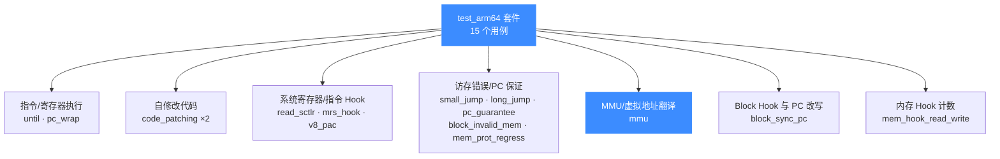

# test_arm64 — ARM64 测试套件

本页讲清 `tests/unit/test_arm64.c` 这一套件：它用 15 个用例覆盖 ARM64（AArch64）的指令执行、寄存器读写、内存映射、MMU 虚拟地址翻译、Hook 介入与 PC 边界条件。读完你能知道 ARM64 后端验证了哪些能力、每个用例在测什么，以及如何本地复现。

## 📌 概述

`test_arm64.c` 共 686 行，通过 `acutest` 框架注册 **15 个用例**（`TEST_LIST` 末尾的 `{NULL, NULL}` 哨兵前共 15 项）。它不像 x86 套件那样追求指令覆盖率，而是围绕"真实二进制移植/逆向场景会踩的坑"组织：自修改代码后的翻译缓存失效、跨页跳转地址截断、MMU 表项手填、`PC` 在错误路径上的位置保证等。



所有用例共用一个全局起始地址 `code_start = 0x1000`、长度 `code_len = 0x4000` 的代码段，并通过 `uc_common_setup` 统一完成"开引擎 → 选 CPU model → 映射代码段 → 写入机器码"四步。下表是全部用例的一览：

| # | 用例 | 验证的能力 |
|---|------|-----------|
| 1 | `test_arm64_until` | 基本执行：`uc_emu_start` 按指令数停止、寄存器与 PC 推进 |
| 2 | `test_arm64_code_patching` | 自修改代码：`uc_mem_write` 覆写后再执行 |
| 3 | `test_arm64_code_patching_count` | 同上 + `uc_ctl_remove_cache` 主动刷翻译缓存 |
| 4 | `test_arm64_v8_pac` | v8 原子指令 `casal`（CPU model = `ARM64_MAX`） |
| 5 | `test_arm64_read_sctlr` | 通过 `CP_REG` 读系统寄存器 `SCTLR_EL1` |
| 6 | `test_arm64_mrs_hook` | `UC_HOOK_INSN` 拦截 `mrs` 指令并改写目标寄存器 |
| 7 | `test_arm64_correct_address_in_small_jump_hook` | 小地址 `br x0` 跳转到未映射页，地址不被截断 |
| 8 | `test_arm64_correct_address_in_long_jump_hook` | 大地址 `br x0`（`0x7FFF…FF00`）跳转，地址不被截断 |
| 9 | `test_arm64_block_sync_pc` | `UC_HOOK_BLOCK` 回调中改写 PC 实现"跳回循环" |
| 10 | `test_arm64_block_invalid_mem_read_write_sync` | 同步访存错误时 PC 停在出错指令、前面指令已生效 |
| 11 | `test_arm64_mmu` | 启用 `UC_TLB_CPU`、手填页表，虚拟地址翻译读物理内存 |
| 12 | `test_arm64_pc_wrap` | PC 在 `0xFFFF…F000` 顶页执行，跨 4 字节不回绕 |
| 13 | `test_arm64_mem_prot_regress` | issue #2078 回归：`ldurh` 越界读不误触 PROT hook |
| 14 | `test_arm64_mem_hook_read_write` | `ldp`/`stp` 序列下 `UC_HOOK_MEM_READ/WRITE` 各触发 4 次 |
| 15 | `test_arm64_pc_guarantee` | 访存错误后 PC 精确停在出错指令地址 |

## 💡 挑代表性用例讲解

### 🔧 `test_arm64_until` — 最小执行闭环

这是整套件"Hello World"。机器码 `mov x16, #1; mov x17, #0x20; add x28, x28, #8` 三条指令，预先写好 `x16/x17/x28`，调 `uc_emu_start(..., count=3)` 按指令数停，再读回校验：

```c
OK(uc_emu_start(uc, code_start, code_start + sizeof(code) - 1, 0, 3));
// 第 5 参数 count=3：执行 3 条指令后停，不靠 end 地址判断
TEST_CHECK(r_x28 == 0x1234123c);   // 0x12341234 + 8
TEST_CHECK(r_pc == (code_start + sizeof(code) - 1));
```

它验证了三件事：`uc_emu_start` 的 `count` 参数语义、寄存器读写正确、PC 停在预期地址。注意 CPU model 选的是 `UC_CPU_ARM64_A72`（Cortex-A72），这是套件的默认基准核。

### 🔧 `test_arm64_code_patching_count` — 自修改代码与翻译缓存

Unicorn 走 TCG JIT，翻译过的 Translation Block 会被缓存。如果你 `uc_mem_write` 覆写了指令但没刷缓存，**下次执行仍跑旧翻译结果**。这个用例就是来钉死这条边界的：

```c
// 先跑一次 add w0, w0, #1 → x0 == 1
// 覆写为 add w0, w0, #0x7FF
OK(uc_mem_write(uc, code_start, patch_code, sizeof(patch_code) - 1));
// 关键一步：手动移除该地址区间的翻译缓存
OK(uc_ctl_remove_cache(uc, code_start, code_start + sizeof(patch_code) - 1));
// 再跑 → x0 == 0x7ff（新指令生效）
TEST_CHECK(r_x0 == 0x7ff);
```

::: warning 注意：写代码段后必须刷缓存
对比姊妹用例 `test_arm64_code_patching`：那个用例**没有**调 `uc_ctl_remove_cache` 也能拿到新结果——因为它每次执行前都重新进了翻译入口、TB 恰好被重建。但这不可靠。自修改/热补丁场景务必显式调 `uc_ctl_remove_cache` 或 `uc_ctl_flush_tb`，否则在不同地址布局下会复现"跑的是旧指令"的玄学 bug。
:::

### 🔧 `test_arm64_mmu` — 手填页表做虚拟地址翻译

这是套件里最重的一个用例（约 100 行），演示了 Unicorn 的硬件 MMU 仿真。它做的事：

1. `uc_ctl_tlb_mode(uc, UC_TLB_CPU)` 切到 **CPU 模式 TLB**（走真实页表遍历，而非默认的 softmmu 直接映射）；
2. 在 `0x1000` 处手写 4 级页表项（`tlbe` 字节序列），把虚拟地址 `0x80000000` 翻译到物理地址 `0x40000000`；
3. 用 `uc_mem_map_ptr` 把一段填满 `0x44` 的宿主内存挂到物理地址 `0x40000000`；
4. 跑一段会写 `TCR_EL1/MAIR_EL1/TTBR0_EL1/SCTLR_EL1` 再开 MMU 的代码，先从物理地址读、再从虚拟地址读同一个位置；
5. 断言两次读到的都是 `0x4444444444444444`。

```c
OK(uc_ctl_tlb_mode(uc, UC_TLB_CPU));
// ...手填 4 级页表...
OK(uc_mem_map_ptr(uc, 0x40000000, 0x1000, UC_PROT_READ, data));
OK(uc_emu_start(uc, 0, 0x44, 0, 0));
TEST_CHECK(x1 == 0x4444444444444444);  // 物理读
TEST_CHECK(x2 == 0x4444444444444444);  // 虚拟读（经 MMU 翻译）
```

这验证了 ARM64 后端完整支持 OS 启动期的"建页表 → 置 `SCTLR.M` 位 → 虚拟地址生效"流程，是给内核/firmware 仿真场景背书的核心用例。详见 [/features/mmu](/features/mmu)。

### 🔧 `test_arm64_correct_address_in_long_jump_hook` — 地址不截断

`br x0` 跳到 `0x7FFFFFFFFFFFFF00`（接近 64 位地址空间顶端）这个未映射地址，应触发 `UC_ERR_FETCH_UNMAPPED`，并且 hook 回调里读到的 `PC` 与 `address` 都必须是完整 64 位值、不能被截成 32 位：

```c
// mov x0, 0x7FFFFFFFFFFFFF00; br x0
uc_assert_err(UC_ERR_FETCH_UNMAPPED,
              uc_emu_start(uc, code_start, code_start + sizeof(code) - 1, 0, 0));
TEST_CHECK(r_pc == 0x7FFFFFFFFFFFFF00);
```

这是为回归"高位地址被当成 32 位截断"一类 bug 而设。配套的小地址版用例 `..._small_jump` 跳到 `0x7F00`，二者一起把"任意 64 位目标地址"这个维度钉死。

### 🔧 `test_arm64_block_sync_pc` — Block Hook 里改 PC

`UC_HOOK_BLOCK` 回调发生在每个基本块入口。这个用例在回调里读 `PC` 校验它等于块地址（同步性），并在**第一次进入**时把 `PC` 改回 `code_start`，从而让 `add x0, x0, #1234` 这条指令跑两遍：

```c
// add x0,x0,#1234; bl t; t: mov x1,#5678
OK(uc_hook_add(uc, &hk, UC_HOOK_BLOCK, test_arm64_block_sync_pc_cb,
               (void *)&data, code_start + 8, code_start + 12));
// 回调里：首次进入写回 PC=code_start，第二次放行
TEST_CHECK(x0 == (1234 * 2));
```

它同时验证了两件事：Block Hook 回调时 `PC` 已对齐到块入口地址（可同步读写），以及"在回调里改 PC 能改变控制流"。这是实现自定义调度器、单步器、覆盖率插桩的基础原语。

## 🧩 按验证的 API 行为类别切分

上面的分类图按"测什么能力"切，下面这张按"验证 Unicorn 作为框架的哪类 API 行为"切，呼应本套件**不追求指令覆盖率**的定位——它测的是执行控制、内存模型、Hook 语义、MMU、PC 边界这五类框架级行为，而非单指令语义。

```mermaid
flowchart TD
    ROOT["test_arm64.c 15 条用例"] --> EC["执行控制<br/>count/until/stop"]
    ROOT --> MM["内存模型与 MMU"]
    ROOT --> HK["Hook 语义"]
    ROOT --> PC["PC 边界与同步性"]
    ROOT --> SMC["自修改代码/缓存"]

    EC --> EC1["test_arm64_until<br/>count 按条数停"]
    EC --> EC2["test_arm64_pc_wrap<br/>顶页 PC 不回绕"]
    MM --> MM1["test_arm64_mmu<br/>手填页表 + UC_TLB_CPU"]
    MM --> MM2["test_arm64_mem_prot_regress<br/>越界读不误触 PROT hook"]
    HK --> HK1["test_arm64_mrs_hook<br/>UC_HOOK_INSN 改 mrs"]
    HK --> HK2["test_arm64_mem_hook_read_write<br/>ldp/stp 各 4 次"]
    HK --> HK3["test_arm64_block_sync_pc<br/>Block Hook 改 PC"]
    PC --> PC1["small_jump / long_jump<br/>地址不截断"]
    PC --> PC2["block_invalid_mem / pc_guarantee<br/>错误时 PC 精确停"]
    SMC --> SMC1["code_patching ×2<br/>+ uc_ctl_remove_cache"]

    style ROOT fill:#3c8cff,color:#fff,stroke:none
    style EC fill:#3c8cff,color:#fff,stroke:none
    style MM fill:#3c8cff,color:#fff,stroke:none
    style HK fill:#3c8cff,color:#fff,stroke:none
    style PC fill:#ffb84d,color:#fff,stroke:none
    style SMC fill:#3c8cff,color:#fff,stroke:none
    style EC1 fill:#3c8cff,color:#fff,stroke:none
    style EC2 fill:#3c8cff,color:#fff,stroke:none
    style MM1 fill:#3c8cff,color:#fff,stroke:none
    style MM2 fill:#3c8cff,color:#fff,stroke:none
    style HK1 fill:#3c8cff,color:#fff,stroke:none
    style HK2 fill:#3c8cff,color:#fff,stroke:none
    style HK3 fill:#3c8cff,color:#fff,stroke:none
    style PC1 fill:#ffb84d,color:#fff,stroke:none
    style PC2 fill:#ffb84d,color:#fff,stroke:none
    style SMC1 fill:#3c8cff,color:#fff,stroke:none
```



单指令语义的正确性由 QEMU 上游 TCG 测试与 `tests/regress/` 共同保证；本套件五类行为是"Unicorn 作为仿真框架"对外承诺的 API 契约。新加用例时若发现自己在逐条验证 `mov`/`ldr` 语义，应改去 `tests/regress/` 写最小复现。

## ⚠️ 注意：本套件不追求指令覆盖率

`test_arm64.c` 的 15 个用例**不是** ARM64 指令集的功能测试矩阵——它没有逐条验证 `mov`/`ldr`/`str`/`mul`/`fdiv` 等单指令语义。单指令语义的正确性由 QEMU 上游的 TCG 测试与 `tests/regress/` 里的回归用例共同保证；本套件的定位是 **Unicorn 作为仿真框架的 API 行为**：执行控制、内存模型、Hook 语义、MMU、PC 边界。如果你要验证某条具体指令的语义，正确的做法是去 `tests/regress/` 找对应 issue 的 Python/C 回归用例，或自己写一个最小用例加进 `tests/unit/`。

## 💻 运行方式

```bash
# 前置：已 cmake 构建，且 UNICORN_BUILD_TESTS=ON（默认开）
cd build

# 只跑 arm64 套件
ctest -R arm64 --output-on-failure

# 直接跑可执行文件（拿到 acutest 的逐用例输出）
./test_arm64

# 跑单个用例（acutest 支持命令行过滤）
./test_arm64 test_arm64_mmu
```

::: tip 提示：构建时裁剪架构可加速
首次构建全架构（`x86;arm;aarch64;riscv;mips;sparc;m68k;ppc;s390x;tricore`）较慢。只调 ARM64 时用 `-DUNICORN_ARCH="aarch64"` 可大幅缩短构建时间。详见 [/guide/compile](/guide/compile)。
:::

如果用例失败，先核对两点：CPU model 是否匹配（`v8_pac` 用例必须用 `UC_CPU_ARM64_MAX` 才支持 v8 原子指令），以及是否在自修改后漏调了 `uc_ctl_remove_cache`。这两类是失败的重灾区。

## 📖 参考

- 源码：[`tests/unit/test_arm64.c`](https://github.com/android-security-engineer/unicorn-skills/blob/master/tests/unit/test_arm64.c)
- acutest 框架：[`tests/unit/acutest.h`](https://github.com/android-security-engineer/unicorn-skills/blob/master/tests/unit/acutest.h)
- issue #2078（`mem_prot_regress` 回归来源）：[github.com/unicorn-engine/unicorn/issues/2078](https://github.com/unicorn-engine/unicorn/issues/2078)

## 相关页面

- [ARM64 架构专题](/arch/arm64/)
- [测试总览与运行指南](/guide/testing)
- [内存映射与 MMU](/features/mmu)
- [UC_HOOK_BLOCK — 基本 Block Hook](/hooks/block)
- [UC_HOOK_INSN — 指令级 Hook](/hooks/insn)
- [uc_emu_start 执行控制](/api/emu-start)
