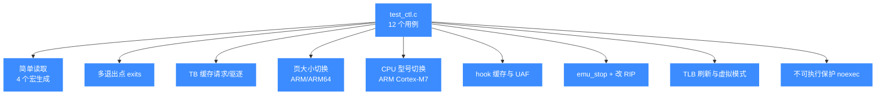
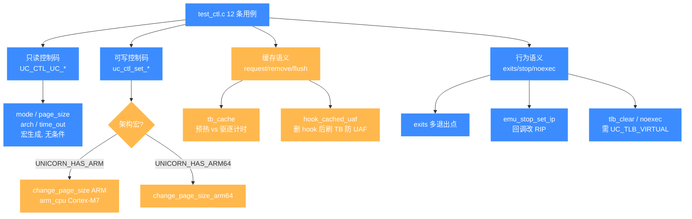

# test_ctl 控制接口测试套件

本页对应 `tests/unit/test_ctl.c`，逐个拆解这套控制接口（`uc_ctl`）单元测试覆盖的能力维度、代表性用例与运行方式，读完你能清楚知道 `uc_ctl` 系列便捷宏都经过了怎样的回归保护。

## 📌 概述

`test_ctl.c` 是 Unicorn 2 引入的 C 单元测试，专门为 `uc_ctl` 控制接口（[总览](/ctl/)）做回归保护。它**不绑定某一个架构**，而是跨架构地验证控制码的读写语义、TB/TLB 缓存、多退出点、CPU 型号切换等"非模拟核心"但影响行为的能力。文件共 419 行，`TEST_LIST` 注册了 **12 个**测试用例（其中 4 个由宏 `GEN_SIMPLE_READ_TEST` 自动生成，ARM/ARM64 专属用例受 `UNICORN_HAS_ARM`/`UNICORN_HAS_ARM64` 宏条件编译）。



## 🧩 按控制码类别与条件编译切分

上面的分类图按用例能力切，下面这张按"控制码属于哪一类 + 是否受架构宏条件编译保护"切。受 `UNICORN_HAS_ARM` / `UNICORN_HAS_ARM64` 保护的用例在极简构建（`-DUNICORN_ARCH="x86"`）下不会进 `TEST_LIST`，CTest 报告的用例数会少于 12，属正常。



新增只读控制码用例时照搬 `GEN_SIMPLE_READ_TEST` 宏；新增可写控制码用例若绑定具体架构，记得用 `#ifdef UNICORN_HAS_<ARCH>` 包住 `TEST_LIST` 注册项，否则极简构建会因找不到符号而编译失败。

## 📋 用例清单

下表列出全部 12 个用例（`TEST_LIST` 顺序与源码一致）：

| 用例名 | 验证能力 | 依赖宏 |
| --- | --- | --- |
| `test_uc_ctl_mode` | 读 `UC_CTL_UC_MODE`（X86 32 位 = 4） | 宏生成 |
| `test_uc_ctl_page_size` | 读 `UC_CTL_UC_PAGE_SIZE`（默认 4096） | 宏生成 |
| `test_uc_ctl_arch` | 读 `UC_CTL_UC_ARCH`（X86 = 4） | 宏生成 |
| `test_uc_ctl_time_out` | 读 `UC_CTL_UC_TIMEOUT`（初始为 0） | 宏生成 |
| `test_uc_ctl_exits` | `uc_ctl_exits_enable` + `uc_ctl_set_exits` 多退出点 | — |
| `test_uc_ctl_tb_cache` | `uc_ctl_request_cache` / `uc_ctl_remove_cache` 性能语义 | — |
| `test_uc_ctl_change_page_size` | `uc_ctl_set_page_size`（ARM, 4096） | `UNICORN_HAS_ARM` |
| `test_uc_ctl_arm_cpu` | `uc_ctl_set_cpu_model`（Cortex-M7, MSP/PSP 切换） | `UNICORN_HAS_ARM` |
| `test_uc_ctl_change_page_size_arm64` | `uc_ctl_set_page_size`（ARM64, 16384） | `UNICORN_HAS_ARM64` |
| `test_uc_hook_cached_uaf` | hook 删除后 TB 缓存失效，避免 UAF | — |
| `test_uc_emu_stop_set_ip` | `uc_emu_stop` 在回调中改写 RIP 后继续 | — |
| `test_tlb_clear` | `uc_ctl_flush_tlb` + `UC_TLB_VIRTUAL` 模式 | — |
| `test_noexec` | `UC_TLB_VIRTUAL` 下不可执行页触发 `UC_ERR_READ_PROT` | — |

::: tip 📌 宏生成用例
前 4 个用例由 `GEN_SIMPLE_READ_TEST(field, ctl_type, arg_type, expected)` 宏展开而来（`test_ctl.c` 第 76–90 行）。它对每个 `UC_CTL_UC_*` 只读控制码做"开引擎 → `uc_ctl` 读 → 比对期望值 → 关引擎"的最小路径回归，确保控制码的读写方向编码不被改坏。想加新的只读控制码时，照搬这个宏即可。
:::

## 💡 代表性用例精讲

### 1️⃣ `test_uc_ctl_exits` — 多退出点（exits）

退出点（[exits-enable](/ctl/exits-enable)、[set-exits](/ctl/set-exits)）允许在不修改代码的前提下，让模拟在指定地址提前结束。本用例编译了这样一段 X86-32 代码：

```bash
cmp eax, 0; jg lb; inc eax; nop  ; lb: inc ebx; nop
```

并注册两个退出点 `code_start + 6` 和 `code_start + 8`（两条 `nop` 处）。由于 `eax` 初值为 0，`jg` 不跳转，执行流走 `inc eax → nop(退出1)`；第二次 `uc_emu_start` 从头再跑一次，仍走同一路径。最终断言 `eax == 1`、`ebx == 1`，验证：

- `uc_ctl_exits_enable` 成功启用退出点机制；
- `uc_ctl_set_exits` 的地址数组被引擎正确识别；
- 退出点可**重复触发**（同一 `uc` 实例连续 `uc_emu_start` 两次）。

### 2️⃣ `test_uc_ctl_tb_cache` — TB 缓存的请求与驱逐

翻译块（TB）缓存是 TCG JIT 的核心（见 [internals/uc-struct](/internals/uc-struct)）。本用例用 `0x90`(nop) 填充出 `8 × 512 = 4096` 字节代码，分别测量三段时间：

1. **standard**：冷缓存直接跑；
2. **cached**：先对 8 个 TB 起点 `uc_ctl_request_cache` 预热，再跑；
3. **evicted**：用 `uc_ctl_remove_cache` 逐个驱逐后再跑。

断言 `cached < standard`（预热加速）且 `evicted > cached`（驱逐后回退）。它不保证 evicted 比 standard 慢，只校验缓存**确实在起作用**——这是 [request-cache](/ctl/request-cache) / [remove-cache](/ctl/remove-cache) 两个便捷宏的语义回归。

### 3️⃣ `test_uc_ctl_arm_cpu` — CPU 型号切换

ARM Thumb 模式下，`uc_ctl_set_cpu_model(uc, UC_CPU_ARM_CORTEX_M7)`（[set-cpu-model](/ctl/set-cpu-model)）切换到 Cortex-M7。随后通过写 `UC_ARM_REG_CONTROL` 的 bit1（`0b10`）在 MSP/PSP 之间切换栈指针 `R13`：写 `CONTROL=0` 用 MSP，写 `CONTROL=0b10` 用 PSP。用例验证两次切换后 `R13` 的值互不相同、且切回 MSP 时恢复 `0x1000`。这同时回归了 CPU 型号切换与 ARM 的 `CONTROL` 寄存器语义。

### 4️⃣ `test_uc_hook_cached_uaf` — hook 缓存与 UAF 防护

代码 `INC ecx; DEC edx; jmp t; t: nop` 共触发 4 次 `UC_HOOK_CODE` 回调。用例的关键在第 286 行 `uc_hook_del` 之后**再跑两次** `uc_emu_start`：引擎在第二次 `start` 时清理已删除 hook 列表，并**应同步失效 TB 中的 hook 缓存**，否则旧缓存会回调已被释放的函数指针，造成 use-after-free。最终断言 `count == 4`（仅前两次执行累加），证明缓存随 hook 删除被正确清除。

### 5️⃣ `test_noexec` — 虚拟 TLB 与不可执行保护

开启 `UC_TLB_VIRTUAL`（[tlb-mode](/ctl/tlb-mode)）后，将代码页 `uc_mem_protect` 为 `UC_PROT_EXEC`（仅可执行，不可读）。代码首条 `mov al, [rip+0]` 会去读下一条指令的字节——因为页没有读权限，`uc_emu_start` 应返回 `UC_ERR_READ_PROT`。本用例验证虚拟 TLB 模式下权限检查被正确下发给 `UC_HOOK_TLB_FILL` 回调路径，而不是走 QEMU 默认的软连接权限绕过。

## 🏃 运行方式

`test_ctl` 在 `CMakeLists.txt` 第 1346 行被无条件加入 `UNICORN_TEST_FILE` 列表，编译产物是 `build/bin/test_ctl`（可执行文件名与源文件同名），并通过 CTest 注册。

```bash
# 完整构建（首次）
cd /home/cc11001100/github/android-security-engineer/unicorn-skills
mkdir -p build && cd build
cmake .. -DCMAKE_BUILD_TYPE=Release -DUNICORN_BUILD_TESTS=ON
make -j$(nproc)

# 只跑控制接口套件
ctest -R ctl --output-on-failure

# 直接运行二进制（acutest 支持过滤）
./bin/test_ctl                 # 跑全部
./bin/test_ctl test_uc_ctl_exits   # 只跑单个用例
```

::: warning ⚠️ 条件编译
`test_uc_ctl_change_page_size` / `test_uc_ctl_arm_cpu` 仅在 `-DUNICORN_ARCH` 包含 `arm`（即 `UNICORN_HAS_ARM` 定义）时编译；`test_uc_ctl_change_page_size_arm64` 仅在包含 `aarch64` 时编译。若你用 `-DUNICORN_ARCH="x86"` 极简构建，这 3 个用例不会出现在 `TEST_LIST` 中，CTest 报告的用例数会少于 12。这是预期行为，不是漏测。
:::

## ⚠️ 注意

- **测时用例依赖宿主时钟**：`test_uc_ctl_tb_cache` 用 `get_clock_realtime`（Linux `gettimeofday` / Windows `QueryPerformanceCounter`）测墙钟时间。在高度抢占或虚拟化环境下，`cached < standard` 可能偶发失败；它属于语义性回归而非严格断言，调试时若失败可多跑几次。
- **`test_noexec` 与 `test_tlb_clear` 必须开虚拟 TLB**：二者都先 `uc_ctl_tlb_mode(uc, UC_TLB_VIRTUAL)`，否则 QEMU 默认软 TLB 不会触发 `UC_HOOK_TLB_FILL`，行为完全不同。
- **本套件不是架构级回归**：它验证的是"控制接口本身"，单架构的指令级回归在 `tests/unit/test_<arch>.c`（如 [test-x86](/tests/test-x86)、[test-arm](/tests/test-arm)）里。

## 📖 参考

- 源码：[`tests/unit/test_ctl.c`](https://github.com/android-security-engineer/unicorn-skills/blob/master/tests/unit/test_ctl.c)
- 控制接口总览：[/ctl/](/ctl/)
- 测试体系说明：[/guide/testing](/guide/testing)
- 相关便捷宏文档：[exits-enable](/ctl/exits-enable)、[request-cache](/ctl/request-cache)、[set-cpu-model](/ctl/set-cpu-model)、[set-page-size](/ctl/set-page-size)、[tlb-mode](/ctl/tlb-mode)、[flush-tlb](/ctl/flush-tlb)

## 相关页面

- [uc_ctl 控制接口总览](/ctl/)
- [测试与基准](/guide/testing)
- [X86 架构专题](/arch/x86/)
- [ARM 架构专题](/arch/arm/)
- [ARM64 架构专题](/arch/arm64/)
- [uc_struct 内部结构](/internals/uc-struct)
