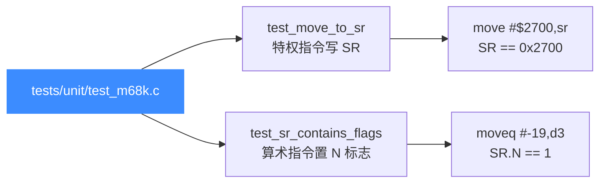
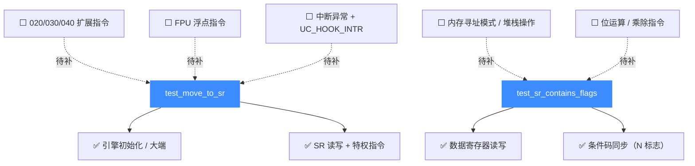

# M68K 测试套件

本页对应 `tests/unit/test_m68k.c`，讲清 Unicorn 为 Motorola 68000（M68K）提供的 C 单元测试目前覆盖了什么、怎么跑、为什么用例这么少。读完你能定位 M68K 的 `unit/` 测试现状，并知道新用例该往哪里加。

## 📌 概述

M68K 的 `unit/` 套件目前**只有 2 个用例**——`test_move_to_sr` 与 `test_sr_contains_flags`，都围绕状态寄存器（SR）展开：一个验证特权指令 `move #imm,sr` 能改写 SR 全部 16 位，另一个验证算术指令执行后 SR 里的条件码（N 标志）被正确置位。这并非 M68K 后端能力薄弱，而是该架构的大量指令语义验证分散在 `tests/regress/` 与各架构专题示例中，`unit/` 套件定位是"细粒度、贴近 API"的冒烟测试，M68K 这里只保留了最小可运行路径。



两个用例共用一个全局起始地址 `code_start = 0x1000`、长度 `code_len = 0x4000` 的代码段，并通过 `uc_common_setup` 统一完成"开引擎 → 选 CPU model → 映射代码段 → 写入机器码"四步。注意 `uc_common_setup` 多了一个 `uc_cpu_m68k cpu_model` 参数，两个用例都选 `UC_CPU_M68K_M68000`（最基础的 68000 核，无后续 020/030/040 的扩展指令）。

| # | 用例 | 验证的能力 |
|---|------|-----------|
| 1 | `test_move_to_sr` | 特权指令 `move #imm,sr` 改写 SR 全 16 位（含中断优先级掩码） |
| 2 | `test_sr_contains_flags` | `moveq` 负数加载后 SR 的 N（负）标志被正确置位 |

## 🔧 用例详解

### `test_move_to_sr` — 特权指令改写状态寄存器

这个用例用一条 4 字节特权指令 `move #$2700,sr`（机器码 `0x46 0xfc 0x27 0x00`）验证三件事：引擎能正确打开 M68K、SR 寄存器可读写、以及特权指令对 SR 的整体改写语义正确。

```c
uc_engine *uc;
char code[] = "\x46\xfc\x27\x00"; // move    #$2700,sr
int r_sr;

uc_common_setup(&uc, UC_ARCH_M68K, UC_MODE_BIG_ENDIAN, code,
                sizeof(code) - 1, UC_CPU_M68K_M68000);

OK(uc_reg_read(uc, UC_M68K_REG_SR, &r_sr));
r_sr = r_sr | 0x2000;          // 预置 supervisor 位
OK(uc_reg_write(uc, UC_M68K_REG_SR, &r_sr));

OK(uc_emu_start(uc, code_start, code_start + sizeof(code) - 1, 0, 0));

OK(uc_reg_read(uc, UC_M68K_REG_SR, &r_sr));
TEST_CHECK(r_sr == 0x2700);
```

`0x2700` 这个值不是随便选的：高字节 `0x27` 把中断优先级掩码（I0–I2）设到 7（全屏蔽），低字节清零所有条件码（C/V/Z/N/X）。预先把 `0x2000`（supervisor 模式位 S）或进 SR，是为模拟"已在特权态"的前置条件——`move #imm,sr` 是特权指令，在用户态会触发违规异常。执行后 SR 被整体覆盖成 `0x2700`，断言通过即说明指令解码、立即数扩展、SR 写回链路都正确。

它覆盖的能力维度：

| 检查点 | 断言 | 说明 |
|--------|------|------|
| 引擎初始化 | `uc_open(UC_ARCH_M68K, UC_MODE_BIG_ENDIAN)` | M68K 唯一大端 mode |
| CPU model 选择 | `uc_ctl_set_cpu_model(UC_CPU_M68K_M68000)` | 基础 68000 核 |
| 内存映射 | `uc_mem_map(code_start, 0x4000, UC_PROT_ALL)` | 16 KiB 代码段 |
| 寄存器读写 | `uc_reg_read/write(UC_M68K_REG_SR)` | SR 可读可写 |
| 特权指令语义 | `r_sr == 0x2700` | `move #imm,sr` 整体覆盖 SR |

::: tip 为什么选 `move #imm,sr`
`move #imm,sr`（操作码 `0x46fc`）是直接写 SR 的最短路径——4 字节、不访存、立即数即结果。任何 SR 解码或写回错误都会立刻让最终值偏离 `0x2700`，是验证"M68K 后端能跑起来且 SR 通道正确"的最小可信探针。
:::

### `test_sr_contains_flags` — 算术指令置位条件码

这个用例验证 SR 不是个孤立寄存器：算术指令执行后会按结果回填 SR 里的条件码位。它跑一条 `moveq #-19,d3`（机器码 `0x76 0xed`），把立即数 `-19` 加载进数据寄存器 D3，然后检查 D3 的值和 SR 的 N 标志。

```c
uint8_t code[] = {
    0x76, 0xed, // moveq #-19, %d3
};

uint32_t d3, sr;

uc_common_setup(&uc, UC_ARCH_M68K, UC_MODE_BIG_ENDIAN, code, sizeof(code),
                UC_CPU_M68K_M68000);

OK(uc_emu_start(uc, code_start, code_start + sizeof(code), 0, 0));

OK(uc_reg_read(uc, UC_M68K_REG_D3, &d3));
OK(uc_reg_read(uc, UC_M68K_REG_SR, &sr));

TEST_CHECK(d3 == 0xFFFFFFED);          // -19 符号扩展到 32 位
TEST_CHECK((sr & 0x8) /* N flag */ == 0x8);  // N 位置 1
```

`moveq` 把一个 8 位立即数符号扩展到 32 位写进 D3，`-19`（`0xED`）扩展后是 `0xFFFFFFED`。因为结果是负数，SR 的 N 位（bit 3，掩码 `0x8`）必须被置 1。这条用例把"指令执行 → 结果写回寄存器 → 条件码同步更新"整条链路一次钉死。

| 检查点 | 断言 | 说明 |
|--------|------|------|
| 立即数符号扩展 | `d3 == 0xFFFFFFED` | `moveq` 8 位 → 32 位 |
| 条件码同步 | `sr & 0x8 == 0x8` | 负结果置 N 标志 |
| 数据寄存器读写 | `uc_reg_read(UC_M68K_REG_D3)` | D3 通道正确 |

::: warning 注意：SR 的条件码位布局
M68K 的 SR 低字节是条件码寄存器 CCR，位布局为 `X N Z V C`（bit 4–0）。N 标志在 bit 3，掩码 `0x8`。如果你要断言其它标志：Z 是 `0x4`、V 是 `0x2`、C 是 `0x1`、X 是 `0x10`。详见 [/arch/m68k/registers](/arch/m68k/registers)。
:::

## 💻 运行方式

套件编译产物是 `build/test_m68k`，已注册到 CTest。两种跑法：

```bash
# 方式一：通过 CTest 按名称过滤
cd build
ctest -R m68k --output-on-failure

# 方式二：直接跑二进制（拿到 acutest 的逐用例输出）
cd build
./test_m68k

# 跑单个用例（acutest 支持命令行过滤）
./test_m68k test_move_to_sr
```

::: warning 先决条件
需要构建时开启 `UNICORN_BUILD_TESTS`（顶层项目默认 ON），且 `UNICORN_ARCH` 列表里包含 `m68k`（默认即包含）。若你裁剪了架构列表（如 `-DUNICORN_ARCH="x86"`），CTest 里不会出现 `m68k`。
:::

::: tip 提示：构建时裁剪架构可加速
首次构建全架构（`x86;arm;aarch64;riscv;mips;sparc;m68k;ppc;s390x;tricore`）较慢。只调 M68K 时用 `-DUNICORN_ARCH="m68k"` 可大幅缩短构建时间。详见 [/guide/compile](/guide/compile)。
:::

## 📊 套件覆盖的能力维度

下图展示当前用例覆盖（实线）与待补充（虚线）的能力维度。M68K 的真实指令语义验证更多依赖 [架构专题示例](/arch/m68k/example) 与 `regress/`，而非 `unit/`。



## ⚠️ 用例稀少的原因与现状

::: details 为什么 M68K unit 套件只有 2 条？
- **语义验证分散**：M68K 的指令集庞大（寻址模式多、变长编码、6 个数据/地址寄存器组），逐条铺用例成本高，深度验证放在 [M68K 指令与特性](/arch/m68k/instructions) 专题与 `tests/regress/`（Python + C，继承自 v1）中，`unit/` 不重复造轮子。
- **SR 是核心探针**：M68K 的特权态切换、中断屏蔽、条件码都集中在 SR 这一个寄存器里，把它测透就能覆盖"后端能跑 + 寄存器通道 + 标志位语义"三件事，因此 `unit/` 优先押在 SR 上。
- **CPU model 差异大**：`M68000` 与 `M68020/030/040/060` 的指令集差异显著（如 020+ 才有 `chk2`、`cmp2`、`callm`、位场扩展等），逐 model 铺用例属于架构专题的职责，`unit/` 只以最基础的 `M68000` 为基准。
:::

::: tip 想补充 M68K 用例？
参考 `tests/unit/test_arm.c` 的写法，在 `test_m68k.c` 里加 `static void test_xxx`，并在文件末尾 `TEST_LIST` 数组里登记条目，重新 `cmake --build build` 即可被 CTest 收录。详见 [测试与基准](/guide/testing)。
:::

## 📖 参考

- 源码：[`tests/unit/test_m68k.c`](https://github.com/android-security-engineer/unicorn-skills/blob/master/tests/unit/test_m68k.c)
- 测试框架：`tests/unit/acutest.h`（由 `unicorn_test.h` 封装）
- [M68K 架构概览](/arch/m68k/) — Motorola 68k 系列与大端 mode
- [M68K 指令与特性](/arch/m68k/instructions) — 寻址模式、`moveq`、`move #imm,sr` 单步示例
- [M68K 寄存器](/arch/m68k/registers) — D/A 寄存器组与 SR/CCR 位布局
- [M68K CPU 型号](/arch/m68k/cpu-models) — `M68000` 与 `M68020/030/040` 差异
- [M68K 示例](/arch/m68k/example) — 完整可运行代码
- [测试与基准](/guide/testing) — `tests/` 目录体系与运行方式

## 相关页面

- [/arch/m68k/](/arch/m68k/) — M68K 架构专题首页
- [/arch/m68k/instructions](/arch/m68k/instructions) — 指令编码与寻址模式
- [/arch/m68k/registers](/arch/m68k/registers) — 寄存器组与 SR/CCR
- [/arch/m68k/cpu-models](/arch/m68k/cpu-models) — CPU model 选择
- [/guide/testing](/guide/testing) — 整体测试体系
- [/internals/uc-struct](/internals/uc-struct) — `uc_struct` 函数指针分发模型
