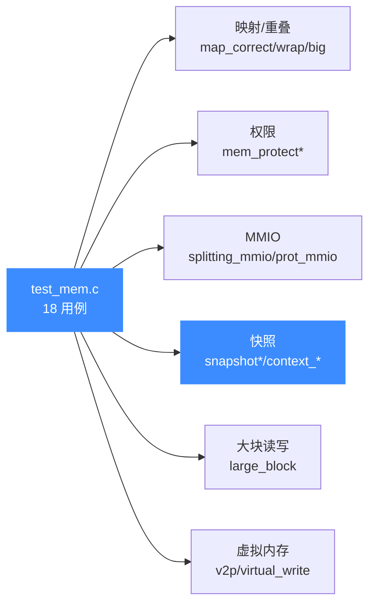
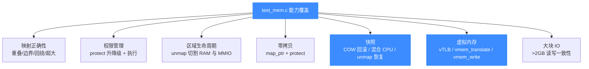

# 内存测试套件 (test_mem)

本页对应源码 `tests/unit/test_mem.c`,这是 Unicorn 跨架构共用的**内存子系统**单元测试集,共 **18 个**用例。读完你能知道这套测试覆盖了哪些内存能力、每个用例在验证什么,以及如何本地复现。

## 📌 概述

`test_mem.c` 不绑定单一架构——它以 `UC_ARCH_X86`(32/64 位)为主载体,个别用例切到 `UC_ARCH_ARM64`,集中压测 **Unicorn 公共内存 API** 的正确性与边界行为:`uc_mem_map` / `uc_mem_unmap` / `uc_mem_protect` / `uc_mem_map_ptr` / `uc_mmio_map` / `uc_context_*` / `uc_vmem_*` / `UC_HOOK_TLB_FILL`。

测试基于 `acutest` 框架(由 `unicorn_test.h` 包装),用 `OK()` 断言"必须成功"、`uc_assert_err()` 断言"必须返回指定错误码"、`TEST_CHECK()` 断言运行期值。



## 📋 用例清单

| 用例 | 验证能力 | 关键断言 |
|------|----------|----------|
| `test_map_correct` | 映射重叠检测 | 重叠映射返回 `UC_ERR_MAP` |
| `test_map_wrapping` | 跨 64 位边界回绕 | 起始+size 越界返回 `UC_ERR_ARG` |
| `test_mem_protect` | 运行期改权限后可写 | `inc [eax+4]` 写入成功 |
| `test_splitting_mem_unmap` | unmap 切割区域 | 中间块移除后两侧仍有效 |
| `test_splitting_mmio_unmap` | MMIO 区域局部替换为 RAM | 部分地址走回调、部分走内存 |
| `test_mem_protect_map_ptr` | `map_ptr` 后 protect/read | 零拷贝内存可读写 |
| `test_map_at_the_end` | 地址空间顶端映射 | `0xfffffffffffff000` 可写 |
| `test_map_wrap` | 顶端映射禁止回绕 | 跨界返回 `UC_ERR_ARG` |
| `test_map_big_memory` | 超大映射拒绝 | 返回 `UC_ERR_NOMEM` |
| `test_mem_protect_remove_exec` | block hook 内降权 | hook 触发 2 次 |
| `test_mem_protect_mmio` | MMIO 段内子区间降权 | 写触发 `UC_ERR_WRITE_PROT` |
| `test_snapshot` | 内存快照 save/restore | 回滚后值为 0 |
| `test_snapshot_with_vtlb` | vTLB 下快照 | 虚拟地址翻译+回滚 |
| `test_context_snapshot` | CPU+内存混合快照 | restore 回滚写入 |
| `test_snapshot_unmap` | 快照后 unmap 可恢复 | restore 重建已释放区域 |
| `test_mem_read_and_write_large_memory_block` | >2GB 块读写 | Metasploit 模式校验 |
| `test_virtual_to_physical` | `uc_vmem_translate` | 只读区写翻译报错 |
| `test_virtual_write` | `uc_vmem_write` + 执行 | `mov rax,[0x2000]` 取回 21 |

## 🔍 代表性用例精讲

### 1️⃣ test_map_correct — 重叠映射必被拒

这是内存映射的"地基测试"。它先按乱序映射三块互不相交的区域,然后尝试在**已覆盖的地址**上再映射,期望全部返回 `UC_ERR_MAP`;最后把缝隙填满应当成功:

```c
OK(uc_mem_map(uc, 0x40000, 0x1000 * 16, UC_PROT_ALL)); // [0x40000, 0x50000]
OK(uc_mem_map(uc, 0x60000, 0x1000 * 16, UC_PROT_ALL)); // [0x60000, 0x70000]
OK(uc_mem_map(uc, 0x20000, 0x1000 * 16, UC_PROT_ALL)); // [0x20000, 0x30000]
uc_assert_err(UC_ERR_MAP, uc_mem_map(uc, 0x25000, 0x1000 * 16, UC_PROT_ALL));
// ... 更多重叠情形 ...
OK(uc_mem_map(uc, 0x35000, 0x5000, UC_PROT_ALL));      // 填缝成功
```

它锁定的是 `uc_mem_map` 的**区间相交检测**——任何与既有区域有 1 字节重叠的新映射都必须被拒绝,这是后续 unmap 切割、protect 改权能成立的前提。

### 2️⃣ test_mem_protect — 运行期动态改权限

验证 `uc_mem_protect` 能在仿真进行中把一块**只读**内存升级为**可写**,从而让一条 `add [eax+4], esi` 写入成功:

```c
OK(uc_mem_map(qc, 0x2000, 0x1000, UC_PROT_READ));                // 先只读
OK(uc_mem_protect(qc, 0x2000, 0x1000, UC_PROT_READ | UC_PROT_WRITE));
// 执行 add [eax+4], esi 后读回 0xdeadbeef
TEST_CHECK(LEINT32(mem) == 0xdeadbeef);
```

它覆盖的是**权限热更新**路径:protect 不只是改标志位,还要让后续 CPU 访存的 TLB/softmmu 路径看到新权限。详见 [运行期改权限](/memory/protect)。

### 3️⃣ test_splitting_mmio_unmap — MMIO 局部"RAM 化"

最精巧的一个用例。先映射一整段 MMIO(`0x3000–0x4fff`),再 `uc_mem_unmap` 掉前半段并改成普通 RAM,写入固定值。执行两条 `mov` 后断言:**前半段走 RAM**(读回 `0xdeadbeef`)、**后半段仍走 MMIO 回调**(读回 `0x19260817`):

```c
OK(uc_mmio_map(uc, 0x3000, 0x2000, read_cb, NULL, NULL, NULL));
OK(uc_mem_unmap(uc, 0x3000, 0x1000));          // 切掉前半
OK(uc_mem_map(uc, 0x3000, 0x1000, UC_PROT_ALL)); // 换成 RAM
TEST_CHECK(r_ecx == 0xdeadbeef);  // RAM
TEST_CHECK(r_ebx  == 0x19260817); // MMIO 回调
```

它验证了 unmap 对**单一 MMIO 区域的切割**不会破坏剩余段的回调绑定——区域分裂后,各子段独立保持 RAM/MMIO 属性。参见 [MMIO](/memory/mmio)。

### 4️⃣ test_snapshot — 内存快照回滚

`uc_context_save` / `uc_context_restore` 配合 `uc_ctl_context_mode(uc, UC_CTL_CONTEXT_MEMORY)` 能把**整片内存**当作快照存档。本例执行两次自增循环,分别在不同存档点 restore,断言内存值回到 0、1:

```c
OK(uc_ctl_context_mode(uc, UC_CTL_CONTEXT_MEMORY));
OK(uc_context_save(uc, c0));           // 存档0:值=0
uc_emu_start(...);                      // 值→1
OK(uc_context_save(uc, c1));           // 存档1:值=1
uc_emu_start(...);                      // 值→2
OK(uc_context_restore(uc, c1));        // 回到1
OK(uc_context_restore(uc, c0));        // 回到0
```

它锁定的是**写时复制(COW)快照**语义——restore 不是"覆盖到存档",而是"丢弃存档之后的改动"。实现见 [写时复制与快照](/memory/cow-snapshot) 与 [快照内部实现](/internals/snapshot-impl)。

::: tip 同族用例
`test_snapshot_with_vtlb` 在启用 `UC_TLB_VIRTUAL` 的虚拟地址模式下重复同一断言;`test_snapshot_unmap` 进一步验证 **快照后 unmap 掉的区域,restore 时会重新出现**——这是内存快照覆盖映射表本身的关键证据。
:::

### 5️⃣ test_virtual_write — 虚拟地址写入与执行

启用 vTLB 后,通过 `UC_HOOK_TLB_FILL` 回调把虚拟地址 `v` 翻译到物理地址 `v - 0x1000`,再用 `uc_vmem_write` 按虚拟地址写机器码与数据,最后执行:

```c
OK(uc_ctl_tlb_mode(uc, UC_TLB_VIRTUAL));
OK(uc_hook_add(uc, &hook, UC_HOOK_TLB_FILL, tlb_fill_cb, NULL, 1, 0));
OK(uc_vmem_write(uc, 0x1000, UC_PROT_EXEC, code, sizeof(code)));
OK(uc_vmem_write(uc, 0x2000, UC_PROT_READ, &rax, sizeof(rax)));
OK(uc_emu_start(uc, 0x1000, 0x1000 + sizeof(code) - 1, 0, 1));
TEST_CHECK(rax == res);  // mov rax,[0x2000] 取回 21
```

它验证的是 **vTLB 翻译 + 虚拟地址写**的完整链路:CPU 执行时看到的虚拟地址经回调翻译到正确物理页,`uc_vmem_write` 也走同一翻译路径。参见 [TLB 模式](/features/tlb-modes) 与 [TLB 内部实现](/internals/tlb)。

## 💻 运行方式

`test_mem.c` 编译为独立的 `test_mem` 可执行文件并注册进 CTest。**它不属于任何单一架构套件**——不管 `UNICORN_ARCH` 怎么选,只要构建了测试(`UNICORN_BUILD_TESTS ON`),它都会出现,因为用例内部硬编码使用 x86/arm64 后端。

```bash
# 1. 构建(在项目根目录)
mkdir build && cd build
cmake .. -DCMAKE_BUILD_TYPE=Release -DUNICORN_ARCH="x86;aarch64"
make

# 2. 只跑内存套件
ctest -R test_mem --output-on-failure

# 3. 直接跑可执行文件(acutest 支持过滤)
./tests/unit/test_mem                  # 全跑
./tests/unit/test_mem test_snapshot    # 只跑指定用例
./tests/unit/test_mem -l               # 列出所有用例
```

::: warning 大块用例的环境限制
`test_mem_read_and_write_large_memory_block` 会申请约 **2.5GB**(`0x9f000000`)内存并在 32 位平台与 Android CI 上**自动跳过**(见源码 `#ifdef __ANDROID__` / `sizeof(void*) < 8` 的早退逻辑)。在这些环境里 ctest 仍会"通过",但实际没执行该用例,属预期行为。
:::

## 🧭 能力覆盖维度



## 📖 参考

- 源码:[`tests/unit/test_mem.c`](https://github.com/android-security-engineer/unicorn-skills/blob/master/tests/unit/test_mem.c)
- 测试框架:`tests/unit/acutest.h`、`tests/unit/unicorn_test.h`
- 内存 API 内部实现:[memory-api](/internals/memory-api)、[softmmu](/internals/softmmu)
- 快照实现:[snapshot-impl](/internals/snapshot-impl)

## 相关页面

- [测试指南](/guide/testing) — 全套测试体系(regress / fuzz / benchmarks)
- [内存模型总览](/memory/overview) — 本套件所测的内存底座
- [映射内存](/memory/map) / [解除映射](/memory/unmap) / [运行期改权限](/memory/protect)
- [MMIO](/memory/mmio) / [写时复制与快照](/memory/cow-snapshot)
- [TLB 模式](/features/tlb-modes) / [TLB 内部实现](/internals/tlb)
- [x86 架构专题](/arch/x86/) — 本套件主要载体架构
