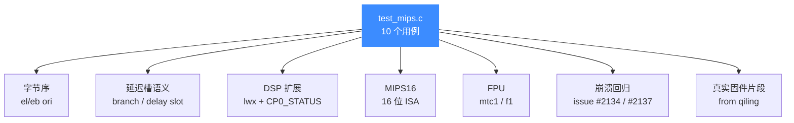
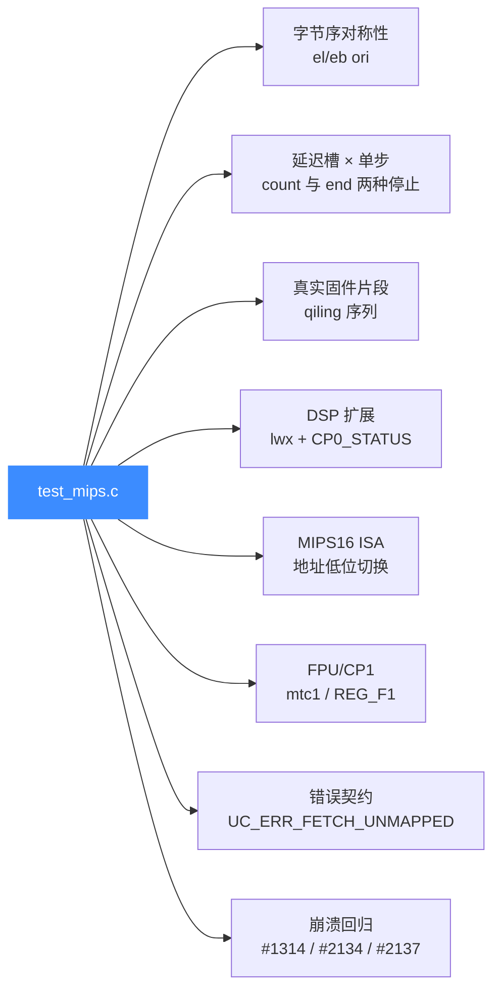

# MIPS 测试套件

本页对应 `tests/unit/test_mips.c`，逐用例讲解 Unicorn 对 MIPS 架构（32/64 位、大小端、延迟槽、DSP 与 MIPS16）的单元测试覆盖了哪些能力，读完你能知道这套测试在防什么回归、以及怎么本地跑起来对照自己的仿真结果。

## 📌 概述

`test_mips.c` 共 **10 个用例**，全部注册在文件末尾的 `TEST_LIST` 中，由 `acutest` 框架驱动、经 CTest 注册为 `test_mips` 目标。它围绕 MIPS 仿真的几个最易出错的能力点组织：字节序、分支延迟槽、DSP 扩展指令、MIPS16 指令集、FPU 寄存器，以及两条从真实 issue 流入的崩溃回归。



测试文件用到的公共搭手函数：

```c
const uint64_t code_start = 0x10000000;
const uint64_t code_len   = 0x4000;

static void uc_common_setup(uc_engine **uc, uc_arch arch, uc_mode mode,
                            const char *code, uint64_t size) {
    OK(uc_open(arch, mode, uc));
    OK(uc_mem_map(*uc, code_start, code_len, UC_PROT_ALL));
    OK(uc_mem_write(*uc, code_start, code, size));
}
```

每个用例都 `uc_open → 映射 0x10000000 一段 → 写机器码 → 设寄存器 → uc_emu_start → 读回断言`，`OK()` 宏断言返回值为 `UC_ERR_OK`。

## 🧪 用例逐个讲解

### 1. `test_mips_el_ori` / `test_mips_eb_ori` — 字节序对称性

这两个用例是**一对**：同一条 `ori $at, $at, 0x3456` 指令，在**小端**和**大端**下机器码字节序相反：

| 用例 | mode | 机器码（4 字节） | 期望 `$at` |
|------|------|------------------|-----------|
| `test_mips_el_ori` | `UC_MODE_MIPS32 \| UC_MODE_LITTLE_ENDIAN` | `56 34 21 34` | `0x77df` |
| `test_mips_eb_ori` | `UC_MODE_MIPS32 \| UC_MODE_BIG_ENDIAN` | `34 21 34 56` | `0x77df` |

初值 `$at = 0x6789`，`0x6789 | 0x3456 = 0x77df`。两个用例最终断言相同，**证明 Unicorn 在同一条指令上对两种字节序的取指/解码是对称的**——这是路由器固件逆向（绝大多数为大端）的生命线。字节序背景见 [MIPS 模式与字节序](/arch/mips/modes)。

### 2. `test_mips_stop_at_branch` — 单步时延迟槽照常执行

```c
// j 0x8; addu $v0, $v1, $v0;
char code[] = "\x02\x00\x00\x08\x21\x10\x62\x00";
OK(uc_emu_start(uc, code_start, code_start + sizeof(code) - 1, 0, 1));  // 只跑 1 条
TEST_CHECK(r_pc == code_start + 0x8);   // PC 跳到了 j 的目标
TEST_CHECK(v1  == 0x5);                 // 但延迟槽里的 addu 也执行了
```

::: warning 这是 MIPS 单步最反直觉的点
即使 `uc_emu_start` 传入 `count=1`（只执行"1 条指令"），**延迟槽里的 `addu` 也会一并执行**，且 PC 已经停在跳转目标 `code_start + 0x8`。如果按 x86 思路假设"单步一条就只动一条"，断言会全部失败。完整讨论见 [MIPS 指令与特性](/arch/mips/instructions)。
:::

### 3. `test_mips_stop_at_delay_slot` — 在延迟槽前主动停下

与上一个相反，这个用例验证"**故意把结束地址切在分支指令之前**"时的语义：跳转指令不提交、PC 不更新、由用户自行从分支指令处重启仿真。

```c
// j 0x8; nop;
char code[] = "\x02\x00\x00\x08\x00\x00\x00\x00\x00\x00\x00\x00";
OK(uc_emu_start(uc, code_start, code_start + 4, 0, 0));  // 结束地址 = 分支指令之后
TEST_CHECK(r_pc == code_start);  // PC 原地不动
```

它和 `test_mips_stop_at_branch` 一起，把"**count 控制**"与"**end 地址控制**"两种停止方式在延迟槽语境下的行为都钉死了。

### 4. `test_mips_stop_delay_slot_from_qiling` — 真实固件片段回归

来自 [Qiling](https://github.com/qilingframework/qiling) 框架的真实代码片段，验证**带分支的复合指令序列**在 `count=2` 下能正确落到分支目标，且延迟槽里的 `andi $v0, $v0, 0xfc` 已生效：

```c
// addiu $a2,$zero,3 ; beq $a1,$a2,0x1e8 ; andi $v0,$v0,0xfc ; beqz $v0,... ; ...
OK(uc_emu_start(uc, code_start, code_start + sizeof(code) + 16, 0, 2));
TEST_CHECK(r_pc == code_start + 4 + 0x1e8);  // 落到 beq 的目标
TEST_CHECK(r_v0 == 0xfc);                    // 延迟槽 andi 已执行
```

它同时跑的是 **大端**模式，是路由器固件路径的端到端冒烟。

### 5. `test_mips_lwx_exception_issue_1314` — DSP 扩展与 issue #1314 回归

`lwx` 是 MIPS DSP 扩展的加载指令。issue #1314 曾报告它在某些路径上抛异常。本用例：

- 显式置 `CP0_STATUS` 的第 24 位（**使能 DSP**），没有这步 `lwx` 会出错；
- 在 `0x10000` 处单独映射一段内存并写入 `0xdeadbeef`；
- 令 `$s3 = 0x10000` 作为基址，执行 `lwx $t9, $t9($s3)`；
- 断言 `$t9 == 0xdeadbeef`。

::: tip DSP 必须先开
`lwx`/`lhx` 等 DSP 指令依赖 `CP0_STATUS` 的 DSP 使能位。Unicorn 忠实还原了这点——不开 DSP 直接跑会复现 #1314 的异常。参考 [MIPS 指令与特性](/arch/mips/instructions)。
:::

### 6. `test_mips_mips16` — MIPS16 16 位指令集

```c
// li $v1, 0xC4;  addu $v0, $v1, $v0  (MIPS16 编码)
char code[] = "\xC4\x6B\x49\xE3";
int mips16_lowbit = 1;
OK(uc_emu_start(uc, code_start | mips16_lowbit, ...));  // 起始地址 | 1 进入 MIPS16
TEST_CHECK(r_v0 == 0x684D);  // 0x6789 + 0xC4 = 0x684D
```

MIPS16 通过**起始地址的最低位 `| 1`** 切换到 16 位 ISA 模式（与 ARM Thumb 同源的设计）。本用例确保 Unicorn 正确识别该切换并解码 16 位指令。注意这里 `uc_open` 仍用 `UC_MODE_MIPS32`，模式位不变、靠地址低位切换。

### 7. `test_mips_mips_fpr` — FPU 寄存器读写

```c
// li $t1, 0x42f6e979; mtc1 $t1, $f1
const char code[] = "\xf6\x42\x09\x3c\x79\xe9\x29\x35\x00\x08\x89\x44";
OK(uc_reg_read(uc, UC_MIPS_REG_F1, (void *)&r_f1));
TEST_CHECK(r_f1 = 0x42f6e979);  // 注：源码此处是赋值而非 ==，见下方注意
```

验证 `mtc1`（整数寄存器 → FPU 寄存器）后 `UC_MIPS_REG_F1` 能以 64 位宽度读回。FPU/CP1 寄存器细节见 [MIPS 寄存器参考](/arch/mips/registers)。

::: warning 源码笔误
`TEST_CHECK(r_f1 = 0x42f6e979)` 写成了**赋值**而非比较 `==`。这是上游既有写法——赋值表达式恒真，该断言实际"永远通过"。读这份测试时不要把它当成严格校验。修 bug 时顺手改成 `==` 是合理的 PR。
:::

### 8. `test_mips_simple_coredump_2134` / `test_mips_simple_coredump_2137` — 崩溃回归

这两条对应 GitHub issue #2134、#2137，曾导致引擎 coredump。

```c
// #2134: 跳转/取指落到未映射地址 → 应返回 UC_ERR_FETCH_UNMAPPED 而非崩溃
uc_assert_err(uc_emu_start(uc, code_start, code_start + sizeof(code) - 1, 0, 0),
              UC_ERR_FETCH_UNMAPPED);

// #2137: 某些指令组合曾触发内部断言/coredump，现在应正常跑完
OK(uc_emu_start(uc, code_start, code_start + sizeof(code) - 1, 0, 0));
```

- **#2134** 用 `uc_assert_err` 断言仿真**返回 `UC_ERR_FETCH_UNMAPPED`**（取指落到未映射区），而不是让进程崩溃——这把"优雅报错"钉死成契约。
- **#2137** 用 `OK()` 断言仿真**正常完成**，确保曾经的内部断言/coredump 不再复活。

这是"修 bug 必加回归"实践的两个范例，更多回归测试在 `tests/regress/`（见 [测试与基准](/guide/testing)）。

## 💻 运行方式

### 走 CTest（推荐）

```bash
cd build
ctest -R mips              # 跑所有名字含 mips 的测试目标
ctest -R test_mips --output-on-failure   # 只跑 test_mips，失败时打印详情
```

`-R` 是正则匹配，`test_mips` 是 CMake 为 `tests/unit/test_mips.c` 注册的可执行目标名。

### 直接跑可执行文件

```bash
cd build
./test_mips                # 跑全部 10 个用例
./test_mips test_mips_el_ori test_mips_eb_ori   # 只跑指定用例（按 TEST_LIST 里的名字）
./test_mips --list         # 列出所有用例名
```

::: tip 前置条件
需在 CMake 配置时开启测试，即 `UNICORN_BUILD_TESTS=ON`（顶层项目时默认 ON），且 `UNICORN_ARCH` 列表里**包含 `mips`**。若用 `cmake .. -DUNICORN_ARCH="x86"` 精简构建，`test_mips` 不会被编译出来。详见 [测试与基准](/guide/testing)。
:::

## 📊 覆盖能力维度



| 维度 | 覆盖用例 | 防什么回归 |
|------|----------|-----------|
| 字节序对称 | `el_ori` / `eb_ori` | 大小端取指解码不一致 |
| 延迟槽语义 | `stop_at_branch` / `stop_at_delay_slot` / `from_qiling` | 单步 count 与 end 地址在分支语境下的 PC/V0 |
| DSP 扩展 | `lwx_exception_issue_1314` | 未使能 DSP 时 `lwx` 抛异常 |
| MIPS16 | `mips16` | 地址低位 `| 1` 切 ISA 失效 |
| FPU | `mips_fpr` | `mtc1` 后 FPR 读回错误 |
| 错误契约 | `simple_coredump_2134` | 取指未映射应返回错误而非崩溃 |
| 崩溃回归 | `simple_coredump_2134` / `2137` | 历史 coredump 复活 |

## ⚠️ 注意

- `test_mips_mips_fpr` 里的 `TEST_CHECK(r_f1 = 0x42f6e979)` 是**赋值**而非 `==`，该断言恒真，详见上文用例 7。读测试结果时不要据此判断 FPR 校验已通过。
- 这 10 个用例只覆盖 **MIPS32**（`test_mips.c` 不含 `UC_MODE_MIPS64` 用例）。64 位 MIPS 的回归主要由 `tests/regress/` 下的 Python/C 用例承担。
- DSP、MIPS16 这类扩展依赖具体 CPU 型号与 CP0 状态；切换 `uc_ctl_set_cpu_model` 后行为可能变化，见 [MIPS CPU 型号](/arch/mips/cpu-models)。

## 🔧 实现细节速记

- 所有用例共享 `code_start = 0x10000000`、`code_len = 0x4000`，由 `uc_common_setup` 统一映射为 `UC_PROT_ALL`。
- `OK(x)` 宏断言 `x == UC_ERR_OK`；`uc_assert_err(x, expected)` 断言 `x == expected`（用于负向用例）。
- `LEINT32(0xdeadbeef)` 是把 32 位常量按小端展开的宏，用于跨字节序写入内存。
- `TEST_LIST` 数组是 `acutest` 的注册入口，顺序与函数定义顺序无关——`ctest` 按这里的名字调度。

## 📖 参考

- [MIPS 架构概览](/arch/mips/) — 为什么 MIPS 要单独讲字节序与延迟槽
- [MIPS 指令与特性](/arch/mips/instructions) — 延迟槽对单步/Hook 的影响、syscall 与中断
- [MIPS 寄存器参考](/arch/mips/registers) — `$0-$31`、CP0、FPU 常量
- [MIPS CPU 型号](/arch/mips/cpu-models) — `uc_ctl_set_cpu_model` 与 DSP/MIPS16 的关系
- [测试与基准](/guide/testing) — `unit/`、`regress/`、`fuzz/`、`benchmarks/` 四大目录职责
- [sample_mips.c 走读](/samples/sample-mips) — 完整可运行的大小端仿真示例

## 相关页面

- [MIPS 架构概览](/arch/mips/)
- [MIPS 指令与特性](/arch/mips/instructions)
- [MIPS 模式与字节序](/arch/mips/modes)
- [测试与基准](/guide/testing)
- [sample_mips.c 走读](/samples/sample-mips)
