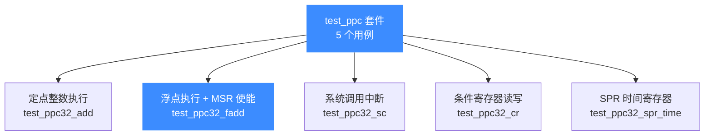
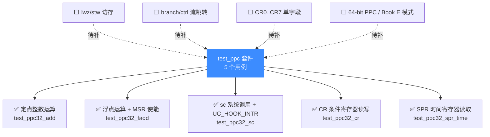

# test_ppc — PowerPC 测试套件

本页对应 `tests/unit/test_ppc.c`，讲清 Unicorn 为 PowerPC（PPC32，大端）提供的 C 单元测试覆盖了哪些能力：整数/浮点指令执行、系统调用中断、条件寄存器读写、SPR 时间寄存器读取。读完你能知道 PPC 后端验证了什么、每个用例在测什么，以及如何本地复现。

## 📌 概述

`test_ppc.c` 通过 `acutest` 框架注册 **5 个用例**（`TEST_LIST` 末尾的 `{NULL, NULL}` 哨兵前共 5 项；文件里出现的 `test_ppc32_sc_cb` 是中断回调函数，不是独立用例）。它围绕"PPC32 后端能跑起来且语义正确"组织：定点指令、浮点指令、`sc` 系统调用异常、`CR` 条件寄存器、`DEC`/`TBU` 等 SPR 时间寄存器。所有用例都跑在 `UC_ARCH_PPC | UC_MODE_32 | UC_MODE_BIG_ENDIAN` 模式下。



所有用例共用一个全局起始地址 `code_start = 0x1000`、长度 `code_len = 0x4000` 的代码段，并通过 `uc_common_setup` 统一完成"开引擎 → 映射代码段 → 写入机器码"三步。下表是全部用例的一览：

| # | 用例 | 验证的能力 |
|---|------|-----------|
| 1 | `test_ppc32_add` | 定点整数加法 `ADD 26, 6, 3`，寄存器间运算与结果回读 |
| 2 | `test_ppc32_fadd` | 双精度浮点加法 `fadd 6, 4, 5`，含 MSR 置位使能 FP |
| 3 | `test_ppc32_sc` | `sc` 系统调用指令触发 `UC_HOOK_INTR`，PC 前进 4 字节 |
| 4 | `test_ppc32_cr` | 条件寄存器 `CR` 的写入与读回一致性 |
| 5 | `test_ppc32_spr_time` | `mfspr` 读取 `DEC`/`TBU` 时间 SPR 不崩溃 |

## 💡 挑代表性用例讲解

### 🔧 `test_ppc32_add` — 定点整数加法闭环

这是套件的最小可信探针。机器码 `7f 46 1a 14` 是 `ADD 26, 6, 3`（把 `r6` 与 `r3` 相加存入 `r26`），预先写好 `r3=42`、`r6=1337`，执行后校验 `r26 == 1379`：

```c
char code[] = "\x7f\x46\x1a\x14"; // ADD 26, 6, 3
// r3 = 42, r6 = 1337
OK(uc_reg_write(uc, UC_PPC_REG_3, &reg));
OK(uc_reg_write(uc, UC_PPC_REG_6, &reg));
OK(uc_emu_start(uc, code_start, code_start + sizeof(code) - 1, 0, 0));
OK(uc_reg_read(uc, UC_PPC_REG_26, &reg));
TEST_CHECK(reg == 1379);
```

它一次性验证了四件事：`uc_open(UC_ARCH_PPC, UC_MODE_32 | UC_MODE_BIG_ENDIAN)` 能正确初始化 PPC32 大端后端、通用寄存器读写正常、4 字节定长指令的 PC 推进正确、定点加法语义无误。任何寄存器映射或大端解码错误都会立刻让 `r26` 出错。

### 🔧 `test_ppc32_fadd` — 浮点加法与 MSR 使能

PPC 的浮点指令要求 `MSR`（Machine State Register）的 FP 使能位打开，否则会触发不可用异常。这个用例先读 `MSR`、置第 13 位（大端）再写回，然后跑 `fadd 6, 4, 5`（双精度 `-75.0 + 3.5 = -71.5`），校验 `FPR6` 的位模式：

```c
char code[] = "\xfc\xc4\x28\x2a"; // fadd 6, 4, 5
OK(uc_reg_read(uc, UC_PPC_REG_MSR, &r_msr));
r_msr |= (1 << 13);                           // Big endian
OK(uc_reg_write(uc, UC_PPC_REG_MSR, &r_msr)); // enable FP
// FPR4 = -75.0 (0xC053400000000000), FPR5 = 3.5 (0x400C000000000000)
OK(uc_emu_start(uc, code_start, code_start + sizeof(code) - 1, 0, 0));
OK(uc_reg_read(uc, UC_PPC_REG_FPR6, &r_fpr6));
TEST_CHECK(r_fpr6 == 0xC052600000000000ul);   // -71.5
```

它验证了：`MSR` 作为系统寄存器可经 `UC_PPC_REG_MSR` 读写、FP 使能位生效、`FPR0..FPR31` 浮点寄存器组独立编址、IEEE 754 双精度加法在 Unicorn 的 PPC 软浮点实现下结果与真机一致（参照 IBM AIX 文档给出的基线）。

::: warning 注意：跑 PPC 浮点前先开 FP 位
不复现这一点的话，直接执行 `fadd` 会在 `MSR.FP=0` 时触发浮点不可用异常（`0x800` 类），表现为执行卡死或 `UC_ERR_INSN_INVALID`。任何用到 `fadd/fmadd/fdiv` 等浮点指令的用例都必须先置 `MSR` 的 FP 位。
:::

### 🔧 `test_ppc32_sc` — 系统调用中断

`sc`（System Call）机器码 `44 00 00 02` 在执行时应当产生一个中断异常，交由 `UC_HOOK_INTR` 回调处理。本用例在回调里调 `uc_emu_stop` 停下仿真，然后校验 `PC` 已前进到 `sc` 的下一条指令（`code_start + 4`）：

```c
char code[] = "\x44\x00\x00\x02"; // sc
OK(uc_hook_add(uc, &h, UC_HOOK_INTR, test_ppc32_sc_cb, NULL, 1, 0));
OK(uc_emu_start(uc, code_start, code_start + sizeof(code) - 1, 0, 0));
OK(uc_reg_read(uc, UC_PPC_REG_PC, &r_pc));
TEST_CHECK(r_pc == code_start + 4);

// 回调实现：
static void test_ppc32_sc_cb(uc_engine *uc, uint32_t intno, void *data) {
    uc_emu_stop(uc);
}
```

这验证了三件事：PPC 后端正确把 `sc` 识别为异常并经 `UC_HOOK_INTR` 上抛、回调能在同步上下文里安全调用 `uc_emu_stop`、异常返回后 `PC` 指向 `sc` 之后的指令而非原地停留。这是实现 OS 仿真、syscall 拦截、沙箱拦截器的基础原语。

### 🔧 `test_ppc32_cr` — 条件寄存器一致性

PPC 的 `CR`（Condition Register）是 32 位寄存器，分 8 个 4 位字段 `CR0..CR7`。这个用例不走任何指令，只测 `uc_reg_write/read` 对 `UC_PPC_REG_CR` 的存取是否保真：

```c
uint32_t r_cr = 0x12345678;
// 写入 r_cr = 0x12345678，清零后读回
OK(uc_reg_write(uc, UC_PPC_REG_CR, &r_cr));
r_cr = 0;
OK(uc_reg_read(uc, UC_PPC_REG_CR, &r_cr));
TEST_CHECK(r_cr == 0x12345678);
```

它钉死了 `CR` 的 32 位整体读写路径——任何字段拆分/重组错误都会让读回值不等于写入值。配套的 `UC_PPC_REG_CR0..CR7` 单字段读写在本套件里未单独覆盖，留给架构专题示例补充。

### 🔧 `test_ppc32_spr_time` — 时间 SPR 不崩溃

`mfspr r3, SPR` 把指定 SPR 搬到通用寄存器。本用例连续读 `DEC`（Decrementer）和 `TBUr`（Time Base Upper）两个时间相关 SPR，**没有结果断言**，只要求仿真不崩溃地跑完两条指令：

```c
char code[] = ("\x7c\x76\x02\xa6" // mfspr r3, DEC
               "\x7c\x6d\x42\xa6" // mfspr r3, TBUr
);
OK(uc_emu_start(uc, code_start, code_start + sizeof(code) - 1, 0, 0));
```

这是为回归"读时间 SPR 触发未实现异常导致仿真中断"一类问题而设的最小冒烟。`DEC`/`TBU` 在 OS 调度、定时器、性能计数器场景频繁出现，保证它们至少能被读取（哪怕返回 0）是 PPC 仿真可用性的底线。

## ⚠️ 注意：本套件不追求指令覆盖率

`test_ppc.c` 的 5 个用例**不是** PPC 指令集的功能测试矩阵——它没有逐条验证 `lwz/stw/mulhw/branch/rlwinm` 等单指令语义。单指令语义的正确性由 QEMU 上游的 TCG 测试与 `tests/regress/` 里的回归用例共同保证；本套件的定位是 **Unicorn 作为仿真框架的 API 行为**：执行控制、寄存器与 SPR 读写、`MSR`/`CR` 系统状态、中断 Hook。如果你要验证某条具体指令的语义，正确的做法是去 `tests/regress/` 找对应 issue 的回归用例，或自己写一个最小用例加进 `tests/unit/`。

::: details 为什么 unit 套件用例偏少？
- **语义验证分散**：PPC 的深度指令行为、`sc` 处理、异常向量等放在 [架构专题示例](/arch/ppc/example) 与 `tests/regress/`（Python + C，继承自 v1）中，`unit/` 不重复造轮子。
- **冒烟定位**：`unit/` 套件定位是"细粒度、贴近 API"的最小可运行路径，PPC 这里保留 5 条覆盖整数/浮点/中断/CR/SPR 五个维度的最小集。
:::

## 💻 运行方式

套件编译产物是 `build/test_ppc`，已注册到 CTest。两种跑法：

```bash
# 方式一：通过 CTest 按名称过滤
cd build
ctest -R ppc --output-on-failure

# 方式二：直接跑二进制（拿到 acutest 的逐用例输出）
cd build
./test_ppc

# 跑单个用例（acutest 支持命令行过滤）
./test_ppc test_ppc32_fadd
```

::: tip 提示：构建时裁剪架构可加速
首次构建全架构（`x86;arm;aarch64;riscv;mips;sparc;m68k;ppc;s390x;tricore`）较慢。只调 PPC 时用 `-DUNICORN_ARCH="ppc"` 可大幅缩短构建时间。详见 [/guide/compile](/guide/compile)。
:::

::: warning 先决条件
需要构建时开启 `UNICORN_BUILD_TESTS`（顶层项目默认 ON），且 `UNICORN_ARCH` 列表里包含 `ppc`（默认即包含）。若你裁剪了架构列表，CTest 里不会出现 `ppc`。
:::

如果用例失败，先核对两点：浮点用例是否漏置了 `MSR` 的 FP 使能位（`test_ppc32_fadd` 必须 `r_msr |= (1 << 13)`），以及中断用例的 `UC_HOOK_INTR` 回调是否在调用 `uc_emu_stop` 前正确返回。这两类是失败的重灾区。

## 📊 套件覆盖的能力维度

下图展示当前用例覆盖（实线）与待补充（虚线）的能力维度：



## 📖 参考

- 源码：[`tests/unit/test_ppc.c`](https://github.com/android-security-engineer/unicorn-skills/blob/master/tests/unit/test_ppc.c)
- acutest 框架：[`tests/unit/acutest.h`](https://github.com/android-security-engineer/unicorn-skills/blob/master/tests/unit/acutest.h)
- IBM AIX 文档（`fadd` 浮点加法基线）：[ibm.com/docs/en/aix/7.2?topic=set-fadd-fa-floating-add-instruction](https://www.ibm.com/docs/en/aix/7.2?topic=set-fadd-fa-floating-add-instruction)

## 相关页面

- [PowerPC 架构概览](/arch/ppc/) — PPC32 大端与 `UC_MODE_32 | UC_MODE_BIG_ENDIAN`
- [PPC 寄存器与 SPR](/arch/ppc/registers) — GPR/FPR/CR/MSR/DEC/TBU
- [PPC 指令与特性](/arch/ppc/instructions) — `add`/`fadd`/`sc`/`mfspr` 编码
- [PPC 示例](/arch/ppc/example) — 完整可运行代码
- [UC_HOOK_INTR — 中断 Hook](/hooks/intr) — `sc` 系统调用拦截
- [测试与基准](/guide/testing) — `tests/` 目录体系与运行方式
- [uc_emu_start 执行控制](/api/emu-start) — count 与 end 语义
