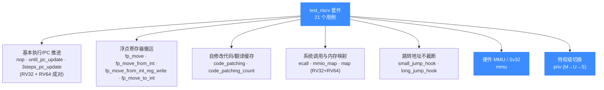

# test_riscv — RISC-V 测试套件

本页讲清 `tests/unit/test_riscv.c` 这一套件：它用 21 个用例覆盖 RISC-V 32/64 两种位宽的指令执行、寄存器读写、浮点寄存器搬运、自修改代码与翻译缓存、ECALL 中断、MMIO 与内存映射、跨地址空间跳转、硬件 MMU 与特权级切换。读完你能知道 RISC-V 后端验证了哪些能力、每个用例在测什么，以及如何本地复现。

## 📌 概述

`test_riscv.c` 通过 `acutest` 框架注册 **21 个用例**（`TEST_LIST` 末尾的 `{NULL, NULL}` 哨兵前共 21 项）。RISC-V 是 Unicorn 里少数对 **RV32 和 RV64 双位宽**都做完整回归的架构之一——21 个用例里有 9 个是"32 位版 + 64 位版"成对出现的，专门用来钉死同一份机器码在两种位宽下行为一致。其余用例聚焦框架级能力：自修改代码后的翻译缓存失效、`mstatus.fs` 控制下的浮点状态开关、Sv32 页表手填、`mret` 时的特权级掉落。



所有用例共用全局起始地址 `code_start = 0x1000`、长度 `code_len = 0x4000` 的代码段，并通过 `uc_common_setup` 统一完成"开引擎 → 映射代码段 → 写入机器码"三步。下表是全部 21 个用例的一览：

| # | 用例 | 验证的能力 |
|---|------|-----------|
| 1 | `test_riscv32_nop` | RV32 最小闭环：`nop` 不改寄存器、PC 推进 4 字节 |
| 2 | `test_riscv64_nop` | RV64 最小闭环：同上 |
| 3 | `test_riscv32_3steps_pc_update` | RV32 `uc_emu_start(count=3)` 按指令数停止 |
| 4 | `test_riscv64_3steps_pc_update` | RV64 同上 |
| 5 | `test_riscv32_until_pc_update` | RV32 按 end 地址停止、`addi` 立即数与栈指针更新 |
| 6 | `test_riscv64_until_pc_update` | RV64 同上 |
| 7 | `test_riscv32_fp_move` | RV32 `fmv.d` 浮点寄存器间搬运 |
| 8 | `test_riscv64_fp_move` | RV64 同上 |
| 9 | `test_riscv64_fp_move_from_int` | `csrrw` 置 `mstatus.fs` 后 `fmv.d.x` 整数→浮点 |
| 10 | `test_riscv64_fp_move_from_int_reg_write` | 直接 `uc_reg_write` 写 `mstatus` 置 `fs` 后 `fmv.d.x` |
| 11 | `test_riscv64_fp_move_to_int` | `fmv.x.d` 浮点→整数寄存器搬运 |
| 12 | `test_riscv64_ecall` | `ecall` 触发 `UC_HOOK_INTR`、PC 停在下一条 |
| 13 | `test_riscv32_mmio_map` | RV32 `lui`+`c.lw` 命中 MMIO 回调、offset 正确 |
| 14 | `test_riscv64_mmio_map` | RV64 同上 |
| 15 | `test_riscv32_map` | RV32 `lui`+`c.lw` 命中普通内存映射 |
| 16 | `test_riscv64_code_patching` | `uc_mem_write` 覆写指令后重新执行 |
| 17 | `test_riscv64_code_patching_count` | 同上 + `uc_ctl_remove_cache` 显式刷翻译缓存 |
| 18 | `test_riscv_correct_address_in_small_jump_hook` | `jr x5` 到 `0x7F00` 未映射页，地址不截断 |
| 19 | `test_riscv_correct_address_in_long_jump_hook` | `jr x5` 到 `0x7FFFFFFFFFFFFF00`，64 位地址不截断 |
| 20 | `test_riscv_mmu` | `UC_TLB_CPU` + 手填 Sv32 页表，虚拟地址翻译写物理内存 |
| 21 | `test_riscv_priv` | `mret` 使 M→U 掉落、U-Mode 写 `sscratch` 触发非法指令、强制 S-Mode 后成功 |

## 🧩 RV32/RV64 成对用例矩阵

上面的分类图按能力域切，下面这张专门把"32 位版 + 64 位版成对出现"的 9 个用例单独拎出来，凸显 RISC-V 是 Unicorn 里少数对双位宽都做完整回归的架构。成对用例钉死同一份机器码在两种位宽下行为一致，是跨位宽移植场景的主防线。

```mermaid
flowchart TD
    ROOT["test_riscv.c 21 条用例"] --> PAIR["成对出现<br/>9 个用例 = 4.5 对"]
    ROOT --> SOLO["仅 RV64<br/>浮点族"]
    ROOT --> SHARED["位宽无关<br/>框架级行为"]

    PAIR --> P1["nop ×2<br/>RV32 + RV64"]
    PAIR --> P2["3steps_pc_update ×2"]
    PAIR --> P3["until_pc_update ×2"]
    PAIR --> P4["fp_move ×2"]
    PAIR --> P5["mmio_map ×2<br/>lui + c.lw 命中回调"]
    PAIR --> P6["map ×2<br/>普通内存命中"]

    SOLO --> S1["fp_move_from_int<br/>csrrw 置 mstatus.fs"]
    SOLO --> S2["fp_move_from_int_reg_write<br/>uc_reg_write 置 fs"]
    SOLO --> S3["fp_move_to_int<br/>fmv.x.d"]

    SHARED --> SH1["ecall · code_patching ×2"]
    SHARED --> SH2["small/long jump · mmu · priv"]

    style ROOT fill:#3c8cff,color:#fff,stroke:none
    style PAIR fill:#3c8cff,color:#fff,stroke:none
    style SOLO fill:#ffb84d,color:#fff,stroke:none
    style SHARED fill:#3c8cff,color:#fff,stroke:none
    style P1 fill:#3c8cff,color:#fff,stroke:none
    style P2 fill:#3c8cff,color:#fff,stroke:none
    style P3 fill:#3c8cff,color:#fff,stroke:none
    style P4 fill:#3c8cff,color:#fff,stroke:none
    style P5 fill:#3c8cff,color:#fff,stroke:none
    style P6 fill:#3c8cff,color:#fff,stroke:none
    style S1 fill:#ffb84d,color:#fff,stroke:none
    style S2 fill:#ffb84d,color:#fff,stroke:none
    style S3 fill:#ffb84d,color:#fff,stroke:none
    style SH1 fill:#3c8cff,color:#fff,stroke:none
    style SH2 fill:#3c8cff,color:#fff,stroke:none
```



浮点族只出 RV64 版的原因：浮点状态开关 `mstatus.fs` 的语义在两种位宽下一致，RV64 版已覆盖逻辑，无需再复制一份 RV32。但若你新增位宽敏感指令（如涉及 `sext.w`/`ld` 的语义），务必照成对传统同时加 32 和 64 两版。

## 💡 挑代表性用例讲解

### 🔧 `test_riscv64_until_pc_update` — 最小执行闭环

这是 RV64 的"Hello World"。机器码 `addi t0, zero, 1; addi t1, zero, 0x20; addi sp, sp, 8` 三条指令，预先写好 `t0/t1/sp`，调 `uc_emu_start` 跑完整段，再读回校验：

```c
char code[] = "\x93\x02\x10\x00\x13\x03\x00\x02\x13\x01\x81\x00";
// addi t0, zero, 1      → t0 = 1
// addi t1, zero, 0x20   → t1 = 0x20
// addi sp, sp, 8        → sp = 0x1234 + 8 = 0x123c
OK(uc_emu_start(uc, code_start, code_start + sizeof(code) - 1, 0, 0));
TEST_CHECK(r_t0 == 0x1);
TEST_CHECK(r_t1 == 0x20);
TEST_CHECK(r_sp == 0x123c);
TEST_CHECK(r_pc == (code_start + sizeof(code) - 1));
```

它验证了四件事：`uc_emu_start` 的 end 地址边界（停在该地址、不越界执行）、立即数符号扩展、`sp` 作为通用整数寄存器参与运算、PC 停在 end 地址。配套的 `..._3steps_pc_update` 用 `count=3`（第 5 参数）按指令数停止、end 传 `-1`，把"按地址停"和"按条数停"两条路径都覆盖到。

### 🔧 `test_riscv64_fp_move_from_int_reg_write` — `mstatus.fs` 与浮点状态

RISC-V 的浮点单元默认是关闭的——`mstatus` 的 `FS` 字段为 `0`（Off）时，任何浮点指令都会触发非法指令异常。这个用例演示了**通过 `uc_reg_write` 直接写 `UC_RISCV_REG_MSTATUS` 置 `fs` 位**后，`fmv.d.x`（整数→双精度浮点）才能正常工作：

```c
char code[] = "\x53\x00\x0b\xf2"; // fmv.d.x ft0, s6
uint64_t r_s6 = 0x56785678;
uint64_t r_mstatus = 0x6000;       // FS = 0b11 (Dirty/Initial)
OK(uc_reg_write(uc, UC_RISCV_REG_MSTATUS, &r_mstatus));
OK(uc_emu_start(uc, code_start, -1, 0, 1));
TEST_CHECK(r_ft0 == 0x56785678);
```

::: warning 注意：跑浮点指令前必须置 mstatus.fs
配套用例 `..._fp_move_from_int` 用的是另一条路径——通过 `csrrw x2, mstatus, x3` 指令在客户机内部置 `fs`，更像真实 OS 的做法。两条路径一起保证：无论从宿主侧 `uc_reg_write` 还是从客户机侧 `csrrw` 置位，浮点单元都能正确使能。如果你自己的 RISC-V 程序跑浮点指令报 `UC_ERR_EXCEPTION`，先查 `mstatus.fs` 是不是 0。详见 [/arch/riscv](/arch/riscv/)。
:::

### 🔧 `test_riscv64_code_patching_count` — 自修改代码与翻译缓存

Unicorn 走 TCG JIT，翻译过的 Translation Block 会被缓存。如果你 `uc_mem_write` 覆写了指令但没刷缓存，**下次执行可能仍跑旧翻译结果**。这个用例钉死了这条边界：

```c
// 先跑 addi t0, t0, 1 → t0 == 1
// 覆写为 addi t0, t0, 0x7FF
OK(uc_mem_write(uc, code_start, patch_code, sizeof(patch_code) - 1));
// 关键一步：手动移除该地址区间的翻译缓存
OK(uc_ctl_remove_cache(uc, code_start,
                       code_start + sizeof(patch_code) - 1));
// 再跑 → t0 == 0x7ff（新指令生效）
TEST_CHECK(r_t0 == 0x7ff);
```

对比姊妹用例 `test_riscv64_code_patching`：那个用例**没有**调 `uc_ctl_remove_cache` 也能拿到新结果——因为它每次执行前 TB 恰好被重建。但这不可靠。自修改/热补丁场景务必显式调 `uc_ctl_remove_cache` 或 `uc_ctl_flush_tb`，否则在不同地址布局下会复现"跑的是旧指令"的玄学 bug。详见 [/ctl/remove-cache](/ctl/remove-cache)。

### 🔧 `test_riscv_mmu` — 手填 Sv32 页表做虚拟地址翻译

这是套件里最重的一个用例，演示了 Unicorn 的硬件 MMU 仿真。它做的事：

1. `uc_ctl_tlb_mode(uc, UC_TLB_CPU)` 切到 **CPU 模式 TLB**（走真实页表遍历，而非默认的 softmmu 直接映射）；
2. 在 `sptbr = 0x2000` 处手写 Sv32 二级页表项（`tlbe` 字节序列），把虚拟地址 `0x15000`（代码）和 `0x16000`（数据）翻译到物理地址 `0x5000` 和 `0x6000`；
3. M-Mode 入口代码先 `csrw sptbr`、置 `mstatus` 的 `MPU`/`SUM` 位、`csrw mepc` 后 `mret`，跳到 S-Mode 代码；
4. S-Mode 代码 `li t0, 0x41414141; sw t0, 0(t1)` 写虚拟地址 `0x16000`；
5. `uc_emu_start` 跑完后直接从物理地址 `0x6000` 读回，断言是 `0x41414141`。

```c
OK(uc_ctl_tlb_mode(uc, UC_TLB_CPU));
// ...手填 Sv32 两级页表，把 0x15000→0x5000、0x16000→0x6000...
OK(uc_emu_start(uc, 0x1000, sizeof(code_m) - 1, 0, 0));
OK(uc_mem_read(uc, data_address, &data_result, sizeof(data_result)));
TEST_CHECK(data_value == data_result);   // 0x41414141
```

这验证了 RISC-V 后端完整支持 OS 启动期的"建页表 → 置 `sptbr`/`mstatus` → `mret` → 虚拟地址生效"流程，是给内核/firmware 仿真场景背书的核心用例。详见 [/features/mmu](/features/mmu) 与 [/ctl/tlb-mode](/ctl/tlb-mode)。

### 🔧 `test_riscv_priv` — 特权级切换与权限陷阱

这个用例把 RISC-V 的 M/S/U 三态权限模型走了一遍。入口在 M-Mode，代码 `csrw mstatus, x0; csrw mepc, 0x3000; mret` 把 `mstatus.MPP` 清零后 `mret`，特权级掉落到 U-Mode：

```c
// 起始在 M-Mode
OK(uc_reg_read(uc, UC_RISCV_REG_PRIV, &priv_value));
TEST_ASSERT(priv_value == 3);          // M = 3
// 跑 mret 后掉到 U-Mode
OK(uc_emu_start(uc, m_entry_address, main_address, 0, 10));
TEST_ASSERT(priv_value == 0);          // U = 0
// U-Mode 写 sscratch → 非法指令异常
err = uc_emu_start(uc, main_address, main_end_address, 0, 0);
TEST_ASSERT(err == UC_ERR_EXCEPTION);
// 强制写 PRIV = 1（S-Mode）后再跑 → 成功
priv_value = 1;
OK(uc_reg_write(uc, UC_RISCV_REG_PRIV, &priv_value));
OK(uc_emu_start(uc, main_address, main_end_address, 0, 0));
TEST_ASSERT(reg_value == 0);           // sscratch 写成功
```

它一次性验证了四件事：`UC_RISCV_REG_PRIV` 可读可写、`mret` 按 `mstatus.MPP` 掉落特权级、U-Mode 访问 CSR 触发非法指令异常（`UC_ERR_EXCEPTION`）、宿主侧可强制改特权级绕过陷阱。这是实现固件仿真、TrustZone/Secure Monitor 类场景的基础原语。

## ⚠️ 注意：本套件不追求指令覆盖率

`test_riscv.c` 的 21 个用例**不是** RISC-V 指令集的功能测试矩阵——它没有逐条验证 `add`/`lw`/`mul`/`fadd`/`beq` 等单指令语义，也没有覆盖压缩指令集（`c.` 前缀只顺带在 `c.lw` 里出现一次）、向量扩展（V）、位操扩展（B）等。单指令语义的正确性由 QEMU 上游的 TCG 测试与 `tests/regress/` 里的回归用例共同保证；本套件的定位是 **Unicorn 作为仿真框架的 API 行为**：执行控制、内存模型、MMU、特权级、浮点状态开关、PC 边界。如果你要验证某条具体 RV32IMF 指令的语义，正确的做法是去 `tests/regress/` 找对应 issue 的 Python/C 回归用例，或自己写一个最小用例加进 `tests/unit/`。

## 💻 运行方式

```bash
# 前置：已 cmake 构建，且 UNICORN_BUILD_TESTS=ON（默认开）
cd build

# 只跑 riscv 套件（ctest 名按二进制名匹配，二进制名即 test_riscv）
ctest -R riscv --output-on-failure

# 直接跑可执行文件（拿到 acutest 的逐用例输出）
./test_riscv

# 跑单个用例（acutest 支持命令行过滤）
./test_riscv test_riscv_mmu
./test_riscv test_riscv_priv
```

::: tip 提示：构建时裁剪架构可加速
首次构建全架构（`x86;arm;aarch64;riscv;mips;sparc;m68k;ppc;s390x;tricore`）较慢。只调 RISC-V 时用 `-DUNICORN_ARCH="riscv"` 可大幅缩短构建时间。详见 [/guide/compile](/guide/compile)。
:::

如果用例失败，先核对三点：浮点类用例是否漏置了 `mstatus.fs`、自修改后是否漏调了 `uc_ctl_remove_cache`、MMU 用例是否漏了 `uc_ctl_tlb_mode(UC_TLB_CPU)`。这三类是失败的重灾区。

## 📖 参考

- 源码：[`tests/unit/test_riscv.c`](https://github.com/android-security-engineer/unicorn-skills/blob/master/tests/unit/test_riscv.c)
- acutest 框架：[`tests/unit/acutest.h`](https://github.com/android-security-engineer/unicorn-skills/blob/master/tests/unit/acutest.h)
- RISC-V 特权规范（`mstatus`/`mret`/CSR）：[riscv.org/wp-content/uploads/2017/05/riscv-spec-v2.2.pdf](https://riscv.org/wp-content/uploads/2017/05/riscv-spec-v2.2.pdf)
- CSR 速查：[five-embeddev.com/quickref/csrs.html](https://five-embeddev.com/quickref/csrs.html)

## 相关页面

- [RISC-V 架构专题](/arch/riscv/)
- [测试总览与运行指南](/guide/testing)
- [内存映射与 MMU](/features/mmu)
- [MMIO 映射](/memory/mmio)
- [uc_ctl_remove_cache — 移除翻译缓存](/ctl/remove-cache)
- [uc_ctl_tlb_mode — TLB 模式](/ctl/tlb-mode)
- [uc_emu_start 执行控制](/api/emu-start)
- [UC_HOOK_INTR — 中断 Hook](/hooks/intr)
