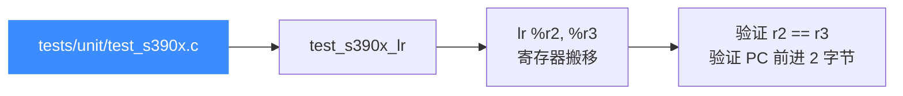
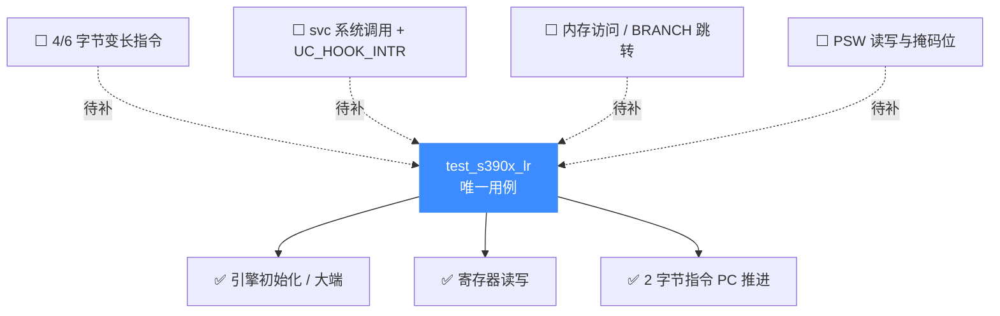

# S390X 测试套件

本页对应 `tests/unit/test_s390x.c`，讲清 Unicorn 为 IBM System z（z/Architecture）提供的 C 单元测试目前覆盖了什么、怎么跑、为什么用例这么少。读完你能定位 S390X 的测试现状，并知道新用例该往哪里加。

## 📌 概述

S390X 的 `unit/` 套件目前**只有 1 个用例** `test_s390x_lr`，验证最基础的寄存器间搬移指令 `lr`（Load Register）。这并非 S390X 后端能力薄弱，而是该架构接入较晚、且大量语义验证分散在 `tests/regress/` 与各架构专题示例中。`unit/` 套件定位是"细粒度、贴近 API"的冒烟测试，S390X 这里只保留了一条最小可运行路径。



## 🔧 用例详解

### `test_s390x_lr` — 寄存器搬移与 PC 推进

这个用例用一条 2 字节指令 `lr %r2, %r3`（机器码 `0x18 0x23`）同时验证三件事：引擎能正确打开 S390X、寄存器读写正常、以及变长指令的 PC 推进长度正确。

```c
char code[] = "\x18\x23"; // lr %r2, %r3
uint64_t r_pc, r_r2, r_r3 = 0x114514;
uc_engine *uc;

uc_common_setup(&uc, UC_ARCH_S390X, UC_MODE_BIG_ENDIAN, code,
                sizeof(code) - 1);

OK(uc_reg_write(uc, UC_S390X_REG_R3, &r_r3));
OK(uc_emu_start(uc, code_start, code_start + sizeof(code) - 1, 0, 0));

OK(uc_reg_read(uc, UC_S390X_REG_R2, &r_r2));
OK(uc_reg_read(uc, UC_S390X_REG_PC, &r_pc));

TEST_CHECK(r_r2 == 0x114514);
TEST_CHECK(r_pc == code_start + sizeof(code) - 1);
```

它覆盖的能力维度：

| 检查点 | 断言 | 说明 |
|--------|------|------|
| 引擎初始化 | `uc_open(UC_ARCH_S390X, UC_MODE_BIG_ENDIAN)` | 唯一大端 mode |
| 内存映射 | `uc_mem_map(code_start, 0x4000, UC_PROT_ALL)` | 4 KiB 代码段 |
| 代码写入 | `uc_mem_write` | 大端机器码落地 |
| 寄存器写 | `uc_reg_write(…, UC_S390X_REG_R3, &0x114514)` | 源寄存器置数 |
| 寄存器搬移语义 | `r2 == 0x114514` | `lr` 把 r3 拷给 r2 |
| 变长指令 PC 推进 | `r_pc == code_start + 2` | 2 字节指令，PC 前进 2 |

::: tip 为什么选 `lr`
`lr`（操作码 `0x18`）是 2 字节 RR 型指令，编码最短、不访存、不触发中断，是验证"S390X 后端能跑起来"的最小可信探针。任何寄存器/PSW 解码错误都会立刻让 `r2` 或 `r_pc` 出错。
:::

## 💻 运行方式

套件编译产物是 `build/test_s390x`，已注册到 CTest。两种跑法：

```bash
# 方式一：通过 CTest 按名称过滤
cd build
ctest -R s390x --output-on-failure

# 方式二：直接跑二进制
cd build
./test_s390x
```

::: warning 先决条件
需要构建时开启 `UNICORN_BUILD_TESTS`（顶层项目默认 ON），且 `UNICORN_ARCH` 列表里包含 `s390x`（默认即包含）。若你裁剪了架构列表，CTest 里不会出现 `s390x`。
:::

## 📊 套件覆盖的能力维度

下图展示当前用例覆盖（实线）与待补充（虚线）的能力维度。S390X 的真实语义验证更多依赖 [架构专题示例](/arch/s390x/example) 与 `regress/`，而非 `unit/`。



## ⚠️ 用例稀少的原因与现状

::: details 为什么 S390X unit 套件只有 1 条？
- **接入时间晚**：S390X 是 Unicorn 2 后期才并入的架构，`unit/` 套件还停留在最小冒烟阶段。
- **语义验证分散**：指令行为、`svc` 中断、PSW 等深度验证放在 [S390X 指令与特性](/arch/s390x/instructions) 专题与 `tests/regress/`（Python + C，继承自 v1）中，`unit/` 不重复造轮子。
- **硬件稀缺**：System z 真机难觅，对照基线少，逐指令铺用例成本高。
:::

::: tip 想补充 S390X 用例？
参考 `tests/unit/test_arm.c` 的写法，在 `test_s390x.c` 里加 `static void test_xxx`，并在文件末尾 `TEST_LIST` 数组里登记条目，重新 `cmake --build build` 即可被 CTest 收录。详见 [测试与基准](/guide/testing)。
:::

## 📖 参考

- 源码：[`tests/unit/test_s390x.c`](https://github.com/android-security-engineer/unicorn-skills/blob/master/tests/unit/test_s390x.c)
- 测试框架：`tests/unit/acutest.h`（由 `unicorn_test.h` 封装）
- [S390X 架构概览](/arch/s390x/) — z/Architecture 与大端 mode
- [S390X 指令与特性](/arch/s390x/instructions) — 变长指令、`svc`、`lr` 单步示例
- [S390X 示例](/arch/s390x/example) — 完整可运行代码
- [测试与基准](/guide/testing) — `tests/` 目录体系与运行方式

## 相关页面

- [/arch/s390x/](/arch/s390x/) — S390X 架构专题首页
- [/arch/s390x/instructions](/arch/s390x/instructions) — 指令编码与 Hook 用法
- [/arch/s390x/registers](/arch/s390x/registers) — 寄存器与 PSW
- [/guide/testing](/guide/testing) — 整体测试体系
- [/internals/uc-struct](/internals/uc-struct) — `uc_struct` 函数指针分发模型
