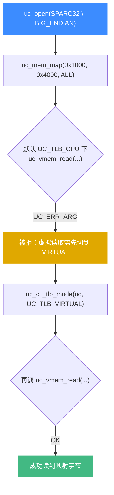
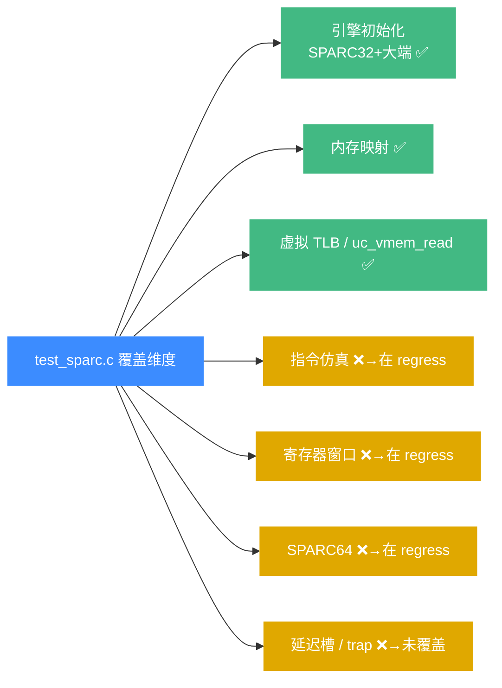

# SPARC 测试套件

本页讲 `tests/unit/test_sparc.c`——SPARC 架构的 C 单元测试。读完你能知道这个套件目前覆盖了什么、为什么这么少，以及怎么跑它。

## 📌 概述

`test_sparc.c` 是 Unicorn 2 引入的、针对 `UC_ARCH_SPARC` 的细粒度单元测试。它和 `test_arm.c`、`test_x86.c` 等同属 `tests/unit/`，由 [acutest](https://github.com/mity/acutest) 框架驱动，编译出的可执行文件 `test_sparc` 会注册进 CTest。

不过和动辄几十个用例的 ARM/x86 套件不同，SPARC 的 unit 文件目前**只有一个**测试函数：

```bash
$ grep -c "static void test_" tests/unit/test_sparc.c
1
```

| 项目 | 内容 |
|------|------|
| 源文件 | `tests/unit/test_sparc.c` |
| 用例数 | 1（`test_virtual_read`） |
| 覆盖能力 | 虚拟 TLB 模式下的 `uc_vmem_read` |
| 关联架构 | `UC_ARCH_SPARC` + `UC_MODE_SPARC32 \| UC_MODE_BIG_ENDIAN` |
| 注册位置 | `CMakeLists.txt`（`UNICORN_HAS_SPARC` 分支，加入 `UNICORN_TEST_FILE`） |

## ⚠️ 为什么只有一个用例

SPARC 的 unit 套件确实很薄，这并非疏漏，而是历史分层的结果：

- **指令级回归测试大多落在 `tests/regress/`**：Unicorn 1 时代就有一批 SPARC 回归测试用 Python 写好，迁到 v2 后继续以脚本形式运行，没有重写成 C 单元测试。SPARC 的 `regress/` 目录里有：
  - `sparc_reg.py`——一口气给全部 32 个整数寄存器（`g0-g7`/`o0-o7`/`l0-l7`/`i0-i7`）写 `add #1`，再读回，验证寄存器窗口语义与 `g0` 恒零。
  - `sparc64.py`——SPARC64 下 `inc %i0` / `inc %i1` 的寄存器自增。
  - `sparc_jump_to_zero.c`——`jmp` 到零地址的跳转行为。
- **fuzz 持续覆盖**：`tests/fuzz/fuzz_emu_sparc_32be.c` 由 OSS-Fuzz 喂随机机器码，长期兜底崩溃类缺陷。
- **unit 侧重"新 API 行为"**：`test_sparc.c` 这唯一的用例聚焦的是 Unicorn 2 新增的**虚拟 TLB**（`UC_TLB_VIRTUAL`）能力，而非某条具体指令——这正是 `unit/` 区别于 `regress/` 的定位。

::: details 现状是 thin，但不是 broken
SPARC 的指令仿真正确性主要靠 `regress/` 里的 Python 用例和 fuzz 来把关。如果你在改 SPARC 后端、想加测试，按 [测试与基准](/guide/testing) 的建议优先放进 `unit/`，把缺失的指令级用例补回来。
:::

## 💡 用例精讲：`test_virtual_read`

这是整个套件唯一的用例，但它验证的是一个跨架构、跨后端共享的通用机制——**虚拟 TLB 模式下的虚拟地址读取**。



源码极短，逐段拆开看（节选自 `tests/unit/test_sparc.c`）：

```c
static void test_virtual_read(void)
{
    uc_engine *uc;
    uint8_t u8 = 8;

    OK(uc_open(UC_ARCH_SPARC, UC_MODE_SPARC32|UC_MODE_BIG_ENDIAN, &uc));
    OK(uc_mem_map(uc, code_start, code_len, UC_PROT_ALL));

    // 默认 CPU TLB 模式下，uc_vmem_read 应被拒绝
    uc_assert_err(UC_ERR_ARG, uc_vmem_read(uc, code_start, UC_PROT_READ, &u8, sizeof(u8)));
    // 切到虚拟 TLB
    OK(uc_ctl_tlb_mode(uc, UC_TLB_VIRTUAL));
    // 切换后同一次调用应成功
    OK(uc_vmem_read(uc, code_start, UC_PROT_READ, &u8, sizeof(u8)));
}
```

它验证了三件事：

1. **打开 SPARC 引擎**：`UC_MODE_SPARC32 | UC_MODE_BIG_ENDIAN` 组合可用，引擎成功初始化并完成内存映射——和 [SPARC 模式与字节序](/arch/sparc/modes) 里讲的大端组合一致。
2. **`uc_vmem_read` 的前置条件**：在默认的 `UC_TLB_CPU` 模式下，虚拟地址读取是**非法操作**，必须返回 `UC_ERR_ARG`。`uc_assert_err` 这个断言（来自 `unicorn_test.h`）专门检查"预期失败"——它确认错误码正好是 `UC_ERR_ARG`，既不是误成功、也不是别的错。
3. **切换到 `UC_TLB_VIRTUAL` 后解锁**：调一次 [uc_ctl_tlb_mode](/ctl/tlb-mode) 把 TLB 实现切到虚拟 TLB，同样的 `uc_vmem_read` 调用就成功了。这一步顺带证明了虚拟 TLB 在 SPARC 后端真的能跑通地址翻译 + 读取。

::: tip 为什么用 SPARC 来测通用机制
`uc_vmem_read` / `UC_TLB_VIRTUAL` 是架构无关的通用 API，理论上换任何一个 arch 都能复现这条断言。选 SPARC 来当载体，部分原因是 SPARC 的 unit 套件当时最"空"，正好拿来挂这条跨架构的基线检查——它更像是为 SPARC 占一个 CTest 槽位，确保该 arch 在 CI 里不会"零测试"地被构建出来。
:::

关于两个测试宏，这里补一句：`OK(...)` 断言返回值是 `UC_ERR_OK`（成功），`uc_assert_err(expected, ...)` 断言返回值正好等于 `expected`。两者都定义在 `tests/unit/unicorn_test.h` 里，是本仓库所有 unit 测试共用的薄包装。

## 🔧 怎么跑

`test_sparc` 在 `UNICORN_HAS_SPARC` 启用时编译，并通过 `UNICORN_TEST_FILE` 注册为 CTest 用例。先确保构建时没把 SPARC 踢出 `UNICORN_ARCH`（默认是包含的），然后：

```bash
# 从仓库根目录
mkdir build; cd build
cmake .. -DCMAKE_BUILD_TYPE=Release -DUNICORN_ARCH="sparc"
make
```

跑 SPARC 相关用例：

```bash
# 方式一：用 CTest 按名字过滤（test_sparc 这一个二进制）
ctest -R sparc --output-on-failure

# 方式二：直接跑可执行文件，看 acutest 的详细输出
./tests/unit/test_sparc
```

`ctest -R sparc` 会命中注册名 `test_sparc`。直接跑二进制时，acutest 默认执行 `TEST_LIST` 里登记的全部用例，可用 `./test_sparc -l` 列表、`./test_sparc test_virtual_read` 指定单跑某条。

::: warning 构建时务必带上 sparc
如果你用 `-DUNICORN_ARCH="x86"` 这种精简架构列表构建，`test_sparc` 根本不会被编译，`ctest -R sparc` 会显示 "No tests ran"。跑 SPARC 测试前请确认 `UNICORN_ARCH` 里包含 `sparc`，详见 [编译指南](/guide/compile)。
:::

## 📖 能力覆盖维度

下面这张图把 `test_sparc.c` 这一个用例映射到 SPARC 仿真能力的几个维度上，标出"已覆盖 / 未在 unit 覆盖"：



绿色（✅）是该 unit 用例实际覆盖的能力；橙色（❌）是 SPARC 仿真里重要、但 unit 套件没有、只能去 `regress/` 或 fuzz 里找的能力。换言之，如果你要重构 SPARC 后端，光靠 `ctest -R sparc` 绿是不够的，还得跑一遍 `regress/` 下的三个脚本：

```bash
cd tests/regress
python3 sparc_reg.py
python3 sparc64.py
./sparc_jump_to_zero   # 需先编译，依赖构建出的 libunicorn
```

## 相关页面

- [SPARC 架构概览](/arch/sparc/) —— 寄存器窗口、位宽、大端背景
- [SPARC 模式与字节序](/arch/sparc/modes) —— `UC_MODE_SPARC32` / `UC_MODE_SPARC64` / `UC_MODE_BIG_ENDIAN`
- [uc_vmem_read](/api/vmem-read) —— 本用例断言的核心 API
- [uc_ctl_tlb_mode](/ctl/tlb-mode) —— `UC_TLB_CPU` 与 `UC_TLB_VIRTUAL` 的切换
- [TLB 模式](/features/tlb-modes) —— 两种 TLB 实现的差异与适用场景
- [测试与基准](/guide/testing) —— `unit/` / `regress/` / `fuzz/` 的分工
