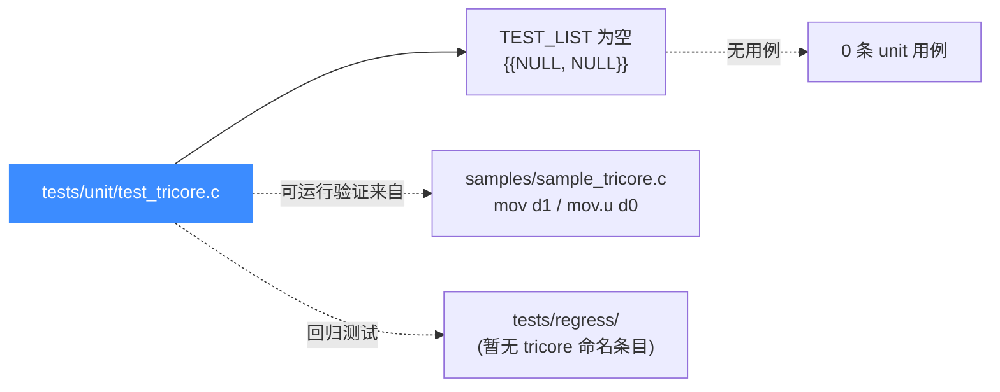
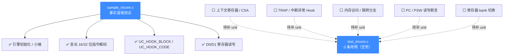

# TriCore 测试套件

本页对应 `tests/unit/test_tricore.c`，讲清 Unicorn 为 TriCore（英飞凌 32 位嵌入式 RISC）提供的 C 单元测试目前覆盖了什么、怎么跑、为什么几乎是空的。读完你能定位 TriCore 的测试现状，并知道真正可运行的语义验证在 `samples/`、`tests/regress/` 与架构专题里。

## 📌 概述

TriCore 的 `unit/` 套件目前**没有任何用例**——文件只保留了 `unicorn_test.h` 头与一段空的 `TEST_LIST` 终止哨兵，没有一条 `static void test_*`。这并非 TriCore 后端能力缺失，而是该架构接入较晚（2022 年由 Aptiv 贡献）、用例落地分散到了 `samples/sample_tricore.c` 与架构专题示例中。`unit/` 套件定位是"细粒度、贴近 API"的冒烟测试，TriCore 这条最小可运行路径目前由 `samples/` 而非 `unit/` 承担。



## 🔧 文件现状逐行解读

`tests/unit/test_tricore.c` 全文只有 6 行，本质是一个**占位骨架**，等后端稳定后再填充用例：

```c
#include "unicorn_test.h"

const uint64_t code_start = 0x1000;
const uint64_t code_len = 0x4000;

TEST_LIST = {{NULL, NULL}};
```

逐行说明：

| 行 | 代码 | 作用 |
|----|------|------|
| 1 | `#include "unicorn_test.h"` | 引入 acutest 测试框架封装（`tests/unit/acutest.h`）与 `uc_common_setup` 等公共夹具 |
| 3 | `const uint64_t code_start = 0x1000` | 预留代码段起始地址常量，供未来用例复用（目前无人引用） |
| 4 | `const uint64_t code_len = 0x4000` | 预留代码段长度（16 KiB），同上 |
| 6 | `TEST_LIST = {{NULL, NULL}}` | acutest 的测试用例注册表；`{NULL, NULL}` 是终止哨兵，表示**注册了 0 条用例** |

::: warning 为什么没有用例却保留这个文件？
acutest 框架要求每个测试二进制都有一个 `TEST_LIST` 数组作为注册表入口。保留一个空壳文件，既声明了"TriCore 后端存在、有对应的 test 目标"，又给后续贡献者留好了直接往里填 `static void test_xxx` 的位置，省去重新搭脚手架的成本。
:::

## 💻 运行方式（含可运行的替代品）

由于 `test_tricore.c` 注册了 0 条用例，`ctest -R tricore` 即便能匹配到目标，也会报告 "No tests run"。**真正能验证 TriCore 后端是否工作的，是 `samples/sample_tricore.c`**，它演示了 `mov d1, #0x1` 与 `mov.u d0, #0x8000` 两条变长指令的执行。

```bash
# 方式一：尝试跑 unit 套件（当前为空，仅作确认）
cd build
ctest -R tricore --output-on-failure
# 预期：No tests were found / No tests ran

# 方式二：直接跑二进制（空 TEST_LIST，acutest 会立即退出）
cd build
./test_tricore

# 方式三（推荐）：跑 sample，这才是 TriCore 的事实冒烟测试
cd build
./sample_tricore
# 预期输出：
#   >>> Tracing basic block at 0x10000 ...
#   >>> Tracing instruction at 0x10000 ...
#   >>> d0 = 0x8000
#   >>> d1 = 0x1
```

`sample_tricore.c` 里 `test_tricore()` 函数验证的核心能力（也是 `unit/` 暂缺、应由 `unit/` 接管的部分）：

```c
#define CODE "\x82\x11\xbb\x00\x00\x08" // mov d1, #0x1; mov.u d0, #0x8000
#define ADDRESS 0x10000

// 用小端 mode 打开 TriCore 引擎
err = uc_open(UC_ARCH_TRICORE, UC_MODE_LITTLE_ENDIAN, &uc);

// 映射 2MB 内存并写入变长混合机器码
uc_mem_map(uc, ADDRESS, 2 * 1024 * 1024, UC_PROT_ALL);
uc_mem_write(uc, ADDRESS, CODE, sizeof(CODE) - 1);

// 挂 block + code 回调观察变长指令
uc_hook_add(uc, &trace1, UC_HOOK_BLOCK, hook_block, NULL, 1, 0);
uc_hook_add(uc, &trace2, UC_HOOK_CODE, hook_code, NULL, ADDRESS,
            ADDRESS + sizeof(CODE) - 1);

uc_emu_start(uc, ADDRESS, ADDRESS + sizeof(CODE) - 1, 0, 0);

// 读回 D0/D1 验证语义
uc_reg_read(uc, UC_TRICORE_REG_D0, &d0);  // 期望 0x8000
uc_reg_read(uc, UC_TRICORE_REG_D1, &d1);  // 期望 0x1
```

它覆盖的能力维度：

| 检查点 | 断言 | 说明 |
|--------|------|------|
| 引擎初始化 | `uc_open(UC_ARCH_TRICORE, UC_MODE_LITTLE_ENDIAN)` | TriCore 唯一小端 mode |
| 内存映射 | `uc_mem_map(ADDRESS, 2MB, UC_PROT_ALL)` | 2 MB 代码段 |
| 变长指令解码 | `82 11`（16 位）/ `bb 00 00 08`（32 位） | 16/32 位混合编码 |
| Hook 机制 | `UC_HOOK_BLOCK` + `UC_HOOK_CODE` | 块级与逐指令回调 |
| 寄存器写语义 | `d1 == 0x1` | `mov d1, #0x1` 立即数落地 |
| 寄存器写语义 | `d0 == 0x8000` | `mov.u d0, #0x8000` 16 位无符号立即数 |

## 📊 套件覆盖的能力维度

下图展示 TriCore `unit/` 套件**当前为空**（全部虚线待补），并把 `samples/sample_tricore.c` 已验证的维度标为实线参考。真正可运行的 TriCore 语义验证当前依赖 [TriCore 示例](/arch/tricore/example) 与 `samples/`，而非 `unit/`。



## ⚠️ 用例稀少的原因与现状

::: details 为什么 TriCore unit 套件是空的？
- **接入时间晚**：TriCore 由 Aptiv（Eric Poole）于 2022 年贡献并入 Unicorn 2，是较晚加入的架构，`unit/` 套件还停留在占位骨架阶段，连 `code_start`/`code_len` 都是预留未用的常量。
- **可运行验证在 samples 里**：同期的 `samples/sample_tricore.c` 已经覆盖了"引擎初始化 → 变长指令解码 → Hook → 寄存器读回"的完整闭环，社区暂时用它充当事实冒烟测试，`unit/` 未重复造轮子。
- **regress 暂无 tricore 命名条目**：`tests/regress/` 目录下当前没有以 `tricore` 命名的回归用例，深度语义验证主要落在 [TriCore 指令与特性](/arch/tricore/instructions) 专题示例与外部贡献者补充中。
- **硬件对照稀缺**：TriCore 真机（AURIX 等 MCU）受众相对小，逐指令铺基线成本高，社区更欢迎按需补用例而非一次性铺满。
:::

::: tip 想补充 TriCore 用例？
参考 `tests/unit/test_s390x.c`（同为后接入架构的最小用例范本）与 `samples/sample_tricore.c` 的机器码，在 `test_tricore.c` 里加 `static void test_xxx`，并在文件末尾把 `{NULL, NULL}` 前面插入 `{"test_xxx", test_xxx},`，重新 `cmake --build build` 即可被 CTest 收录。详见 [测试与基准](/guide/testing)。
:::

## 📖 参考

- 源码：[`tests/unit/test_tricore.c`](https://github.com/android-security-engineer/unicorn-skills/blob/master/tests/unit/test_tricore.c)（6 行占位骨架）
- 示例源码：[`samples/sample_tricore.c`](https://github.com/android-security-engineer/unicorn-skills/blob/master/samples/sample_tricore.c)（事实冒烟测试）
- 测试框架：`tests/unit/acutest.h`（由 `unicorn_test.h` 封装）
- [TriCore 架构概览](/arch/tricore/) — TriCore 定位与小端 mode
- [TriCore 指令与特性](/arch/tricore/instructions) — 16/32 位变长混合编码、`UC_HOOK_CODE` 单步
- [TriCore 示例](/arch/tricore/example) — 完整可运行代码
- [测试与基准](/guide/testing) — `tests/` 目录体系与运行方式

## 相关页面

- [/arch/tricore/](/arch/tricore/) — TriCore 架构专题首页
- [/arch/tricore/instructions](/arch/tricore/instructions) — 变长指令编码与 Hook 用法
- [/arch/tricore/registers](/arch/tricore/registers) — D0–D15 数据寄存器与上下文寄存器
- [/samples/sample-tricore](/samples/sample-tricore) — 可运行的 sample 详解
- [/guide/testing](/guide/testing) — 整体测试体系
- [/internals/target-tricore](/internals/target-tricore) — `qemu/target/tricore` 后端实现
- [/internals/uc-struct](/internals/uc-struct) — `uc_struct` 函数指针分发模型
