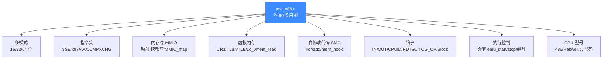
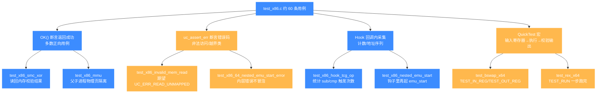

# X86 测试套件

本页对应源码 `tests/unit/test_x86.c`,逐一讲解 X86 架构在 Unicorn 中的单元测试覆盖了哪些能力、如何运行、典型用例验证了什么。读完你能知道 X86 后端被回归保护到什么程度,以及自己写 X86 测试时该模仿哪些写法。

## 📌 概述

`test_x86.c` 是全仓库规模最大、维度最广的架构测试文件,共 **2268 行、77 个 `static void test_` 函数**,其中去回调后登记在文件末尾 `TEST_LIST` 数组(由 `acutest` 框架驱动)的有效用例约 **60 条**。它不是简单跑几条机器码就结束,而是把 16/32/64 位三种模式、SSE/x87/AVX 指令、自修改代码、MMIO、虚拟内存(MMU)、TLB、TCG 操作钩子、嵌套 `uc_emu_start`、CPU 型号差异等维度全拉了一遍。



套件依赖一个公共构造函数 `uc_common_setup()`,几乎所有用例都先调它来 `uc_open` + `uc_mem_map` + `uc_mem_write`,把"建引擎、映射代码段、写机器码"三步打包,公共常量 `code_start=0x1000`、`code_len=0x4000`,这样每条用例只关心自己要验证的那一点:

```c
const uint64_t code_start = 0x1000;
const uint64_t code_len = 0x4000;

static void uc_common_setup(uc_engine **uc, uc_arch arch, uc_mode mode,
                            const char *code, uint64_t size)
{
    OK(uc_open(arch, mode, uc));
    OK(uc_mem_map(*uc, code_start, code_len, UC_PROT_ALL));
    OK(uc_mem_write(*uc, code_start, code, size));
}
```

文件里还内建了一套 `QuickTest` 框架(`TEST_CODE`/`TEST_IN_REG`/`TEST_OUT_REG`/`TEST_RUN` 宏),用于一次性声明"输入寄存器—执行—校验输出寄存器"的回归用例,`test_bswap_x64`、`test_rex_x64`、`test_fxsave_fpip_*` 都走这条捷径。

## 💻 典型用例讲解

下面挑 6 条有代表性的用例,说明它们各自验证了 X86 后端的什么能力。

### 1. `test_x86_smc_xor` / `test_x86_smc_add` — 自修改代码(SMC)

```c
// xor dword ptr [edi+0x3], eax ; edi=0x1000, eax=0xbc4177e6
// dw 0x3ea98b13
char code[] = "\x31\x47\x03\x13\x8b\xa9\x3e";
int r_edi = code_start;
int r_eax = 0xbc4177e6;

uc_common_setup(&uc, UC_ARCH_X86, UC_MODE_32, code, sizeof(code) - 1);
uc_reg_write(uc, UC_X86_REG_EDI, &r_edi);
uc_reg_write(uc, UC_X86_REG_EAX, &r_eax);
OK(uc_emu_start(uc, code_start, code_start + 3, 0, 0));

OK(uc_mem_read(uc, code_start + 3, (void *)&result, 4));
TEST_CHECK(LEINT32(result) == (0x3ea98b13 ^ 0xbc4177e6));
```

验证点:指令在执行过程中改写了自己所在代码段的数据。SMC 是 CPU 模拟器的硬骨头——TCG 把一个翻译块(translation block)译成宿主指令后,如果块内写操作命中了该块自身的代码页,Unicorn 必须侦测到并让旧 TB 失效、重新译码,否则会执行到已被覆盖的旧指令。`test_x86_smc_add` 进一步用 64 位 `mov [rip+0x10], rax` + `mov word ptr [rip], 0x0548` 把一条 `mov eax, [rax+0x12345678]` 改写成 `add rax, 0x12345678`,证明对 RIP 相对寻址写代码页的失效也成立;`test_x86_smc_mem_hook` 则校验 SMC 期间内存写钩子收到的地址序列完全正确。

### 2. `test_x86_mmu` — 长模式分页与 `fork` 语义

这条用例模拟 Linux 的 `fork()` 流程:父进程执行 `mov rax, 57; syscall`(57 是 x86-64 的 `fork` 系统调用号),钩子里切换页表把虚拟地址 `0x4000` 重映射到不同物理页,再用 `uc_context_save`/`uc_context_restore` 复现场景跑子进程。核心是手工搭一套四级页表:

```c
OK(uc_open(UC_ARCH_X86, UC_MODE_64, &uc));
OK(uc_ctl_tlb_mode(uc, UC_TLB_CPU));   // 启用 CPU 真实分页模式
// ...
test_x86_mmu_prepare_tlb(uc, 0x0, tlb_base);   // 写 PML4E/PDPE/PDE
test_x86_mmu_pt_set(uc, 0x2000, 0x0, tlb_base, true);  // vaddr 0x2000 -> paddr 0x0
test_x86_mmu_pt_set(uc, 0x4000, 0x1000, tlb_base, true); // 父:0x4000 -> 0x1000
OK(uc_ctl_flush_tlb(uc));
OK(uc_emu_start(uc, 0x2000, 0x0, 0, 0));
// 父进程写 [0x4000]=60,保存上下文后把 0x4000 重映射到 0x2000
OK(uc_context_save(uc, context));
// ... 父子各自跑完后
TEST_CHECK(LEINT64(parrent) == 60);   // 物理页 0x1000 仍是 60
TEST_CHECK(LEINT64(child) == 42);     // 物理页 0x2000 写入 42
```

验证点:`UC_TLB_CPU` 模式下 Unicorn 真的走 CR3/CR0/CR4/EFER 的分页通路,PML4→PDPT→PD→PT 四级查表正确,`uc_ctl_flush_tlb` 能在页表改写后强制重填,且同一虚拟地址在不同页表映射下能隔离到不同物理页(写时复制的基础)。配套的 `test_x86_read_virtual` 还用 `uc_vmem_read(uc, 0x4000, UC_PROT_READ, ...)` 验证按虚拟地址(而非物理地址)读内存并受页表权限位约束——对一个只读页用 `UC_PROT_WRITE` 读会返回 `UC_ERR_READ_PROT`。

### 3. `test_x86_vtlb` — 虚拟 TLB 回调填表

```c
OK(uc_ctl_tlb_mode(uc, UC_TLB_VIRTUAL));
OK(uc_hook_add(uc, &hook, UC_HOOK_TLB_FILL, test_x86_vtlb_callback, NULL, 1, 0));

static bool test_x86_vtlb_callback(uc_engine *uc, uint64_t addr,
                                   uc_mem_type type, uc_tlb_entry *result,
                                   void *user_data)
{
    result->paddr = addr;      // 1:1 直通
    result->perms = UC_PROT_ALL;
    return true;
}
```

验证点:`UC_TLB_VIRTUAL` 模式把 TLB 缺失的裁决权交给用户钩子——每当虚拟地址未命中,Unicorn 调用 `UC_HOOK_TLB_FILL` 让你自己决定映射到哪个物理地址、给什么权限。这给沙箱/插桩场景提供了完全可控的地址翻译层,既不用搭页表,又能动态决定可见性。这条用例用最简单的"恒等映射 + 全权限"证明钩子返回的 `uc_tlb_entry` 被正确喂回 TLB。

### 4. `test_x86_hook_tcg_op` — TCG 操作级钩子

```c
// sub esi,[0x1000]; sub eax,ebx; sub eax,1; cmp eax,0; cmp ebx,edx; cmp esi,[0x1000]
char code[] = "\x2b\x35\x00\x10\x00\x00\x29\xd8\x83\xe8\x01\x83\xf8\x00\x39"
              "\xd3\x3b\x35\x00\x10\x00\x00";

// 1) 不带 flag:6 条 sub/cmp 都触发(3 条 sub + 3 条 cmp 底层都是 sub)
OK(uc_hook_add(uc, &h, UC_HOOK_TCG_OPCODE, test_x86_hook_tcg_op_cb,
               &results, 0, -1, UC_TCG_OP_SUB, flag));
TEST_CHECK(results.len == 6);

// 2) UC_TCG_OP_FLAG_DIRECT:只算"真正的 sub",3 条
flag = UC_TCG_OP_FLAG_DIRECT;
TEST_CHECK(results.len == 3);

// 3) UC_TCG_OP_FLAG_CMP:只算"作为 cmp 的 sub",3 条
flag = UC_TCG_OP_FLAG_CMP;
TEST_CHECK(results.len == 3);
```

验证点:`UC_HOOK_TCG_OPCODE` 是 Unicorn 独有的、在 TCG 中间表示层而不是 x86 指令层下钩子的能力。x86 的 `cmp` 在 TCG 里就是一条 `sub`(只丢掉结果、留下标志),所以一次遍历能被 `UC_TCG_OP_SUB` 同时捕获。`flag` 参数能把"直接减法"和"比较用减法"分流——这是做指令级插桩、污点分析、覆盖率统计时极细的粒度,普通指令钩子做不到。

### 5. `test_x86_nested_emu_start` / `test_x86_nested_emu_stop` — 嵌套执行

```c
char code[] = "\x41\x4a"; // INC ecx; DEC edx;
OK(uc_hook_add(uc, &h, UC_HOOK_CODE, test_x86_nested_emu_start_cb, NULL,
               code_start, code_start));   // 钩在 INC 上
OK(uc_emu_start(uc, code_start, code_start + 1, 0, 0));  // 只想跑 INC

// 钩子里又起一次 emu_start 跑 DEC
static void test_x86_nested_emu_start_cb(uc_engine *uc, uint64_t addr,
                                         size_t size, void *data)
{
    OK(uc_emu_start(uc, code_start + 1, code_start + 2, 0, 0));
}
```

验证点:`uc_emu_start` 不是不可重入的死循环——在代码钩子里再次调用 `uc_emu_start` 跑另一段代码,Unicorn 能正确保存/恢复外层 TB 状态、回来继续。最终 `ecx` 从 `0x1234` 涨到 `0x1235`(外层 INC 生效)、`edx` 从 `0x7890` 降到 `0x788f`(内层嵌套跑的 DEC 生效)。`test_x86_nested_emu_stop` 进一步证明:在嵌套钩子里调 `uc_emu_stop` 只停内层、外层不受影响(`ecx` 保持 `0x1234` 不变,因为外层那条 INC 被钩子拦截后没真正执行);`test_x86_64_nested_emu_start_error` 还验证内层 `uc_emu_start` 触发的 `UC_ERR_READ_UNMAPPED` 不会冒泡让外层失败——这是把 Unicorn 当调试器/嵌套解释器用时必须成立的隔离性。

### 6. `test_x86_486_cpuid` / `test_x86_hook_cpuid` — CPU 型号与指令钩子

```c
char code[] = {0x31, 0xC0, 0x0F, 0xA2}; // XOR EAX EAX; CPUID

OK(uc_open(UC_ARCH_X86, UC_MODE_32, &uc));
OK(uc_ctl_set_cpu_model(uc, UC_CPU_X86_486));   // 切到 i486
OK(uc_emu_start(uc, 0, sizeof(code), 0, 0));

OK(uc_reg_read(uc, UC_X86_REG_EBX, &ebx));
TEST_CHECK(ebx == 0x756e6547); // "Genu" magic,Intel CPU 标识
```

验证点:`uc_ctl_set_cpu_model` 真的改变了后端 CPUID 的输出。i486 型号下 `CPUID` 能正常返回 Intel 的 "Genu" 厂商串(`ebx` 低 32 位 = `0x756e6547`),说明型号切换触发了 `qemu/target/i386` 里对应的特性集。而 `test_x86_hook_cpuid` 用 `UC_HOOK_INSN` + `UC_X86_INS_CPUID` 拦截 `CPUID` 指令,在回调里改写返回值(让 `eax=7`)——证明指令级钩子能在 `CPUID` 这种特权查询上做透明改写,这是反检测、CPU 指纹伪造场景的基础。

## 🧪 按测试手段切分的用例分组

上面的分类图按"测什么能力"切，下面这张按"用什么手段断言"切：是用 `OK()` 断言 API 返回成功、用 `uc_assert_err` 断言期望错误码、还是用 Hook 回调里采集计数/序列来验证。这一维度更能指导你为新用例挑模板。



挑模板的捷径：纯执行类照 `OK()` 模板；异常路径类照 `uc_assert_err` 模板；指令级插桩类照 Hook 采集模板；"一组输入寄存器跑出指定输出寄存器"的简单回归用 `QuickTest` 宏一行声明即可。

## 🚀 运行方式

```bash
# 1. 先构建(顶层仓库根目录)
mkdir build && cd build
cmake .. -DCMAKE_BUILD_TYPE=Release -DUNICORN_ARCH="x86"
cmake --build . -j

# 2. 跑 X86 套件(由 CTest 收录)
cd build
ctest -R x86 --output-on-failure
ctest -R test_x86 -V          # 只看 test_x86 二进制

# 3. 直接跑二进制(不走 CTest,可过滤用例)
./tests/unit/test_x86                         # 跑全部
./tests/unit/test_x86 test_x86_mmu            # 只跑指定用例
./tests/unit/test_x86 --help                  # acutest 自带筛选选项
```

::: tip 用例过滤
`acutest` 支持 `test_x86 用例名1 用例名2` 形式只跑子集,也支持 `--skip` 跳过、`--list` 列出全部用例名。CI 里常用 `ctest -R test_x86 --output-on-failure` 一条命令覆盖整个 X86 套件。
:::

::: warning 编译条件用例
`test_x86_unaligned_access` 与 `test_x86_64_unaligned_access` 受预处理宏 `#if !defined(TARGET_READ_INLINED) && defined(BOOST_LITTLE_ENDIAN)` 保护——只有在小端且未启用 inlined-read 优化时才登记进 `TEST_LIST`。在受限构建下 `TEST_LIST` 条目数会比源码里看到的 `test_` 函数少,属正常。
:::

## ⚠️ 注意与边界

- **CPU 型号敏感**:`test_x86_inc_dec_pxor` 显式指定 `UC_CPU_X86_HASWELL`(SSE/AVX2 才有完整 PXOR 语义),`test_x86_486_cpuid` 指定 `UC_CPU_X86_486`。换型号会改变 CPUID、特性位、可用指令集,复制用例时务必带上对应的 `uc_ctl_set_cpu_model`。
- **三种模式别混**:`UC_MODE_16`(`test_x86_16_add`、`test_x86_16_incorrect_ip`)、`UC_MODE_32`、`UC_MODE_64` 的地址宽度、默认操作数大小、寄存器名(ESP/RSP、EIP/RIP)都不同,16 位模式还要注意 `code_start` 的段基址计算。混用会导致看似"指令没生效"实则译码尺寸错位。
- **SMC 用例别开 TB 缓存**:SMC 测试依赖"写代码页→TB 失效→重译"路径。如果你自己扩展这类用例,务必保持代码段与数据段落在同一可写映射内,且不要手动 `uc_ctl_request_cache` 冻住 TB,否则会跑过时的翻译块、得到错误结果。
- **MMU 用例要刷 TLB**:`test_x86_mmu` 每次改完页表都调 `uc_ctl_flush_tlb(uc)`,否则旧 TLB 项会让新映射不生效。漏掉这步是用 `UC_TLB_CPU` 模式最常见的坑。
- **嵌套 `uc_emu_start` 的隔离**:`test_x86_nested_emu_start_error` 故意在嵌套内层触发 `UC_ERR_READ_UNMAPPED`,断言外层 `uc_emu_start` 仍返回 `UC_ERR_OK`。若你自己的嵌套逻辑期望错误向上传播,需要在内层回调里显式保存返回值并用 `uc_emu_stop` 传递。

## 🔧 实现要点

- 测试框架是仓库自带的 `acutest`(见 `tests/unit/acutest.h`),由 `unicorn_test.h` 再包一层 `OK()` 宏断言 `UC_ERR_OK`、`uc_assert_err()` 断言"期望错误码"。新用例照此写即可,无需引入第三方依赖。
- 用例统一通过 `uc_common_setup` 建环境,所有用例共用 `code_start=0x1000`、`code_len=0x4000` 这套地址约定;涉及大内存的用例(`test_bswap_x64` 等)走 `QuickTest` 框架,用 `MEM_BASE=0x40000000`、`MEM_TEXT` 单独规划。
- 涉及指令级能力的用例按钩子类型分:端口 IO 用 `UC_HOOK_INSN` + `UC_X86_INS_IN`/`OUT`;CPUID 用 `UC_X86_INS_CPUID`;RDTSC/RDTSCP 同理;SYSENTER/SYSCALL 走 `UC_HOOK_INSN` 或 `UC_HOOK_INSN`+对应指令号。这是 X86 后端指令拦截正确性的主防线。
- 内存异常路径(`test_x86_invalid_mem_read`/`_write`/`_jump`)用 `uc_assert_err(UC_ERR_READ_UNMAPPED, uc_emu_start(...))` 直接断言 `uc_emu_start` 返回的错误码,确保非法访问不会静默通过。
- TLB/虚拟内存用例覆盖了三种模式:`UC_TLB_VIRTUAL`(`test_x86_vtlb`,钩子填表)、`UC_TLB_CPU`(`test_x86_mmu`,真实页表)、以及 `uc_vmem_read`/`uc_vmem_translate`(按虚拟地址读写、查询翻译结果),形成对地址翻译子系统的完整回归网。

## 📖 参考

- 源码:[`tests/unit/test_x86.c`](https://github.com/android-security-engineer/unicorn-skills/blob/master/tests/unit/test_x86.c)
- 测试框架:`tests/unit/acutest.h`(由 `unicorn_test.h` 封装)
- [X86 架构总览](/arch/x86/) — 16/32/64 位模式与寄存器
- [X86 CPU 型号](/arch/x86/cpu-models) — `UC_CPU_X86_486` / `HASWELL` 等型号差异
- [TCG 操作钩子](/hooks/tcg-opcode) — `UC_HOOK_TCG_OPCODE` 详解
- [TLB 填充钩子](/hooks/tlb-fill) — `UC_HOOK_TLB_FILL` 与虚拟 TLB
- [uc_ctl 接口](/ctl/) — `uc_ctl_set_cpu_model`、`uc_ctl_tlb_mode`、`uc_ctl_flush_tlb`
- [测试与基准](/guide/testing) — `unit/`、`regress/`、`fuzz/` 全景

## 相关页面

- [X86 实战示例](/arch/x86/example)
- [X86 指令集](/arch/x86/instructions)
- [X86 寄存器](/arch/x86/registers)
- [内存 Hook](/hooks/) — `UC_HOOK_MEM_READ` / `UC_HOOK_MEM_WRITE`
- [uc_emu_start / uc_emu_stop API](/api/emu-start)
- [uc_vmem_read / vmem_translate](/api/vmem-read)
- [测试与基准](/guide/testing)
- [Unicorn 内部结构](/internals/uc-struct)
